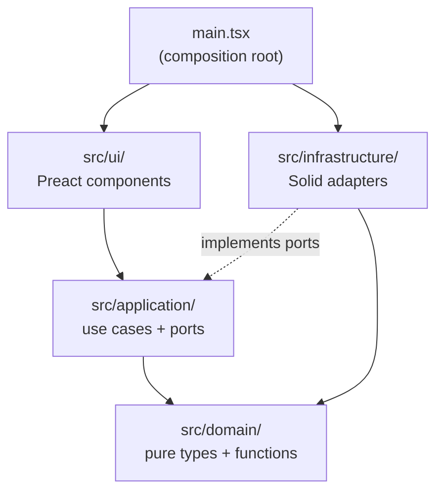

# Architecture

Solid Memo is structured as hexagonal (ports & adapters) layers. Dependencies
point in one direction only; the composition root is the single place where
layers are wired together.

## Layers

| Layer | Path | Responsibility |
|---|---|---|
| UI | `src/ui/` | Preact components and async-state management. Calls use cases only. |
| Application | `src/application/` | Use cases (what the app does) and ports (what the app needs). |
| Domain | `src/domain/` | Pure types and pure functions. The app's vocabulary. |
| Infrastructure | `src/infrastructure/` | Implementations of the ports against real technology: `solid/` for pods (Inrupt), `shacl/` for shape validation (rdf-validate-shacl) and the generated shape descriptors. |
| Composition root | `src/main.tsx` | Instantiates infrastructure, injects it into use cases, renders the UI. |

## Dependency rule

A module may depend only on layers below it in this graph. Infrastructure
implements application ports (dependency inversion): the application layer
owns the interfaces, infrastructure conforms to them.

## Key objects

- `UseCases` ([src/application/useCases.ts](../src/application/useCases.ts)) —
  the UI's only entry point. Created once by the composition root and passed
  to `App` as a prop.
- Ports ([src/application/ports.ts](../src/application/ports.ts)) — narrow
  interfaces (one per external capability) implemented by factories in
  `src/infrastructure/solid/`.
- Domain types ([src/domain/](../src/domain/)) — free of any library type,
  so every layer above can be tested without infrastructure. The record
  types under `src/domain/shapes/` are generated from the SHACL
  [shapes](shapes.md); the migration chain beside them is hand-written.

## Why

- Vendor code stays swappable and upgradeable in isolation (see
  [vendor-code.md](vendor-code.md)).
- Every seam is injectable, which is what makes 100% unit coverage
  practical (see [testing.md](testing.md)).
