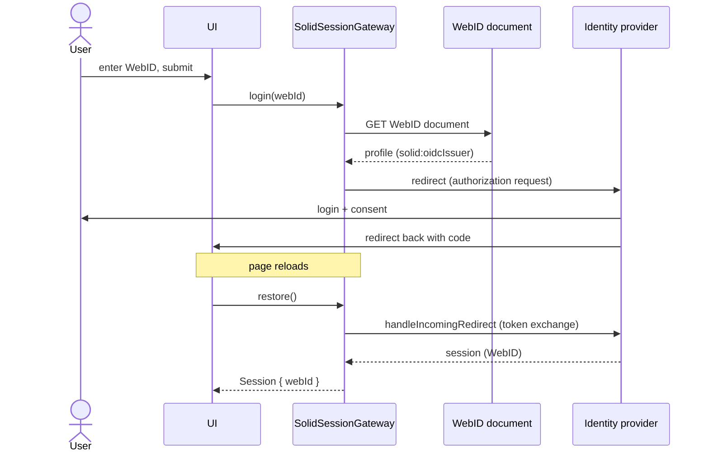

# Authentication

Login, session restore, and logout against a Solid identity provider using
Solid-OIDC. All authentication code lives in
[src/infrastructure/solid/solidSessionGateway.ts](../src/infrastructure/solid/solidSessionGateway.ts),
behind the `SessionGateway` port.

## Login flow

The user enters only their WebID. The app dereferences it (unauthenticated)
and reads the `solid:oidcIssuer` triple to find their identity provider, then
starts the OIDC redirect flow.

## Session restore

`restore()` runs on every page load (App's boot effect). It completes a
pending OIDC redirect if one is in flight, otherwise silently restores a
previous session (`restorePreviousSession: true`). It returns a domain
`Session` or `null`; the UI branches on that.

## Authenticated requests

Repositories receive `fetch` by injection. The composition root injects
[authFetch](../src/infrastructure/solid/authFetch.ts), a lazy wrapper that
delegates to the current default session's fetch at call time — never a
reference captured before login.

## Logout

`logout()` clears the session via the authn library; the UI additionally
clears the react-query cache so no pod data outlives the session that
fetched it.
