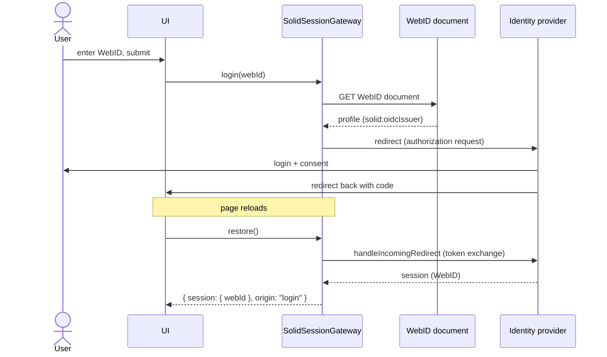

# Authentication

Login, session restore, and logout against a Solid identity provider using
Solid-OIDC. All authentication code lives in
[packages/solid/src/solidSessionGateway.ts](../packages/solid/src/solidSessionGateway.ts),
behind the `SessionGateway` port.

## Login flow

The user enters only their WebID (collected by the
[onboarding flow](onboarding.md), validated as an `https:` URL). The app
dereferences it (unauthenticated) and reads the `solid:oidcIssuer` triple to
find their identity provider, then starts the OIDC redirect flow. The issuer
is never inferred from the WebID's origin — the two often differ (a WebID on
`alice.datapod.igrant.io` is served by the issuer `datapod.igrant.io`) — and
must itself be an `https:` URL.

Alternatively the user picks a suggested provider ([onboarding](onboarding.md));
`loginWithIssuer` then skips the profile lookup and starts the same flow at
that issuer.

The app never handles credentials: no password field, no client secret, no
hand-rolled OIDC. The authn library registers the client dynamically and
runs the authorization-code + PKCE flow.

```mermaid
sequenceDiagram
    actor User
    participant UI
    participant Gateway as SolidSessionGateway
    participant Pod as WebID document
    participant IdP as Identity provider

    User->>UI: enter WebID, submit
    UI->>Gateway: login(webId)
    Gateway->>Pod: GET WebID document
    Pod-->>Gateway: profile (solid:oidcIssuer)
    Gateway->>IdP: redirect (authorization request)
    IdP->>User: login + consent
    IdP->>UI: redirect back with code
    Note over UI,Gateway: page reloads
    UI->>Gateway: restore()
    Gateway->>IdP: handleIncomingRedirect (token exchange)
    IdP-->>Gateway: session (WebID)
    Gateway-->>UI: { session: { webId }, origin: "login" }
```

## Session restore

`restore()` runs on every page load (App's boot effect). It completes a
pending OIDC redirect if one is in flight, otherwise silently restores a
previous session (`restorePreviousSession: true`). It returns a domain
`EstablishedSession` (`{ session, origin }`) or `null`. `origin` is
`"login"` when the library emitted its `LOGIN` event (a login redirect just
completed) and `"restored"` otherwise; the UI shows the "Pod connected"
onboarding step only for the former.

### Returning to the view

Both trips to the identity provider — an interactive login and the
silent restore a reload makes — come back to the bare page: a redirect
URL cannot carry a fragment, and the view lives in the URL hash
([routing.md](routing.md)). `restore()` puts the hash back before it
returns, so the Workspace starts on the view the user left:

- **Reload** — the library keeps the URL it left from and reports it in
  its `SESSION_RESTORED` event.
- **Login** — `login()` keeps the URL it starts from in session storage
  (`solid-memo:loginStartedAt`), read once when the login completes. A
  deep link opened while signed out, or a view whose session expired,
  opens again after signing in. Without session storage the login still
  works and lands on the default view.

Only a URL of this same page is followed back.

## Authenticated requests

Repositories receive `fetch` by injection. The composition root injects
[authFetch](../packages/solid/src/authFetch.ts), a lazy wrapper that
delegates to the current default session's fetch at call time — never a
reference captured before login.

## Logout

`logout()` clears the session via the authn library; the UI additionally
clears the react-query cache so no pod data outlives the session that
fetched it.
