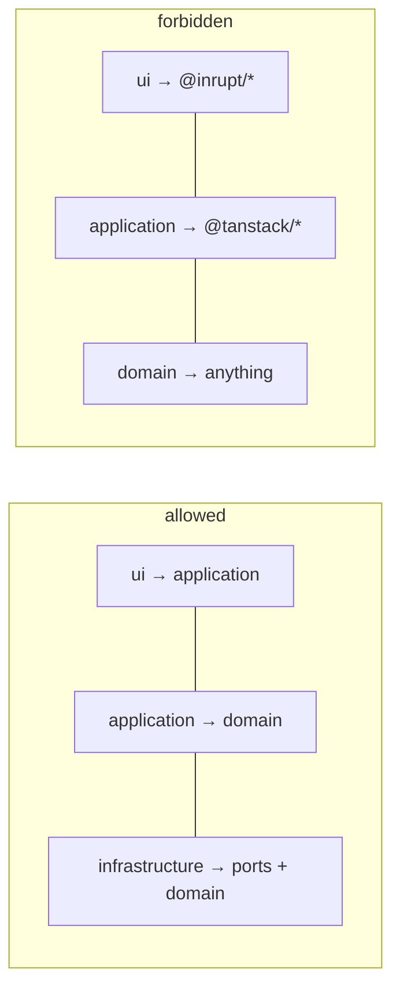

# Boundaries

Import rules between layers. These are the load-bearing walls of the
codebase; a change that violates them is wrong even if it works.

## Rules

| Package / module | Allowed in | Forbidden everywhere else |
|---|---|---|
| `@inrupt/solid-client`, `@inrupt/solid-client-authn-browser` | `src/infrastructure/solid/` only | UI, application, domain |
| `@tanstack/react-query` | `src/ui/` and `src/main.tsx` | application, domain, infrastructure |
| `preact` | `src/ui/`, `src/main.tsx` | application, domain, infrastructure |
| `@fontsource/*`, `@fontsource-variable/*` | `src/style.css` | any TypeScript module |
| `n3` | `tooling/` (build-time parsing, index, generators, the Turtle formatter) | `src/` — the app reads RDF through `@inrupt/solid-client` |
| `rdf-validate-shacl` | `src/infrastructure/shacl/engine.ts` only (loaded lazily); `tooling/` through that module | everywhere else |
| `@rdfjs/types` (types only) | `src/infrastructure/shacl/`, `src/test/` | domain, application, UI |
| Anything (imports at all) | — | `src/domain/` imports nothing except sibling domain modules |

Additional rules:

- UI components never import ports or infrastructure. They receive `UseCases`
  as a prop.
- Application imports domain types and nothing else.
- Infrastructure may import domain types (to map onto them) and application
  ports (to implement them) — never UI. `src/infrastructure/solid/` may
  import `src/infrastructure/shacl/` (descriptors and the registry, which
  are vendor-free data); `@inrupt/solid-client` is also allowed in
  `src/infrastructure/shacl/` (it parses the shape documents).
- `tooling/` may import `src/domain/` and `src/infrastructure/shacl/`
  (both Node-safe); nothing in `src/` imports `tooling/`.
- Modules reachable from `vite.config.ts` (`tooling/` and
  `src/infrastructure/shacl/`) spell out `.ts` on relative imports: a
  future Vite loads the config with Node's own loader, which needs them.
- Generated files (`*.generated.ts`, `src/domain/shapes/generated.ts`)
  are never edited by hand: change `vocab/` or `shapes/` and run
  `npm run generate` ([shapes.md](shapes.md)).
- `src/main.tsx` is the only module that imports across all layers.



## Enforcement

Currently by convention, verified with:

```sh
grep -rn "@inrupt" src --include="*.ts" --include="*.tsx" | grep -v infrastructure | grep -v src/test/
grep -rn "@tanstack" src | grep -vE "src/(ui|main)"
grep -rn "from \"n3\"" src
grep -rn "rdf-validate-shacl" src | grep -v infrastructure/shacl/engine
```

All must return nothing (test files mirror their subject's layer and follow
the same rules). Lint enforcement (`eslint-plugin-boundaries` or
`import/no-restricted-paths`) is planned but not yet configured.

## Adding a dependency

1. Decide which single layer it belongs to.
2. If it performs I/O, wrap it behind a port in `src/application/ports.ts`
   and implement the port in `src/infrastructure/`.
3. Add the confinement rule to the table above.
