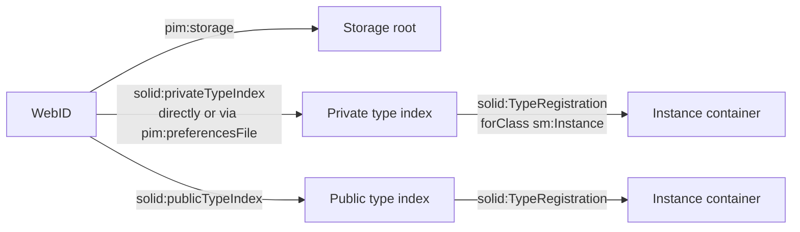
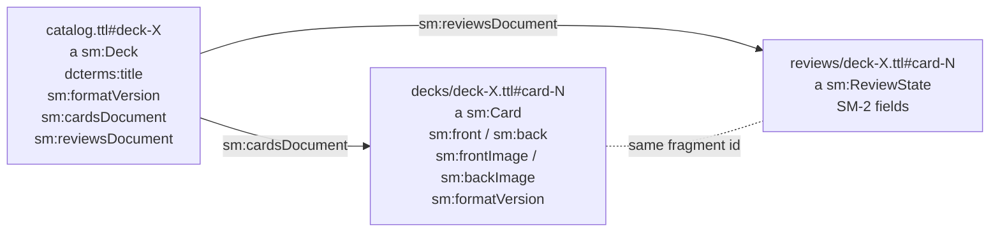

# Data model in the pod

Where Solid Memo stores data in a user's pod and how it finds it again.
Implemented in `src/infrastructure/solid/` (vocabulary in
[vocab.ts](../src/infrastructure/solid/vocab.ts), discovery in
[typeIndex.ts](../src/infrastructure/solid/typeIndex.ts)).

## Vocabulary

Solid Memo mints its own terms under `https://solid-memo.com/vocab/v1#`
(prefix `sm:` below) — no existing RDF vocabulary covers spaced repetition.
The namespace is versioned; readers ignore unknown triples and writers never
delete triples they don't understand.

## Discovery chain



- **Storage**: `pim:storage` triples in the (extended) profile via
  `getPodUrlAll`; when absent, the Solid Protocol Link-header walk-up
  (`rel="type"` targeting `pim:Storage` — capital S) from the WebID URL;
  manual URL entry as last resort. 0, 1, or N storages are all handled.
- **Instances**: one `solid:TypeRegistration` per instance, `solid:forClass
  sm:Instance`, in the private type index by default. `dcterms:title` on the
  registration names the instance (harmless extra triples). Reading accepts
  both `solid:instanceContainer` and `solid:instance`.
- **Type index links** are read from the WebID subject in the WebID
  document and in its extended profile documents (`rdfs:seeAlso` /
  `foaf:isPrimaryTopicOf`), plus `pim:preferencesFile` for the private one.
- **Missing indexes** (normal on Community Solid Server pods): the user is
  warned and chooses — create the private index (document under
  `<storage>settings/` plus a profile link) or register publicly. The link
  goes in the WebID document when it is writable, else in the first
  extended profile that accepts it (Inrupt PodSpaces: the WebID document on
  `id.inrupt.com` is read-only; `<storage>profile` is the writable one). An
  index document already at the target URL is adopted, not overwritten. If
  registration fails, instance creation fails loudly and the created
  container is cleaned up; there is no local fallback.
- **Deleting an instance** wipes the container recursively (children
  first, `meta.ttl` last, so a half-deleted instance still attaches by
  URL), then removes its registrations from both type indexes. Data goes
  before registration so a failure leaves the instance listed and the
  delete retryable.

## Instance layout

```
<storage>solid-memo/<name>/          (default path; user-editable)
├── meta.ttl        #it: a sm:Instance; dcterms:title; dcterms:created;
│                        sm:formatVersion 1
├── preferences.ttl #it: a sm:Preferences (created on first explicit save):
│                        study caps + sm:developerMode (boolean, absent = off)
├── catalog.ttl     one subject per deck (titles live ONLY here);
│                        sm:formatVersion, optional dcterms:creator/license/
│                        description/source
├── decks/<deckId>.ttl    card corpus: one sm:Card per fragment (slow churn),
│                        sm:front/back text and/or sm:frontImage/backImage
│                        IRIs, each with sm:formatVersion
└── reviews/<deckId>.ttl  SM-2 state: one sm:ReviewState per fragment (fast churn);
                          optional sm:previous* snapshot = state before the
                          day's first review (restored by "reset the day")
```

## Decks and cards

Granularity is chosen around the N+1 problem (no batch requests, no SPARQL
on Solid servers): reading a whole deck is one GET, and a study session
never rewrites card content.



- The **catalog** holds one subject per deck with its title and links to the
  two documents — the deck list renders from a single fetch. A deck may
  name its authors (`dcterms:creator`, one literal each), licence
  (`dcterms:license`, a URL) and a description (`dcterms:description`, a
  literal: what it covers and where its content came from — shown on the
  deck page with its URLs as links); a deck copied from the
  [deck library](deck-library.md) inherits those and also carries
  `dcterms:source` (the library document it came from).
- **Card sides**: each side is text (`sm:front` / `sm:back`, a literal),
  a picture (`sm:frontImage` / `sm:backImage`, always an IRI — a string in
  its place is ignored) or both; a side with neither makes the subject
  not a card. Pictures are shown only when their URL is http(s); pod data
  is untrusted.
- **Format versions**: every deck and card the app writes carries
  `sm:formatVersion` (the same term `meta.ttl` uses for the instance):
  decks are at 1, cards at 2 (pictures). Readers treat a missing version
  as 1 — data written before the field existed — read older versions as
  they are, and pass a newer stored version through unchanged. Bringing
  a pod's cards up to the current version is the user's call; see
  [migrations.md](migrations.md).
- **Cards** are hash-fragment subjects (`#card-<uuid>`, or the library's
  own ids such as `#sweden` for imported decks) inside one document per
  deck. Fragment ids are generated once at creation and never re-derived.
- **Review state** lives in a separate document per deck, joined to cards by
  the same fragment id. Card edits and review updates never touch each
  other's documents.
- Cards/reviews documents are created lazily on first write; deck removal
  deletes both documents and the catalog subject; card removal also removes
  the card's review state.

Registration in the type index:

```turtle
<#sm-inst-9f3c1a> a solid:TypeRegistration ;
    solid:forClass sm:Instance ;
    solid:instanceContainer <https://pod.example/solid-memo/main/> ;
    dcterms:title "Japanese study" .
```

`meta.ttl` makes a container self-describing: attach-by-URL reads it to
recover an instance that lost its registration.

## Write discipline

- Mutations always follow `getSolidDataset` → modify → `saveSolidDatasetAt`
  (issues a PATCH of the delta — never a clobbering PUT). Only brand-new
  documents are saved from `createSolidDataset()`.
- 404 is a normal state for not-yet-created documents; repositories treat it
  as empty, not as an error.
- No `.acl`/`.acr` resources are ever written: a resource without its own
  ACL safely inherits its ancestors' access, while a malformed one replaces
  inheritance entirely and can lock the owner out (WAC) or expose data.
  Access control stays whatever the user's server dictates.
