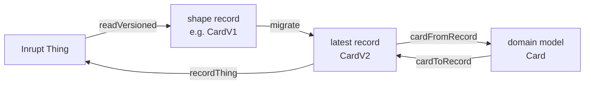
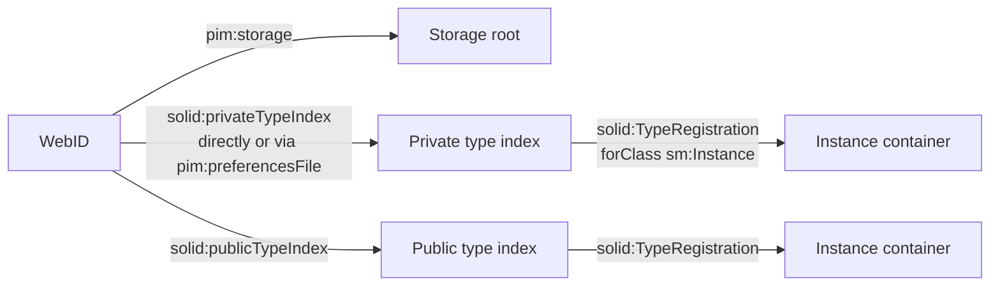
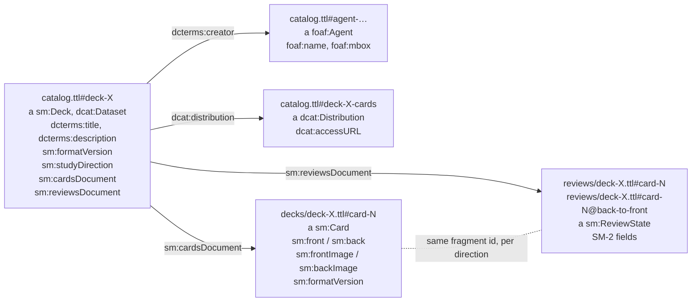

# Data model in the pod

Where Solid Memo stores data in a user's pod and how it finds it again.
Implemented in `src/infrastructure/solid/` (vocabulary in
[vocab.ts](../src/infrastructure/solid/vocab.ts), discovery in
[typeIndex.ts](../src/infrastructure/solid/typeIndex.ts)).

## Vocabulary and shapes

Solid Memo mints its own terms under `https://solid-memo.com/vocab/v1#`
(prefix `sm:` below) — no existing RDF vocabulary covers spaced repetition.
The terms are defined in [`vocab/v1.ttl`](../vocab/v1.ttl) ([vocab.md](vocab.md));
what a valid subject of each class looks like, version by version, is a
SHACL shape under [`shapes/`](../shapes/) ([shapes.md](shapes.md)). Both
are published with the site, and the app's constants, record types and
descriptors are generated from them. Readers ignore unknown triples and
writers never delete triples they don't understand.


```mermaid
flowchart LR
    thing["Inrupt Thing"] -->|readVersioned| record["shape record<br/>e.g. CardV1"]
    record -->|migrate| latest["latest record<br/>CardV2"]
    latest -->|cardFromRecord| model["domain model<br/>Card"]
    model -->|cardToRecord| latest
    latest -->|recordThing| thing
```

## Discovery chain


```mermaid
flowchart LR
    W[WebID] -->|pim:storage| S[Storage root]
    W -->|solid:privateTypeIndex<br/>directly or via pim:preferencesFile| PTI[Private type index]
    W -->|solid:publicTypeIndex| PUB[Public type index]
    PTI -->|solid:TypeRegistration<br/>forClass sm:Instance| I1[Instance container]
    PUB -->|solid:TypeRegistration| I2[Instance container]
```

- **Storage**: `pim:storage` triples in the (extended) profile via
  `getPodUrlAll`; when absent, the Solid Protocol Link-header walk-up
  (`rel="type"` targeting `pim:Storage` — capital S) from the WebID URL;
  manual URL entry as last resort. 0, 1, or N storages are all handled.
- **Instances**: one `solid:TypeRegistration` per instance, `solid:forClass
  sm:Instance`, in the private type index by default. `dcterms:title` on the
  registration names the instance (harmless extra triples). Reading accepts
  both `solid:instanceContainer` and `solid:instance`.
- **Type index links** are read from the WebID subject in the WebID
  document and in its extended profile documents (`rdfs:seeAlso` /
  `foaf:isPrimaryTopicOf`), plus `pim:preferencesFile` for the private one.
- **Missing indexes** (normal on Community Solid Server pods): the user is
  warned and chooses — create the private index (document under
  `<storage>settings/` plus a profile link) or register publicly. The link
  goes in the WebID document when it is writable, else in the first
  extended profile that accepts it (Inrupt PodSpaces: the WebID document on
  `id.inrupt.com` is read-only; `<storage>profile` is the writable one). An
  index document already at the target URL is adopted, not overwritten. If
  registration fails, instance creation fails loudly and the created
  container is cleaned up; there is no local fallback.
- **Deleting an instance** wipes the container recursively (children
  first, `meta.ttl` last, so a half-deleted instance still attaches by
  URL), then removes its registrations from both type indexes. Data goes
  before registration so a failure leaves the instance listed and the
  delete retryable.

## Instance layout

```
<storage>solid-memo/<name>/          (default path; user-editable)
├── meta.ttl        #it: a sm:Instance; dcterms:title; dcterms:created;
│                        after a format update dcterms:replaces (the
│                        backup) and dcterms:modified; sm:formatVersion 2
├── preferences.ttl #it: a sm:Preferences (created on first explicit save):
│                        study caps, sm:answerScale, sm:developerMode,
│                        sm:invalidDataPolicy, sm:formatVersion 3
├── catalog.ttl     one subject per deck (titles live ONLY here), a
│                        sm:Deck and dcat:Dataset: sm:formatVersion 3,
│                        dcterms:description, sm:studyDirection, optional
│                        dcterms:creator/license, dcat:theme/keyword,
│                        prov:wasDerivedFrom; beside each deck its
│                        dcat:Distribution (#deck-X-cards) and the
│                        foaf:Agent nodes of its creators (#agent-…)
├── decks/<deckId>.ttl    card corpus: one sm:Card per fragment (slow churn),
│                        sm:front/back text and/or sm:frontImage/backImage
│                        IRIs, each with sm:formatVersion
└── reviews/<deckId>.ttl  SM-2 state: one sm:ReviewState per card and
                          direction (fast churn) — #<cardId> front→back,
                          #<cardId>@back-to-front the other way; optional
                          sm:previous* snapshot = state before the day's
                          first review (restored by "reset the day");
                          sm:formatVersion 2
```

## Decks and cards

Granularity is chosen around the N+1 problem (no batch requests, no SPARQL
on Solid servers): reading a whole deck is one GET, and a study session
never rewrites card content.


```mermaid
graph LR
    C["catalog.ttl#deck-X<br/>a sm:Deck, dcat:Dataset<br/>dcterms:title, dcterms:description<br/>sm:formatVersion<br/>sm:studyDirection<br/>sm:cardsDocument<br/>sm:reviewsDocument"]
    A["catalog.ttl#agent-…<br/>a foaf:Agent<br/>foaf:name, foaf:mbox"]
    X["catalog.ttl#deck-X-cards<br/>a dcat:Distribution<br/>dcat:accessURL"]
    C -->|dcterms:creator| A
    C -->|dcat:distribution| X
    D["decks/deck-X.ttl#card-N<br/>a sm:Card<br/>sm:front / sm:back<br/>sm:frontImage / sm:backImage<br/>sm:formatVersion"]
    R["reviews/deck-X.ttl#card-N<br/>reviews/deck-X.ttl#card-N@back-to-front<br/>a sm:ReviewState<br/>SM-2 fields"]
    C -->|sm:cardsDocument| D
    C -->|sm:reviewsDocument| R
    D -. same fragment id, per direction .- R
```

- The **catalog** holds one subject per deck with its title and links to the
  two documents — the deck list renders from a single fetch. Since deck
  format 3 a deck is a DCAT dataset (`dcat:Dataset`, see
  [vocab.md](vocab.md) and [validation.md](validation.md)): it always has
  a description (`dcterms:description`: what it covers and where its
  content came from — shown on the deck page with its URLs as links; a
  deck without one gets "Flashcards: <title>."), and may name its
  authors (`dcterms:creator`, each a `foaf:Agent` node `#agent-<slug>`
  beside the deck, with `foaf:name` and a `mailto:` `foaf:mbox`; the app
  shows them as "Name <email>"), licence (`dcterms:license`, a URL),
  topics (`dcat:theme`, concepts of the [topics](vocab.md#concept-schemes)
  scheme) and keywords (`dcat:keyword`). Its cards document is named as
  its `dcat:distribution` (`#deck-X-cards`, with `dcat:accessURL`). A
  deck copied from the [deck library](deck-library.md) inherits the
  provenance and says which release it came from with
  `prov:wasDerivedFrom` (`dcterms:source` before format 3). Agents no
  deck names any more are removed with the deck that named them.
- **Card sides**: each side is text (`sm:front` / `sm:back`, a literal),
  a picture (`sm:frontImage` / `sm:backImage`, always an IRI — a string in
  its place is ignored) or both; a side with neither makes the subject
  not a card. Pictures are shown only when their URL is http(s); pod data
  is untrusted.
- **Direction**: a deck's `sm:studyDirection` says how it is studied — a
  concept of `sm:StudyDirections`: `sm:frontToBack`, `sm:backToFront` or
  `sm:bidirectional` (every card asked both ways). Formats 1 and 2 said
  it with the string `sm:direction` (absent meaning front→back, the only
  way there was before the field existed). Changed in the Browser; a
  library deck brings its own.
- **Format versions**: every subject the app writes carries
  `sm:formatVersion`, saying which version of its class's
  [shape](shapes.md) it conforms to: instance 1, decks 3 (DCAT),
  cards 2 (pictures), review states 2, preferences 3; the catalogue,
  agent and distribution nodes 1. Readers treat a
  missing version as 1 — data written before the field existed — read
  older versions as they are, and pass a newer stored version through
  unchanged. Bringing a pod up to the current versions is the user's
  call; see [migrations.md](migrations.md). A developer can check an
  instance against the shapes in the browser ([validation.md](validation.md)).
- **Cards** are hash-fragment subjects (`#card-<uuid>`, or the library's
  own ids such as `#sweden` for imported decks) inside one document per
  deck. Fragment ids are generated once at creation and never re-derived.
- **Review state** lives in a separate document per deck, joined to cards
  by the same fragment id — one subject per card *and direction*:
  `#<cardId>` for front→back (every state written before directions
  existed, which is what they all were) and `#<cardId>@back-to-front` for
  the other way. Card edits and review updates never touch each other's
  documents; removing a card removes both of its states.
- Cards/reviews documents are created lazily on first write; deck removal
  deletes both documents and the catalog subject; card removal also removes
  the card's review state.

Registration in the type index:

```turtle
<#sm-inst-9f3c1a> a solid:TypeRegistration ;
    solid:forClass sm:Instance ;
    solid:instanceContainer <https://pod.example/solid-memo/main/> ;
    dcterms:title "Japanese study" .
```

Beside it, the instance's catalogue is registered as a DCAT catalogue,
so other applications find its decks without knowing Solid Memo:

```turtle
<#sm-cat-4b7d2e> a solid:TypeRegistration ;
    solid:forClass dcat:Catalog ;
    solid:instance <https://pod.example/solid-memo/main/catalog.ttl#catalog> ;
    dcterms:title "Japanese study" .
```

`meta.ttl` makes a container self-describing: attach-by-URL reads it to
recover an instance that lost its registration. Deleting an instance
removes both registrations.

An instance's URL is not permanent: the [format update](migrations.md#the-pod-migration)
writes an updated copy at `<name>-<uuid>/` and switches the type index
registrations to it, keeping the original as a backup that the copy's
`dcterms:replaces` names. Anything that stores an instance URL must
expect it to move and find the instance through the type index again.

## The catalogue

`catalog.ttl#catalog` is a `dcat:Catalog` (shape `CatalogV1`) of the
instance's decks: a `dcterms:title` (the instance's name), a
`dcterms:description`, `dcterms:publisher` (the pod owner's WebID,
described in the same document as a `foaf:Agent` with the `foaf:name`
of their profile), the topics scheme and the EU data themes as
`dcat:themeTaxonomy`, and a `dcat:dataset` per deck, kept in step as
decks are added and removed. It is written when an instance is created,
and by the [format update](migrations.md) for an instance made before
there were catalogues; its registration is written when the update switches over. The whole document
conforms to DCAT-AP (a test holds what the app writes to it).

A deck's description, topics and keywords are edited in its Browser
("Describe deck"); the description is required, as DCAT-AP asks of
every dataset.

## Write discipline

- Mutations always follow `getSolidDataset` → modify → `saveSolidDatasetAt`
  (issues a PATCH of the delta — never a clobbering PUT). Only brand-new
  documents are saved from `createSolidDataset()`.
- 404 is a normal state for not-yet-created documents; repositories treat it
  as empty, not as an error.
- No `.acl`/`.acr` resources are ever written: a resource without its own
  ACL safely inherits its ancestors' access, while a malformed one replaces
  inheritance entirely and can lock the owner out (WAC) or expose data.
  Access control stays whatever the user's server dictates.
