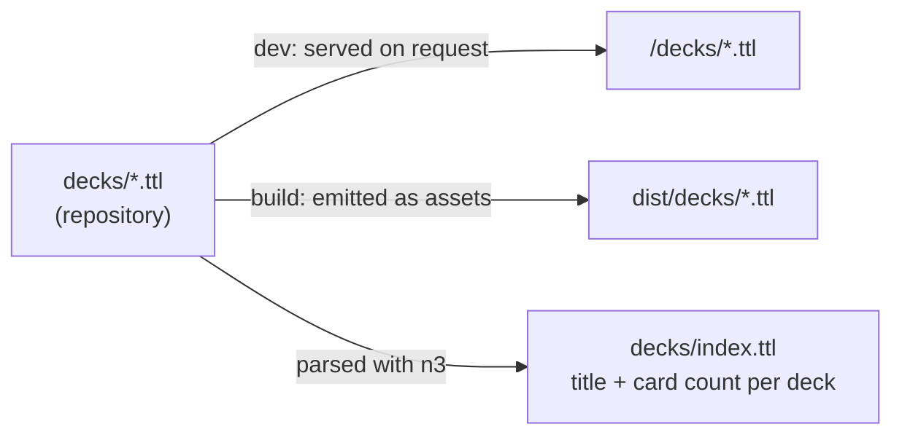
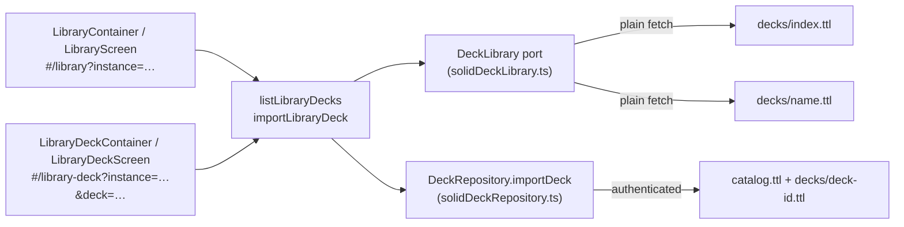

# Deck library

Ready-made decks that any user can copy into their own instance. The
library is part of the site — static Turtle files published next to the
app — not part of anyone's pod.

## Authoring a deck

Drop a Turtle file into [`decks/`](../decks/) at the repository root.
The file is one `sm:Deck` with its cards as hash-fragment subjects, the
same shape as a pod's cards document plus the deck's own title:

```turtle
@base <https://solid-memo.com/decks/capitals-of-the-world> .
@prefix solid-memo: <https://solid-memo.com/vocab/v1#> .
@prefix dcterms:    <http://purl.org/dc/terms/> .

<> a solid-memo:Deck ;
    dcterms:title "Capitals of the world" ;
    dcterms:creator "Anton Wiklund" ;
    dcterms:license <https://creativecommons.org/publicdomain/zero/1.0/> ;
    dcterms:description "Capitals as listed by …" ;
    dcterms:source <https://en.wikipedia.org/wiki/List_of_national_capitals> ;
    solid-memo:formatVersion 1 .

<https://en.wikipedia.org/wiki/List_of_national_capitals>
    dcterms:title "List of national capitals" ;
    dcterms:creator "Wikipedia contributors" ;
    dcterms:license <https://creativecommons.org/licenses/by-sa/4.0/> .

<#sweden> a solid-memo:Card ;
    solid-memo:front "Sweden" ;
    solid-memo:back "Stockholm" ;
    solid-memo:formatVersion 1 .
```

A side may be a picture instead of (or as well as) text — the
[world flags deck](../decks/world-flags.ttl) shows the flag alone on the
front. The picture is an IRI, never a quoted string:

```turtle
<#sweden> a solid-memo:Card ;
    solid-memo:frontImage <https://flagcdn.com/se.svg> ;
    solid-memo:back "Sweden" ;
    solid-memo:formatVersion 2 .
```

Rules the build enforces (a broken file fails `npm run build` rather
than silently vanishing from the library):

- exactly one `sm:Deck` subject, with a `dcterms:title` and a
  `sm:formatVersion` (currently 1);
- cards are `sm:Card` subjects with their own `sm:formatVersion` and, on
  each side, text (`sm:front` / `sm:back`) or a picture (`sm:frontImage`
  / `sm:backImage`) or both; a picture must be an IRI (`<https://…>`), a
  string literal fails the build; anything else is ignored on import;
- `dcterms:creator` (one literal per author) and `dcterms:license` (a
  URL) are optional but expected for published decks — the capitals deck
  is CC0, the most permissive choice, and the library screen credits both;
  `dcterms:description` (a literal) is where a deck credits its sources —
  the flags deck names flagpedia.net for its list and flagcdn.com for the
  images — and is shown, URLs linked, in the library and on the deck page;
- the same sources may also be stated as data: `dcterms:source` (one IRI
  per source) on the deck, and the source's own `dcterms:title`,
  `dcterms:creator` and `dcterms:license` on that IRI as a subject. The
  source's authors and licence belong there, never on the deck, whose
  `dcterms:creator` is whoever compiled it. Untyped subjects like these
  pass the build; the index carries them and a library deck's page lists
  them, but they are not copied on import — the pod's catalog entry uses
  `dcterms:source` for the library document itself (see
  [In the app](#in-the-app));
- `dcterms:created` (an `xsd:dateTime`) is optional; the deck's page
  shows it as the day the deck was made;
- the file name is a plain `name.ttl` (no hidden files, no
  subdirectories); `index.ttl` is reserved for the generated index.

The `@base` is optional. The deck is found by type, not by URL, so the
subjects inside may use a canonical URL (as above) or stay relative to
wherever the file is served.

## Publishing

[`tooling/deckLibrary.ts`](../tooling/deckLibrary.ts) is a Vite plugin
registered in [vite.config.ts](../vite.config.ts):



- **Dev server**: `/decks/<name>.ttl` and `/decks/index.ttl` are served
  from the folder on every request (as `text/turtle`), so a new or edited
  deck shows up without a restart.
- **Build**: the same files are emitted into `dist/decks/`, deployed to
  GitHub Pages with the rest of the site.
- **Index**: a static host cannot list a directory, so the build
  generates `decks/index.ttl` — one `sm:Deck` subject per file, relative
  to the index, with `dcterms:title` and `sm:cardCount`, the deck's
  provenance, and each source it names as a subject of its own:

  ```turtle
  <capitals-of-the-world.ttl> a sm:Deck ;
      dcterms:title "Capitals of the world" ;
      sm:cardCount 243 ;
      dcterms:creator "Anton Wiklund" ;
      dcterms:license <https://creativecommons.org/publicdomain/zero/1.0/> ;
      dcterms:description "…" ;
      dcterms:created "2026-09-22T09:49:00.236Z"^^xsd:dateTime ;
      dcterms:source <https://en.wikipedia.org/wiki/List_of_national_capitals> .

  <https://en.wikipedia.org/wiki/List_of_national_capitals>
      dcterms:title "List of national capitals" ;
      dcterms:creator "Wikipedia contributors" ;
      dcterms:license <https://creativecommons.org/licenses/by-sa/4.0/> .
  ```

  The app browses the library — the list and each deck's page — from
  this one small document and fetches a deck document only to list its
  cards or to import it.

`n3` (already a transitive dependency of `@inrupt/solid-client`) does the
build-time parsing. It is confined to `tooling/`; the app itself keeps
reading RDF through `@inrupt/solid-client` in the infrastructure layer.

## In the app



- The library screen is a plain list — each deck's name and card count,
  a checkbox to tick it — so the library stays scannable however many
  decks it holds. Clicking a row opens the deck's own page, which says
  the rest: the description (URLs linked), authors, licence, creation
  date and sources, with an import button for that deck alone and a
  "Browse cards" button that lists its cards read-only, paged like the
  Browser. The list and the page read the index only; the card list
  fetches the deck document (`listLibraryCards`). `Workspace` resolves
  the deck for both from the same `["library"]` cache entry, and a deck
  the library does not have falls back to the library
  ([routing.md](routing.md)).
- An author written `Name <email>` is shown as the name, linked
  `mailto:` — on the library and deck pages alike (`parseAuthor` in
  [domain/author.ts](../src/domain/author.ts)).
- The `DeckLibrary` port reads the index and deck documents with a plain
  (unauthenticated) fetch, resolved relative to the page (`new
  URL("decks/index.ttl", document.baseURI)`), so it works from any base
  path.
- `importDeck` copies a deck into the instance with **one write of the
  cards document** (all 243 cards of the capitals deck in a single PUT),
  then one write of the catalog entry — not one PATCH per card. Cards
  keep their library fragment ids (`#sweden`); review state joins on the
  same id as for any other card.
- The catalog entry records where the deck came from
  (`dcterms:source <…/decks/name.ttl>`, surfaced as `Deck.sourceUrl`)
  and carries over its authors, licence and description, which the deck
  page then credits ("By Anton Wiklund · CC0 1.0", the description
  beneath). The library screen uses the
  source to mark decks the instance already holds; a second copy is
  still allowed.
- The copy is written in this app's own format version, whatever the
  library file said. A library deck or card in a *newer* format than the
  app writes is refused at import rather than silently stripped.
- Several decks can be ticked and imported at once. Imports run one at a
  time; a failure part-way leaves the earlier decks imported (the deck
  list is refreshed so they show as such) and reports the error.
- The imported deck is an ordinary deck afterwards: renamed, edited or
  removed in its Browser like any other, with no link back to the library
  beyond the source triple.
