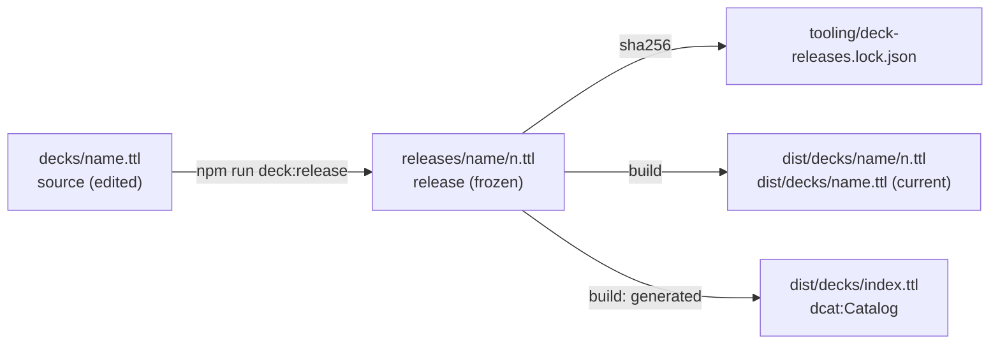
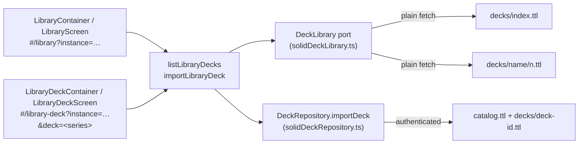

# Deck library

Ready-made decks that any user can copy into their own instance. The
library is part of the site — static Turtle files published next to the
app — not part of anyone's pod. It is described with
[DCAT](https://www.w3.org/TR/vocab-dcat-3/) and conforms to
[DCAT-AP](validation.md#profiles-dcat-ap-and-skos): the library is a
`dcat:Catalog`, each deck a `dcat:DatasetSeries` of its releases, each
release a `dcat:Dataset` with a Turtle `dcat:Distribution`.


```mermaid
flowchart LR
    src["decks/name.ttl<br/>source (edited)"] -->|npm run deck:release| rel["releases/name/n.ttl<br/>release (frozen)"]
    rel -->|sha256| lock["tooling/deck-releases.lock.json"]
    rel -->|build| dist["dist/decks/name/n.ttl<br/>dist/decks/name.ttl (current)"]
    rel -->|build: generated| idx["dist/decks/index.ttl<br/>dcat:Catalog"]
```

## Authoring a deck

A deck's source is a Turtle file in [`decks/`](../decks/): one `sm:Deck`
(also a `dcat:Dataset`) with its cards as hash-fragment subjects, in deck
format 3 ([shapes.md](shapes.md)), without anything that makes it a
release:

```turtle
@base <https://solid-memo.com/decks/capitals-of-the-world> .

@prefix solid-memo: <https://solid-memo.com/vocab/v1#> .
@prefix dcterms:    <http://purl.org/dc/terms/> .
@prefix dcat:       <http://www.w3.org/ns/dcat#> .
@prefix foaf:       <http://xmlns.com/foaf/0.1/> .
@prefix prov:       <http://www.w3.org/ns/prov#> .
@prefix topic:      <https://solid-memo.com/vocab/topics#> .

<>
    a solid-memo:Deck ,
      dcat:Dataset ;
    dcterms:title "Capitals of the world" ;
    dcterms:description "Every country and its capital city. …" ;
    dcterms:creator <#anton-wiklund> ;
    dcterms:license <https://creativecommons.org/publicdomain/zero/1.0/> ;
    prov:wasDerivedFrom <https://en.wikipedia.org/wiki/List_of_national_capitals> ;
    dcat:theme <http://publications.europa.eu/resource/authority/data-theme/EDUC> ,
               topic:geography ;
    dcat:keyword "capitals" ,
                 "countries" ;
    dcterms:language <http://publications.europa.eu/resource/authority/language/ENG> ;
    solid-memo:studyDirection solid-memo:bidirectional ;
    solid-memo:formatVersion 3 .

<#anton-wiklund>
    a foaf:Agent ;
    foaf:name "Anton Wiklund" ;
    foaf:mbox <mailto:anton@example.com> .

<https://creativecommons.org/publicdomain/zero/1.0/>
    a dcterms:LicenseDocument .

<https://en.wikipedia.org/wiki/List_of_national_capitals>
    dcterms:title "List of national capitals" ;
    dcterms:creator "Wikipedia contributors" ;
    dcterms:license <https://creativecommons.org/licenses/by-sa/4.0/> .

<#sweden>
    a solid-memo:Card ;
    solid-memo:front "Sweden" ;
    solid-memo:back "Stockholm" ;
    solid-memo:formatVersion 1 .
```

- **Required:** `dcterms:title`, `dcterms:description` (DCAT-AP asks one
  of every dataset; it is shown, URLs linked, on the deck's page),
  `solid-memo:studyDirection` (a concept of `sm:StudyDirections`) and the
  EU data theme `EDUC` among the `dcat:theme`s.
- **Topics** are further `dcat:theme`s from
  [Solid Memo's topics](../vocab/topics.ttl) (`topic:geography`,
  `topic:swedish`, …): the library can be filtered by them. **Keywords**
  (`dcat:keyword`) are found by its search. **Languages** are EU
  authority-table IRIs described in [vocab/external.ttl](../vocab/external.ttl)
  (add one there before a deck uses it).
- **Creators** are `foaf:Agent` nodes of the document with a
  `foaf:name` (and optionally a `mailto:` `foaf:mbox`), shown as
  "Name", linked `mailto:`. **Licences** are IRIs, typed
  `dcterms:LicenseDocument` in the document.
- **Sources** the deck was compiled from are `prov:wasDerivedFrom`
  IRIs, each described as a subject of its own (`dcterms:title`, its own
  `dcterms:creator` literals and `dcterms:license`). The source's authors
  and licence belong there, never on the deck, whose creator is whoever
  compiled it. (`dcterms:source` is not used: DCAT keeps it for datasets.)
- **Cards** are `sm:Card` subjects with their own `sm:formatVersion` and
  text (`sm:front` / `sm:back`), a picture (`sm:frontImage` /
  `sm:backImage`, always an IRI — the [world flags deck](../decks/world-flags.ttl)
  shows the flag alone on the front) or both on each side.
- `dcterms:created` and `dcterms:modified` are optional; bump
  `dcterms:modified` when the content changes.
- The file name is the deck's name, `decks/<name>.ttl`: lower-case
  letters, digits and dashes. The Swedish decks are generated by
  [scripts/generate_decks_for_swedish_learning.py](../scripts/generate_decks_for_swedish_learning.py).

Every hand-written Turtle file in the repository — `decks/`, `shapes/`,
`vocab/` and `tooling/fixtures/` — follows one layout: `@base` first,
prefixes aligned in a block, each subject on a line of its own, one
predicate per line indented four spaces, further objects aligned under
the first, a blank line between subjects, lists and blank nodes inline.
`npm run format:turtle` ([tooling/formatTurtle.ts](../tooling/formatTurtle.ts))
rewrites the files that way and `npm run format:turtle:check` (run by CI
and by the test suite) fails on any that differ. Comment blocks are kept
before the subject they precede. `releases/` (frozen) and `vendor/` (not
ours) are never reformatted.

## Releasing a deck

A source is not published as it is: what users import is a **release**,
which never changes once made.

```sh
npm run deck:release -- capitals-of-the-world --notes "Added Kosovo."
```

[tooling/deckRelease.ts](../tooling/deckRelease.ts) takes
`decks/<name>.ttl` and writes `releases/<name>/<n>.ttl`, the next
version:

- the source re-based onto the release's own IRI,
  `https://solid-memo.com/decks/<name>/<n>.ttl`, so `<>` is the release
  and `<#sweden>`, `<#anton-wiklund>` its cards and agents — fragment ids
  are the same in every release, which is what lets a copy be upgraded
  card by card;
- with what makes it a release on the deck: `dcat:version "<n>"`,
  `dcterms:issued` (now), `adms:versionNotes` (the notes),
  `dcterms:publisher` (Solid Memo, described in the index),
  `dcat:inSeries` and `dcat:isVersionOf` its series (`index.ttl#<name>`),
  `dcat:prev` and `dcat:previousVersion` the release before, and its
  `dcat:distribution <#turtle>` (a `dcat:Distribution` whose
  `dcat:accessURL` and `dcat:downloadURL` are the file itself, media type
  `text/turtle`). A source that states any of these itself is refused.

The release is validated with the whole library (below) before it is
written; a source that has not changed since its last release is
refused. Its sha256 is appended to
[tooling/deck-releases.lock.json](../tooling/deck-releases.lock.json).
Commit both. **A release is never edited, renumbered or removed**: the
build fails if one differs from the lockfile, is missing from it, or a
deck's versions have a gap.

## Publishing

[tooling/deckLibrary.ts](../tooling/deckLibrary.ts) is a Vite plugin
registered in [vite.config.ts](../vite.config.ts). It reads the
releases and the lockfile, builds the index, validates everything, and
publishes under `decks/` — served on request by the dev server, emitted
into `dist/decks/` by the build:

| Path | What |
|---|---|
| `decks/<name>/<n>.ttl` | Every release, byte for byte. |
| `decks/<name>.ttl` | A copy of the deck's current release, at the address decks had before releases, so copies imported then still resolve. |
| `decks/index.ttl` | The generated catalogue. |

The **index** is a `dcat:Catalog` (title, description, publisher
`<#solid-memo>`, the EU data themes and the topics as its theme
taxonomies, `dcat:dataset` per deck). Each deck is its series,
`<#<name>>`, a `dcat:DatasetSeries` and `dcat:Dataset` with the current
release's title, description, themes and keywords, `dcat:first`,
`dcat:last`, `dcat:hasVersion` (every release) and
`dcat:hasCurrentVersion`. Every release is described — the current one
in full, everything but its cards, plus `sm:cardCount`; older ones with
their title, description, version, issue time and notes — so the app
lists the library from this one document. IRIs under the library are
written relative to the index, so the library works wherever the site
is hosted.

**Validation**, which fails the build and the release command alike:

- every release against Solid Memo's shapes (`LibraryDeckV3`, the cards,
  the agents, the distribution) and against DCAT-AP, with the index and
  the [reference data](validation.md#profiles-dcat-ap-and-skos) beside
  it;
- what the shapes cannot say: a release is exactly one `sm:Deck`, the
  document itself, whose `dcat:version` and series are the ones its path
  says;
- the index against the shapes (`CatalogV1`, `LibraryDeckSeriesV1`,
  `LibraryDeckV3` for the current releases) and DCAT-AP;
- each source as its next release would be, so a broken source fails
  before anyone releases it. A source with changes not released yet, or
  never released, is only a **warning** (on the dev server and in the
  build log): releasing is a deliberate act.

A test checks the repository's library is valid and released as it is.
`n3` does the build-time parsing; it is confined to `tooling/`.

## In the app


```mermaid
flowchart LR
    ui["LibraryContainer / LibraryScreen<br/>#/library?instance=…"] --> uc["listLibraryDecks<br/>importLibraryDeck"]
    page["LibraryDeckContainer / LibraryDeckScreen<br/>#/library-deck?instance=…&deck=&lt;series&gt;"] --> uc
    uc --> lib["DeckLibrary port<br/>(solidDeckLibrary.ts)"]
    uc --> repo["DeckRepository.importDeck<br/>(solidDeckRepository.ts)"]
    lib -->|plain fetch| idx["decks/index.ttl"]
    lib -->|plain fetch| doc["decks/name/n.ttl"]
    repo -->|authenticated| pod["catalog.ttl + decks/deck-id.ttl"]
```

- `toLibraryDecks` ([libraryMapper.ts](../src/infrastructure/solid/mappers/libraryMapper.ts))
  reads the catalogue's datasets, each series' current release (through
  the `LibraryDeckSeriesV1` and `LibraryDeckV3` shapes) and its releases,
  and names creators from the agents in the index. A series or release
  that does not fit its shape is left out.
- The library screen lists each deck's name and card count with a
  checkbox, filtered by **topic** (checkboxes of the topics the decks
  name, a broader topic finding the narrower: "Languages" finds the
  Swedish decks) and by a **search** of names, descriptions and keywords
  (`filterLibraryDecks` in [domain/library.ts](../src/domain/library.ts)).
  Clicking a row opens the deck's page: description, topics, keywords,
  the release (version, date, notes), authors, licence, dates and
  sources, an import button and "Browse cards" (a read-only, paged list
  fetched from the release document).
- A deck's page is addressed by its **series** (`&deck=…/index.ttl#name`),
  which outlives releases; an address of one of its releases still finds
  it. A deck the library does not have falls back to the library
  ([routing.md](routing.md)).
- `importDeck` copies the current release into the instance with **one
  write of the cards document** (all 243 cards of the capitals deck in a
  single PUT), then one write of the catalog, and carries over the
  description, authors (as agents), licence, topics, keywords and
  direction. The copy says which release it came from with
  `prov:wasDerivedFrom <…/decks/name/n.ttl>` (`Deck.sourceUrl`). Cards
  keep their library fragment ids (`#sweden`).
- A pod deck is a copy of a library deck when its source is any release
  of the deck's series — or, for a deck imported before releases, the
  deck's old address (`isCopyOf`); the library marks such decks
  "Already imported". A second copy is still allowed.
- The copy is written in this app's own format, whatever the release
  said. A release or card in a *newer* format than the app writes is
  refused at import rather than silently stripped.
- Several decks can be ticked and imported at once, one at a time; a
  failure part-way leaves the earlier ones imported and reports the error.
- When the library publishes a newer release of an imported deck, the
  deck's page offers to update the copy card by card, keeping what the
  user changed and their review history
  ([migrations.md](migrations.md#catching-up-with-the-library)).
