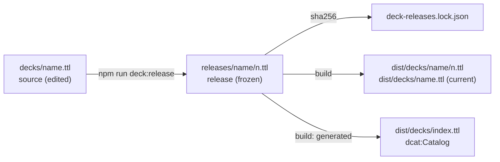
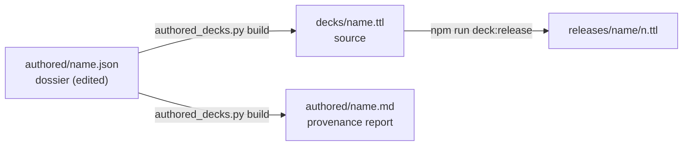
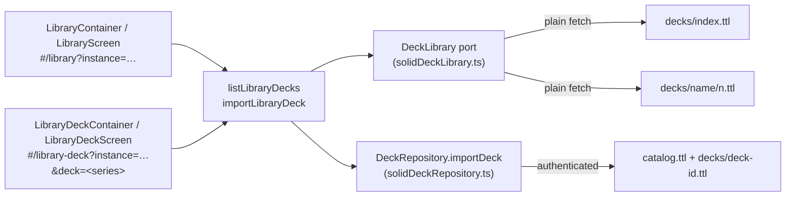

# Deck library

Ready-made decks that any user can copy into their own instance. The
library is part of the site — static Turtle files published next to the
app — not part of anyone's pod. It is described with
[DCAT](https://www.w3.org/TR/vocab-dcat-3/) and conforms to
[DCAT-AP](validation.md#profiles-dcat-ap-and-skos): the library is a
`dcat:Catalog`, each deck a `dcat:DatasetSeries` of its releases, each
release a `dcat:Dataset` with a Turtle `dcat:Distribution`.


```mermaid
flowchart LR
    src["decks/name.ttl<br/>source (edited)"] -->|npm run deck:release| rel["releases/name/n.ttl<br/>release (frozen)"]
    rel -->|sha256| lock["deck-releases.lock.json"]
    rel -->|build| dist["dist/decks/name/n.ttl<br/>dist/decks/name.ttl (current)"]
    rel -->|build: generated| idx["dist/decks/index.ttl<br/>dcat:Catalog"]
```

## Authoring a deck

A deck's source is a Turtle file in [`packages/deck-library/decks/`](../packages/deck-library/decks/): one `sm:Deck`
(also a `dcat:Dataset`) with its cards as hash-fragment subjects, in
library deck format 5 ([shapes.md](shapes.md)), without anything that
makes it a release. Its title and description are language-tagged, one per language
and one of them English; the others are translations. Sources in format
3 and 4 stay valid. A pod's own decks need no English since deck format
5, but the library's titles and descriptions still do (`LibraryDeckV4`
and `LibraryDeckV5`): English first is the library's curation policy,
so every library deck can be read by anyone who reads English, not a
rule of the data. Keywords are language-tagged, several per language,
and every keyword says its language: give each deck keywords in English
and in Swedish, the app showing the reader's only (a word shared by
both, such as "HTTP", is stated in each). Write
each text in the language it is in, with `zxx` for text in no language
(codes, numbers, symbols), and never the same words under English as a
stand-in for another language.

```turtle
@base <https://solid-memo.com/decks/capitals-of-the-world> .

@prefix solid-memo: <https://solid-memo.com/vocab/v1#> .
@prefix dcterms:    <http://purl.org/dc/terms/> .
@prefix dcat:       <http://www.w3.org/ns/dcat#> .
@prefix foaf:       <http://xmlns.com/foaf/0.1/> .
@prefix prov:       <http://www.w3.org/ns/prov#> .
@prefix topic:      <https://solid-memo.com/vocab/topics#> .

<>
    a solid-memo:Deck ,
      dcat:Dataset ;
    dcterms:title "Capitals of the world"@en ,
                  "Världens huvudstäder"@sv ;
    dcterms:description "Every country and its capital city. …"@en ;
    dcterms:creator <#anton-wiklund> ;
    dcterms:license <https://creativecommons.org/publicdomain/zero/1.0/> ;
    prov:wasDerivedFrom <https://en.wikipedia.org/wiki/List_of_national_capitals> ;
    dcat:theme <http://publications.europa.eu/resource/authority/data-theme/EDUC> ,
               topic:geography ;
    dcat:keyword "capitals"@en ,
                 "countries"@en ,
                 "huvudstäder"@sv ,
                 "länder"@sv ;
    dcterms:language <http://publications.europa.eu/resource/authority/language/ENG> ;
    solid-memo:studyDirection solid-memo:bidirectional ;
    solid-memo:formatVersion 5 .

<#anton-wiklund>
    a foaf:Agent ;
    foaf:name "Anton Wiklund" ;
    foaf:mbox <mailto:anton@example.com> .

<https://creativecommons.org/publicdomain/zero/1.0/>
    a dcterms:LicenseDocument .

<https://en.wikipedia.org/wiki/List_of_national_capitals>
    dcterms:title "List of national capitals" ;
    dcterms:creator "Wikipedia contributors" ;
    dcterms:license <https://creativecommons.org/licenses/by-sa/4.0/> .

<#sweden>
    a solid-memo:Card ;
    solid-memo:front "Sweden" ;
    solid-memo:back "Stockholm" ;
    solid-memo:formatVersion 1 .
```

- **Required:** `dcterms:title`, `dcterms:description` (DCAT-AP asks one
  of every dataset; it is shown, URLs linked, on the deck's page),
  `solid-memo:studyDirection` (a concept of `sm:StudyDirections`) and the
  EU data theme `EDUC` among the `dcat:theme`s.
- **Topics** are further `dcat:theme`s from
  [Solid Memo's topics](../packages/vocab/vocab/topics.ttl) (`topic:geography`,
  `topic:swedish`, …): the library can be filtered by them. **Keywords**
  (`dcat:keyword`) are shown in the reader's language and found by its
  search in any language. **Languages** are EU
  authority-table IRIs described in [packages/vocab/vocab/external.ttl](../packages/vocab/vocab/external.ttl)
  (add one there before a deck uses it).
- **Creators** are `foaf:Agent` nodes of the document with a
  `foaf:name` (and optionally a `mailto:` `foaf:mbox`), shown as
  "Name", linked `mailto:`. **Licences** are IRIs, typed
  `dcterms:LicenseDocument` in the document.
- **Sources** the deck was compiled from are `prov:wasDerivedFrom`
  IRIs, each described as a subject of its own (`dcterms:title`, its own
  `dcterms:creator` literals and `dcterms:license`). The source's authors
  and licence belong there, never on the deck, whose creator is whoever
  compiled it. (`dcterms:source` is not used: DCAT keeps it for datasets.)
- **Cards** are `sm:Card` subjects with their own `sm:formatVersion` and
  text (`sm:front` / `sm:back`), a picture (`sm:frontImage` /
  `sm:backImage`, always an IRI — the [world flags deck](../packages/deck-library/decks/world-flags.ttl)
  shows the flag alone on the front) or both on each side. From card
  format 4 a side's text may be tagged with its language, one text per
  language: the [famous paintings deck](../packages/deck-library/decks/famous-paintings.ttl)
  tags its backs `@en`. Untagged text means the language is not known:
  tag a new card's sides, as the app does for every card a user writes.
  A card's notes and label are tagged too; the library's cards are in
  card format 4, which asks for one of them in English.
- **A released card is never removed, but retired**: to stop using a
  card, keep it and add `owl:deprecated true` (card format 3). Copies of
  the deck keep it and its review history, but no longer study it, and
  the app lists it only under "Show retired cards"; a later release can
  bring it back by leaving the flag out. The build refuses a release that
  drops a card of the release before it. `sm:cardCount` in the index
  counts the cards in use.
- `dcterms:created` and `dcterms:modified` are optional; bump
  `dcterms:modified` when the content changes.
- The file name is the deck's name, `decks/<name>.ttl`: lower-case
  letters, digits and dashes. The Swedish decks are generated by
  [scripts/generate_decks_for_swedish_learning.py](../packages/deck-library/scripts/generate_decks_for_swedish_learning.py),
  the network ports deck by
  [scripts/generate_deck_of_network_ports.py](../packages/deck-library/scripts/generate_deck_of_network_ports.py),
  the famous paintings deck, whose pictures are public-domain
  thumbnails linked from Wikimedia Commons, by
  [scripts/generate_deck_of_famous_paintings.py](../packages/deck-library/scripts/generate_deck_of_famous_paintings.py)
  and the Swedish labour market taxonomy deck of new and changed
  occupation names, from the labour market taxonomy of
  Arbetsförmedlingen (the Swedish Public Employment Service), by
  [scripts/generate_deck_of_swedish_labour_market_taxonomy_occupation_names.py](../packages/deck-library/scripts/generate_deck_of_swedish_labour_market_taxonomy_occupation_names.py).
  That deck has one card per name: every name that went out of use since
  the taxonomy's first version (with what replaced it), and every name
  that is new since then (with what it replaces). The note under the
  front gives the verdict, "In use" or "Out of use", once the answer is
  revealed; the back's label says how the answer relates ("Replaced
  by"), and its note says when. It grows by one release per taxonomy
  version: commit the script, re-run it, and release with the `npm run
  deck:release` command it prints, whose notes it writes by comparing
  with the previous release — how many names are new, how many changed
  and how, and which cards were retired or brought back. Cards are added
  or changed, and retired (never removed) when no rule makes them any
  more, so copies keep their reviews when they are upgraded. The deck is
  reproducible byte for byte: it records the script's commit and SHA-256,
  the command line, and a SHA-256 of every taxonomy version it read, and
  the script refuses to run from uncommitted code (unless
  `--allow-uncommitted`, for drafts) or to overwrite a deck whose taxonomy
  versions no longer match their checksums.

  **The weekly update.**
  [.github/workflows/taxonomy-deck.yml](../.github/workflows/taxonomy-deck.yml)
  runs every Monday (and on demand). The generator's `--check` asks the
  taxonomy for its newest version (one small request) and compares it
  with the newest one the deck's latest release covers. When there is a
  newer one, the workflow regenerates the deck at the commit it runs on,
  releases it with the notes the generator writes (`--notes-file`), runs
  the full check itself (`npm run check`, the build and the pySHACL
  cross-check: a pull request opened with the workflow's own token
  starts no other workflow), and opens a pull request from
  `deck/taxonomy-update`, or updates the open one. Merging it publishes
  the release. A failure (a published taxonomy version that changed, a
  taxonomy not as the script expects, a release that would not be valid)
  opens an issue, or comments on the open one. It runs Python 3.14, the
  version the deck records: card ids are slugs, which depend on the
  Unicode version, so regenerate by hand with 3.14 too. Until the deck's
  first release, made by hand, it does nothing. The repository must
  allow GitHub Actions to create pull requests (Settings → Actions →
  General → Workflow permissions).

### Authored decks

Most of the library is researched card by card rather than generated
from one dataset. Such a deck is written as a **dossier**,
[`packages/deck-library/authored/<name>.json`](../packages/deck-library/authored/),
which holds everything known about how it was made, and
[scripts/authored_decks.py](../packages/deck-library/scripts/authored_decks.py)
(its docstring defines the format) builds the deck from it:


```mermaid
flowchart LR
    dossier["authored/name.json<br/>dossier (edited)"] -->|authored_decks.py build| deck["decks/name.ttl<br/>source"]
    dossier -->|authored_decks.py build| report["authored/name.md<br/>provenance report"]
    deck -->|npm run deck:release| rel["releases/name/n.ttl"]
```

- **What a dossier records:** the deck's metadata; every source with
  its licence, the licence's evidence (its terms page, quoted), its role
  and when it was retrieved; the method, step by step; the selection
  criteria; every query and command run, verbatim; why the deck's licence
  complies; the quality-control rounds, each finding with its resolution;
  and every card with its **evidence** — at least two distinct sources,
  one of them a content source, each with where it says what — and
  optional **Wikidata checks** (a label, or a statement's value).
- **Licences.** A source is either **content** (information in the
  cards, including which items were picked, came from it) or
  **verification** (consulted to confirm facts, nothing taken). Content
  may only come from sources whose licence allows it: CC0 and public
  domain freely, CC BY makes the deck CC BY 4.0, CC BY-SA makes it
  CC BY-SA 4.0; anything else (all rights reserved, non-commercial, GPL
  documentation) can only verify. The script refuses a dossier that
  breaks this. Content sources are the deck's `prov:wasDerivedFrom`, with
  their creators and licences; every source is `prov:used` by the deck's
  `<#compilation>` activity, whose `rdfs:seeAlso` is the report.
- **Checks.** `authored_decks.py check <name>` (and `build`) validates the
  dossier (fields, languages per side, one answer per front and per back
  of a bidirectional deck, evidence, licences) and re-runs its Wikidata
  checks against live Wikidata, so a later edit there that contradicts a
  card is caught before the next release. `node
  packages/deck-library/scripts/validate_sources.ts <name>` validates the
  built deck with the library's shapes and DCAT-AP, as its next release.
  CI runs `authored_decks.py sync --all`, which fails when a deck or
  report differs from what its dossier builds to: edit the dossier,
  rebuild, never the outputs. The build is offline and clock-free.
- **Languages.** Every text in a dossier states its language: `zxx` for
  text in no language (numbers, years, codes, formulas, commands), `la`
  for scientific names, and names in each language they are written in
  (`"Henry VIII"@en`, `"Henrik VIII"@sv`). The first authored decks wrote
  language-neutral text untagged (`""`), which the builder still reads;
  a new dossier does not. Keywords are listed per language,
  `{"en": [...], "sv": [...]}`, and built as library deck format 5.
- **The provenance report**, `authored/<name>.md`, is generated: sources
  and licences, licence evidence, method, selection, queries, every
  quality-control round, and a table of every card with its evidence.
  The deck's description links to it.
- **How the first authored decks were made** (2026-10-04): research
  agents (Claude, Anthropic) at the maintainer's direction each wrote
  one dossier from its sources; three independent reviewer agents per
  deck then checked every card for facts, for language and translation,
  and for licensing, attribution and documentation; a fixer verified
  each finding, applied or rejected it, and logged it as a round in the
  dossier; and fresh reviewers re-checked the changed cards and a third
  of the rest until no errors remained. Each report says so. The second
  twenty were made the same way the same day; in both, a fresh reviewer
  finally checked every card, and the maintainer reviews every deck in
  full before it is released. A correction is a change to the dossier,
  logged as a new quality-control round, and a new release.

Every hand-written Turtle file in the repository — `packages/deck-library/decks/`, `packages/vocab/shapes/`,
`packages/vocab/vocab/` and `packages/vocab/fixtures/` — follows one layout: `@base` first,
prefixes aligned in a block, each subject on a line of its own, one
predicate per line indented four spaces, further objects aligned under
the first, a blank line between subjects, lists and blank nodes inline.
`npm run format:turtle` ([packages/turtle/src/formatTurtle.ts](../packages/turtle/src/formatTurtle.ts))
rewrites the files that way and `npm run format:turtle:check` (run by CI
and by the test suite) fails on any that differ. Comment blocks are kept
before the subject they precede. `packages/deck-library/releases/` (frozen) and `packages/vocab/vendor/` (not
ours) are never reformatted.

## Releasing a deck

A source is not published as it is: what users import is a **release**,
which never changes once made.

```sh
npm run deck:release -- capitals-of-the-world --notes "Added Kosovo."
```

[packages/deck-library/src/deckRelease.ts](../packages/deck-library/src/deckRelease.ts) takes
`decks/<name>.ttl` and writes `releases/<name>/<n>.ttl`, the next
version:

- the source re-based onto the release's own IRI,
  `https://solid-memo.com/decks/<name>/<n>.ttl`, so `<>` is the release
  and `<#sweden>`, `<#anton-wiklund>` its cards and agents — fragment ids
  are the same in every release, which is what lets a copy be upgraded
  card by card;
- with what makes it a release on the deck: `dcat:version "<n>"`,
  `dcterms:issued` (now), `adms:versionNotes` (the notes),
  `dcterms:publisher` (Solid Memo, described in the index),
  `dcat:inSeries` and `dcat:isVersionOf` its series (`index.ttl#<name>`),
  `dcat:prev` and `dcat:previousVersion` the release before, and its
  `dcat:distribution <#turtle>` (a `dcat:Distribution` whose
  `dcat:accessURL` and `dcat:downloadURL` are the file itself, media type
  `text/turtle`). A source that states any of these itself is refused.

The release is validated with the whole library (below) before it is
written; a source that has not changed since its last release is
refused. Its sha256 is appended to
[deck-releases.lock.json](../packages/deck-library/deck-releases.lock.json).
Commit both. **A release is never edited, renumbered or removed**: the
build fails if one differs from the lockfile, is missing from it, or a
deck's versions have a gap.

## Publishing

[packages/deck-library/src/deckLibrary.ts](../packages/deck-library/src/deckLibrary.ts) is a Vite plugin
registered in [vite.config.ts](../apps/web/vite.config.ts). It reads the
releases and the lockfile, builds the index, validates everything, and
publishes under `packages/deck-library/decks/` — served on request by the dev server, emitted
into `dist/decks/` by the build:

| Path | What |
|---|---|
| `decks/<name>/<n>.ttl` | Every release, byte for byte. |
| `decks/<name>.ttl` | A copy of the deck's current release, at the address decks had before releases, so copies imported then still resolve. |
| `decks/index.ttl` | The generated catalogue. |

The **index** is a `dcat:Catalog` (title, description, publisher
`<#solid-memo>`, the EU data themes and the topics as its theme
taxonomies, `dcat:dataset` per deck, `ldp:inbox` when the build is given
`LIBRARY_INBOX_URL`: where the app sends word of likes and imports, and
`sm:libraryStats` when it is given `LIBRARY_STATS_URL`: where their counts
are published, [library-stats.md](library-stats.md)).
Each deck is its series,
`<#<name>>`, a `dcat:DatasetSeries` and `dcat:Dataset` with the current
release's title, description, themes and keywords (with their tags), `dcat:first`,
`dcat:last`, `dcat:hasVersion` (every release) and
`dcat:hasCurrentVersion`. Every release is described — the current one
in full, everything but its cards, plus `sm:cardCount`; older ones with
their title, description, version, issue time and notes — so the app
lists the library from this one document. IRIs under the library are
written relative to the index, so the library works wherever the site
is hosted.

**Validation**, which fails the build and the release command alike:

- every release against Solid Memo's shapes (`LibraryDeckV3`, `LibraryDeckV4` or `LibraryDeckV5`, the cards,
  the agents, the distribution) and against DCAT-AP, with the index and
  the [reference data](validation.md#profiles-dcat-ap-and-skos) beside
  it;
- what the shapes cannot say: a release is exactly one `sm:Deck`, the
  document itself, whose `dcat:version` and series are the ones its path
  says;
- the index against the shapes (`CatalogV1`, `LibraryDeckSeriesV3`,
  `LibraryDeckV3`, `LibraryDeckV4` or `LibraryDeckV5` for the current
  releases) and DCAT-AP.
  A series states the title and description of its current release in
  every language it has, a format-3 release's untagged text as English,
  and its keywords as the release has them (a format-4 release's
  untagged);
- each source as its next release would be, so a broken source fails
  before anyone releases it. A source with changes not released yet, or
  never released, is only a **warning** (on the dev server and in the
  build log): releasing is a deliberate act.

**Previews.** So a new or changed deck can be browsed, imported and
studied before it is frozen, the dev server (`npm run dev`) also
publishes each such source as its next release — in the index, at
`decks/<name>/<n>.ttl` and at `decks/<name>.ttl` — with the version notes
"Preview of decks/<name>.ttl, not released: shown by the dev server
only." The build never does: `dist/decks/` holds releases alone. A copy
imported from a preview says it came from a release that does not exist
yet, so import previews into a test instance only.

A test checks the repository's library is valid and released as it is.
`n3` does the build-time parsing, in the node-only packages ([boundaries.md](boundaries.md)).

## In the app


```mermaid
flowchart LR
    ui["LibraryContainer / LibraryScreen<br/>#/library?instance=…"] --> uc["listLibraryDecks<br/>importLibraryDeck"]
    page["LibraryDeckContainer / LibraryDeckScreen<br/>#/library-deck?instance=…&deck=&lt;series&gt;"] --> uc
    uc --> lib["DeckLibrary port<br/>(solidDeckLibrary.ts)"]
    uc --> repo["DeckRepository.importDeck<br/>(solidDeckRepository.ts)"]
    lib -->|plain fetch| idx["decks/index.ttl"]
    lib -->|plain fetch| doc["decks/name/n.ttl"]
    repo -->|authenticated| pod["catalog.ttl + decks/deck-id.ttl"]
```

- `toLibraryDecks` ([libraryMapper.ts](../packages/solid/src/mappers/libraryMapper.ts))
  reads the catalogue's datasets, each series' current release (through
  the `LibraryDeckSeriesV3` and `LibraryDeckV5` shapes, older formats
  migrated in memory) and its releases, showing the English title and
  description and keeping the other languages, which an import copies
  as they are (every tag, nothing guessed or added), and names creators
  from the agents in the index. An import writes the user's copy at the
  latest formats (deck format 6, card format 5), whatever format the
  release was frozen at: a release's keywords keep their tags, and a
  format-4 release's untagged keywords stay untagged, their language
  unknown. A series or release
  that does not fit its shape is left out.
- The library screen lists each deck's name and card count with a
  checkbox, filtered by **topic** (checkboxes of the topics the decks
  name, a broader topic finding the narrower: "Languages" finds the
  Swedish decks) and by a **search** of names, descriptions and keywords,
  in every language (`filterLibraryDecks` in [domain/library.ts](../packages/domain/src/library.ts)).
  Clicking a row opens the deck's page: description, topics, keywords
  in the reader's language,
  the release (version, date, notes), authors, licence, dates and
  sources, an import button and "Browse cards" (a read-only, paged list
  fetched from the release document).
- A deck's page is addressed by its **series** (`&deck=…/index.ttl#name`),
  which outlives releases; an address of one of its releases still finds
  it. A deck the library does not have falls back to the library
  ([routing.md](routing.md)).
- `importDeck` copies the current release into the instance with **one
  write of the cards document** (all 243 cards of the capitals deck in a
  single PUT), then one write of the catalog, and carries over the
  description, authors (as agents), licence, topics, keywords and
  direction. The copy says which release it came from with
  `prov:wasDerivedFrom <…/decks/name/n.ttl>` (`Deck.sourceUrl`). Cards
  keep their library fragment ids (`#sweden`).
- With the [statistics](library-stats.md), each row also says how many
  have imported and like the deck, and the list can be ordered by
  either. The deck's page shows both counts and a like toggle for users
  logged in with a pod.
- A pod deck is a copy of a library deck when its source is any release
  of the deck's series — or, for a deck imported before releases, the
  deck's old address (`isCopyOf`); the library marks such decks
  "Already imported". A second copy is still allowed.
- The copy is written in this app's own format, whatever the release
  said. A release or card in a *newer* format than the app writes is
  refused at import rather than silently stripped.
- Several decks can be ticked and imported at once, one at a time; a
  failure part-way leaves the earlier ones imported and reports the error.
- When the library publishes a newer release of an imported deck, the
  deck's page offers to update the copy card by card, keeping what the
  user changed and their review history
  ([migrations.md](migrations.md#catching-up-with-the-library)).
