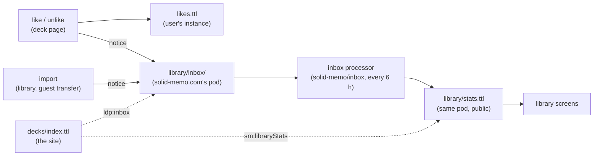

# Library likes and downloads

The deck library shows how many people like each deck and how many have
imported it, and can be listed in order of either. The site is static
files ([deployment.md](deployment.md)) and counts nothing itself: the
app sends word of each like, unlike and import to the library's inbox
on solid-memo.com's pod, the **inbox processor** (the separate
`solid-memo/inbox` repository) counts it, and publishes the totals in a
statistics document on the same pod. The library's index names both.



Everything is said in standard vocabularies: likes, unlikes and imports
are [ActivityStreams 2.0](https://www.w3.org/TR/activitystreams-vocabulary/)
activities (`as:Like`, `as:Undo`, `as:Add`), the inbox is a
[Linked Data Notifications](https://www.w3.org/TR/ldn/) inbox
(`ldp:inbox`), and the counts are schema.org interaction counters. The
only Solid Memo terms are `sm:announced` and `sm:libraryStats`, which
nothing standard says, and `sm:formatVersion`, which every shape asks of
its subjects ([shapes.md](shapes.md)).

## In the user's pod

A like is kept in the instance's `likes.ttl`, one `as:Like` per deck,
`#like-<name>` ([data-model.md](data-model.md#instance-layout)): the
deck's series in the library's index (`as:object`), when
(`as:published`), and whether the library has been told
(`sm:announced`). It names no actor: the pod is the user's.
The document is private like the rest of the instance. It is written
whole, with `If-Match`, because node-solid-server keeps a boolean as 1
or 0 and a PATCH deleting `"false"^^xsd:boolean` finds nothing there.

- **Liking** keeps the like first, then tells the library. A like the
  library could not be told of stays `sm:announced false`, and
  `announceLibraryLikes` tells it the next time the library is opened.
- **Unliking** tells the library first and removes the like only once
  it has. A failure shows an error and leaves the like as it was, so the
  library never goes on counting a like the user took back.
- **Guests** cannot like: they have no WebID to like as. Their imports
  are counted when their study moves into a real pod
  ([guest-mode.md](guest-mode.md)).

## Notices

The app sends a notice for each like, unlike and import, as the
logged-in user (authenticated fetch), with a POST of a Turtle document
to the inbox the index's catalogue names (`ldp:inbox`). Any Solid login
may append to the inbox; no sender can read or list it. A like is an
`as:Like` with its `as:actor`, `as:object` (the deck's series, which
stays the same from release to release) and `as:published`; an import
an `as:Add` of the deck, its `as:target` (the user's pod) left out; an
unlike an `as:Undo` of the like it takes back, a second subject of the
same document:

```turtle
<#notice>
    a as:Undo ;
    solid-memo:formatVersion 1 ;
    as:actor <https://alice.example/profile/card#me> ;
    as:object <#like> ;
    as:published "2026-10-05T10:00:00.000Z"^^xsd:dateTime .

<#like>
    a as:Like ;
    solid-memo:formatVersion 1 ;
    as:actor <https://alice.example/profile/card#me> ;
    as:object <https://solid-memo.com/decks/index.ttl#world-flags> .
```

The shapes are `like-activity`, `undo-activity` and `add-activity`
([shapes.md](shapes.md)), each with `sm:formatVersion 1`. An import's
notice is sent in the background, and so are those of a guest's imports
when their study moves into a real pod: the import or the move never
waits for it or fails with it. When the index names no inbox, no notice
is sent.

## Counting

The inbox processor, in the `solid-memo/inbox` repository, does the
counting; nothing in this repository does. It runs every six hours in
GitHub Actions, logged in as the library's WebID
(`https://pod.solid-memo.com/library/profile/card#me`), reads the
inbox, and keeps what it has counted on the library's pod. It drops a
notice that does not fit its shape, names a deck that is not in the
live index, or comes from an actor whose profile cannot be read (so an
actor must be an https WebID with a public profile), and keeps any
notice no handler accepts. Its records and how it counts are its own;
what this app depends on is the notices above and the document below.

The counts are approximate. Anyone with a Solid login can send a notice
naming any https WebID whose profile exists.

## Published statistics

The processor publishes the totals in a public Turtle document (readable
cross-origin) that the index's catalogue names with `sm:libraryStats`,
next to its `ldp:inbox`. Each deck series, named absolutely as in the
live index, has a `schema:interactionStatistic`: a
`schema:InteractionCounter` of `schema:LikeAction` and one of
`schema:DownloadAction`, at fragments `#<name>-likes` and
`#<name>-downloads`. A deck the document leaves out has neither:

```turtle
<> dcterms:modified "2026-10-05T06:00:00.000Z"^^xsd:dateTime .

<https://solid-memo.com/decks/index.ttl#world-flags>
    schema:interactionStatistic <#world-flags-likes> ,
                                <#world-flags-downloads> .

<#world-flags-likes>
    a schema:InteractionCounter ;
    schema:interactionType schema:LikeAction ;
    schema:userInteractionCount 2 .

<#world-flags-downloads>
    a schema:InteractionCounter ;
    schema:interactionType schema:DownloadAction ;
    schema:userInteractionCount 7 .
```

`DeckLibrary.libraryStats` reads the index, then the document it names.
When the index names none, or the document is missing or cannot be
read, the library shows no counts and no order to choose, and works as
before. Because the decks are named absolutely, the counts match only
the index at `https://solid-memo.com/decks/index.ttl`: a dev server's
index names its decks under its own address and finds none. The library
screen shows "7 downloads · 2 likes" under each deck and an order
(library, most downloaded, most liked). The deck page shows both counts
"as of" when they were counted, plus a like toggle.

## Setting it up

The library's pod, its inbox (`acl:Append` for `acl:AuthenticatedAgent`,
nothing for the public) and the statistics document are set up with the
inbox processor, in its repository. Here, the build names them in the
index from two variables of the GitHub repository, which the deploy
workflow passes to `npm run build`:

| Variable | Value |
|---|---|
| `LIBRARY_INBOX_URL` | `https://pod.solid-memo.com/library/inbox/` |
| `LIBRARY_STATS_URL` | `https://pod.solid-memo.com/library/stats.ttl` |

They are plain variables, not secrets: the site holds no pod
credentials. Each works alone. Without `LIBRARY_INBOX_URL`, the index
names no inbox and the app sends no notices; without
`LIBRARY_STATS_URL`, it names no statistics and the app shows no counts.
