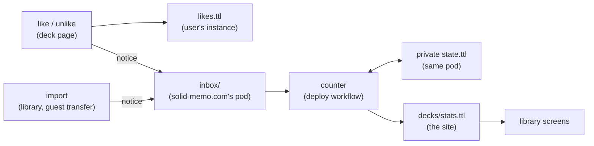

# Library likes and downloads

The deck library shows how many people like each deck and how many have
imported it, and can be listed in order of either. The site is static
files ([deployment.md](deployment.md)), so the counts are kept on a pod
of solid-memo.com's own and published beside the library's index each
time the site is deployed.



Everything is said in standard vocabularies: likes, unlikes and imports
are [ActivityStreams 2.0](https://www.w3.org/TR/activitystreams-vocabulary/)
activities (`as:Like`, `as:Undo`, `as:Add`), the inbox is a
[Linked Data Notifications](https://www.w3.org/TR/ldn/) inbox
(`ldp:inbox`), and the counts are schema.org interaction counters. The
only Solid Memo terms are `sm:announced`, which nothing standard says,
and `sm:formatVersion`, which every shape asks of its subjects
([shapes.md](shapes.md)).

## In the user's pod

A like is kept in the instance's `likes.ttl`, one `as:Like` per deck,
`#like-<name>` ([data-model.md](data-model.md#instance-layout)): the
deck's series in the library's index (`as:object`), when
(`as:published`), and whether the library has been told
(`sm:announced`). It names no actor: the pod is the user's.
The document is private like the rest of the instance. It is written
whole, with `If-Match`, because node-solid-server keeps a boolean as 1
or 0 and a PATCH deleting `"false"^^xsd:boolean` finds nothing there.

- **Liking** keeps the like first, then tells the library. A like the
  library could not be told of stays `sm:announced false`, and
  `announceLibraryLikes` tells it the next time the library is opened.
- **Unliking** tells the library first and removes the like only once
  it has. A failure shows an error and leaves the like as it was, so the
  library never goes on counting a like the user took back.
- **Guests** cannot like: they have no WebID to like as. Their imports
  are counted when their study moves into a real pod
  ([guest-mode.md](guest-mode.md)).

## Notices

The app sends a notice for each like, unlike and import, as the
logged-in user (authenticated fetch), with a POST of a Turtle document
to the inbox the index's catalogue names (`ldp:inbox`). A like is an
`as:Like` with its `as:actor`, `as:object` (the deck's series, which
stays the same from release to release) and `as:published`; an import
an `as:Add` of the deck, its `as:target` (the user's pod) left out; an
unlike an `as:Undo` of the like it takes back, a second subject of the
same document:

```turtle
<#notice>
    a as:Undo ;
    solid-memo:formatVersion 1 ;
    as:actor <https://alice.example/profile/card#me> ;
    as:object <#like> ;
    as:published "2026-10-05T10:00:00.000Z"^^xsd:dateTime .

<#like>
    a as:Like ;
    solid-memo:formatVersion 1 ;
    as:actor <https://alice.example/profile/card#me> ;
    as:object <https://solid-memo.com/decks/index.ttl#world-flags> .
```

The shapes are `like-activity`, `undo-activity` and `add-activity`
([shapes.md](shapes.md)). An import's notice is sent in the
background: the import never waits for it or fails with it. When the
index names no inbox, no notice is sent.

## Counting

`countLibraryNotices` ([libraryCounter.ts](../packages/application/src/libraryCounter.ts))
runs in the deploy workflow as `npm run count -w @solid-memo/library-stats -- <stats.ttl>`:

1. Read the tally kept from earlier runs; everyone in it was found to
   have a WebID when first counted.
2. Read every notice in the inbox. Leave out those that are no notice,
   are about a deck that is not in this library's index, or are not from
   an https WebID whose profile can be read (asked once per person).
3. Count the notices into the tally (`tallyNotices` in
   [libraryStats.ts](../packages/domain/src/libraryStats.ts)): a person
   counts once per deck however often they import it, and their latest
   like or unlike wins, whatever order the notices come in.
4. Save the tally, then delete every notice read. A run cut short
   counts the notices left again next time, which changes nothing.
5. Write `decks/stats.ttl`.

People are counted by a salted SHA-256 hash of their WebID, never the
WebID itself. The salt is a secret, so the tally cannot be checked
against a list of known WebIDs. The tally is kept privately on the
library's pod, as Turtle of the same activities the notices are, each
person an IRI of their key (`<#person-<key>>`): per person and deck,
their latest `as:Like` or `as:Undo` and an `as:Add` of their first
import. Only totals are published.

The counts are approximate. Anyone with a Solid login can send a notice
naming any https WebID whose profile exists.

## Published statistics

`decks/stats.ttl` sits beside the index, its IRIs relative to it: each
deck's `schema:interactionStatistic` is a `schema:InteractionCounter`
of `schema:LikeAction` and one of `schema:DownloadAction`:

```turtle
<> dcterms:modified "2026-10-05T06:00:00.000Z"^^xsd:dateTime .

<index.ttl#world-flags>
    schema:interactionStatistic <#world-flags-likes> ,
                                <#world-flags-downloads> .

<#world-flags-likes>
    a schema:InteractionCounter ;
    schema:interactionType schema:LikeAction ;
    schema:userInteractionCount 2 .

<#world-flags-downloads>
    a schema:InteractionCounter ;
    schema:interactionType schema:DownloadAction ;
    schema:userInteractionCount 7 .
```

`DeckLibrary.libraryStats` reads it. When it is missing or cannot be
read, the library shows no counts and no order to choose, and works as
before. The library screen shows "7 downloads · 2 likes" under each deck
and an order (library, most downloaded, most liked). The deck page shows
both counts "as of" when they were counted, plus a like toggle.

## Setting it up

The library's pod is solid-memo.com's own, not a user's:

1. Create an account and pod on a Solid server with client credentials
   (Community Solid Server: the account page's "Credential tokens").
2. Create the inbox container. Its ACL grants `acl:Append` to
   `acl:AuthenticatedAgent`, nothing to the public, and full control to
   the counter's WebID.
3. Choose a place for the tally (e.g. `private/state.ttl`), readable
   and writable by the counter's WebID only.
4. In the GitHub repository, set the variables `LIBRARY_INBOX_URL`,
   `LIBRARY_STATE_URL` and `SOLID_OIDC_ISSUER`, and the secrets
   `SOLID_CLIENT_ID`, `SOLID_CLIENT_SECRET` and `LIBRARY_STATS_SALT` (a
   long random string, never changed: a new salt counts everyone again
   as new people).

Until `LIBRARY_INBOX_URL` is set, the index names no inbox, so the app
sends no notices and the deploy publishes no statistics.
