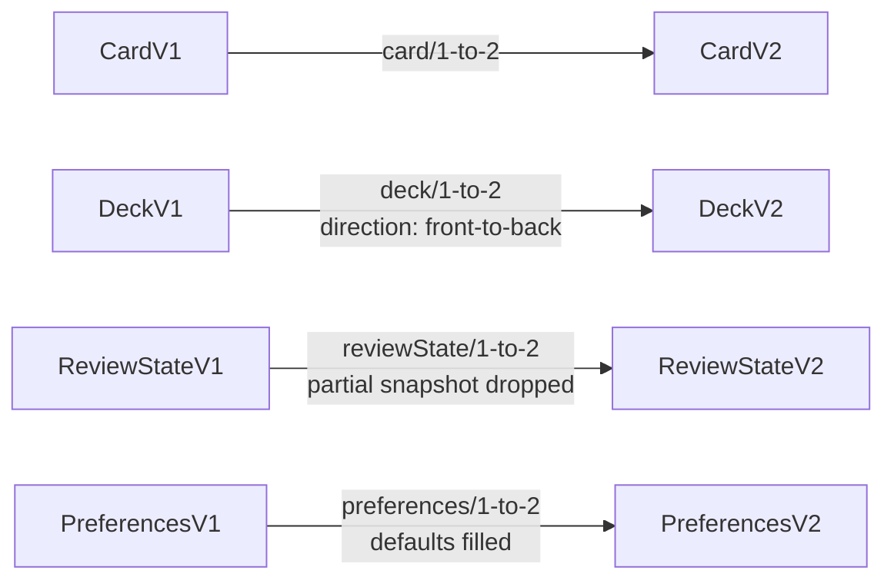
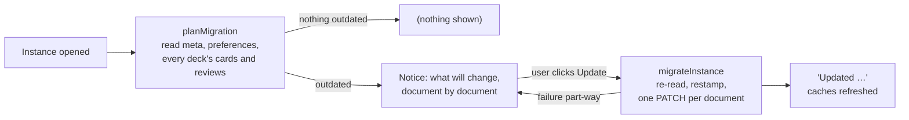

# Format versions and migrations

How Solid Memo tells old data from new, and how it brings a pod up to
the format the current app writes. The formats are the
[shapes](shapes.md); the steps between them are the migration modules
in [domain/shapes/migrations](../src/domain/shapes/migrations/); the
plan is in [domain/migration.ts](../src/domain/migration.ts); the notice
the user sees in [ui/MigrationContainer.tsx](../src/ui/MigrationContainer.tsx).

## Versions

Every subject Solid Memo writes carries `sm:formatVersion` (a missing one
means 1, the format that predates the field). `LATEST_VERSION` in the
generated [shapes module](../src/domain/shapes/generated.ts) is what the
app writes today; `DECK_FORMAT_VERSION` and friends are aliases of it.

| Class | 1 | 2 | Why the version moved |
|---|---|---|---|
| Instance | title, created | — | — |
| Deck | title, document links, provenance | `sm:direction`, stated | A format-1 reader would study a bidirectional deck one way only and count the other way's review subjects against the day's budgets without matching them to any card. |
| Card | `sm:front` and `sm:back`, both required | a side may be a picture (`sm:frontImage` / `sm:backImage`, an IRI), text, or both | A format-1 reader treats a card without `sm:front` as malformed and drops it, so picture-only cards must not be mistaken for format 1. |
| Review state | the SM-2 fields; a snapshot and per-direction subjects were added without a bump, so format 1 admits them | the same fields; the snapshot is all five triples or none; the subject naming (`#<cardId>`, `#<cardId>@back-to-front`) is part of the contract | Stamping begins: a format-1 reader meeting a format-2 state would silently ignore the snapshot and the other direction, which is what a version is meant to flag. |
| Preferences | whatever the unversioned era wrote: every field optional, a missing one meaning its default | every field stated | The document is rewritten on every save, so stamping costs nothing; format 2 is the complete record. |

Rules that hold across versions:

- **Readers never refuse older data.** A subject is read with the shape
  of its stored version, then brought up to the latest record in memory
  by the migration chain. Nothing is written until the user asks.
- **Every write is in the current format.** `recordThing` stamps the
  descriptor's version on every subject it writes: adding or editing a
  card, saving a deck, a review, the preferences, an import.
- **Newer data passes through.** A stored version above the latest is
  read with the latest shape this app has; the model keeps the stored
  version, and the migration plan never counts it. The library import
  refuses newer data instead, with a clear message.

## The chain

One module per step (`<class>/<n>-to-<n+1>.ts`), each a pure, total
function from the record of one version to the record of the next,
never mutating its input. `migrate(shape, record)` walks the chain to
the latest version; a gap is a programming error and throws. Tests
assert that the chain is contiguous for every kind, that every step is
pure, that the latest record passes through untouched, and — with the
real shapes — that every step's output conforms to the shape it moves to.

## The pod migration

- **Plan first, write nothing.** Opening an instance reads the meta
  document, the preferences, and every deck's entry, cards and review
  states, and counts what is below the latest version. The result is
  cached for the session per instance.
- **The user decides.** The notice names what is outdated (deck entries,
  cards and review states per deck, the preferences, the instance
  record), says which formats this app now writes and what each added,
  and offers one button. Until it is pressed the app keeps working on
  the old format. There is no automatic write.
- **Re-read before writing.** `migrateInstance` reads each document again
  and restamps only the outdated subjects, so nothing edited between the
  plan and the click is overwritten with stale content.
- **One write per document**, in the order meta → preferences → per deck
  (entry, cards, review states), each an in-place edit so unknown
  triples survive. A failure leaves whole documents either done or
  untouched; the plan is recomputed and the notice shows what remains.
- **Content does not change.** Each subject is written from the model
  the app already read — which the chain brought up to date — so a
  format-1 deck gains the direction it was being studied in, a
  format-1 preferences document gains the defaults it was being read
  with, and everything else keeps its triples and only moves its
  version.

After the first deploy that versions review states and preferences,
every existing instance shows the notice once for them; the update is
restamping only.

## Catching up with the library

A deck imported from the [deck library](deck-library.md) may be
re-published there in a newer format later — format 2 gave the library's
decks a study direction (they are all bidirectional). The ordinary
migration above would bring the copy to format 2 as front→back, the only
direction its format-1 entry could state; the user's copy would never
learn what the library now says.

So the deck page of an imported deck also asks the library
(`planLibraryUpgrade` in [domain/libraryUpgrade.ts](../src/domain/libraryUpgrade.ts);
shown by [ui/LibraryUpgradeContainer.tsx](../src/ui/LibraryUpgradeContainer.tsx))
and offers to apply the newer format's additions with the library's
values. The offer is made only when every check passes:

- the deck's `dcterms:source` is exactly that library document;
- the library's deck format is newer than the copy's;
- this app writes that deck format (or a newer one) and reads every card
  format the document uses;
- something beyond the version number would change (for 1 → 2: the
  direction differs) — otherwise the ordinary migration suffices.

Applying it is one write of the catalog entry (`saveDeck`): the library's
direction and format version. Cards and review history are untouched,
and the direction remains the user's to change in the Browser.

## Adding a format version

1. Write `shapes/<class>/v<N+1>.ttl` (copy `v<N>.ttl`, change the version
   assertion to `sh:hasValue N+1`, add or change the properties). Add any
   new terms to the [vocabulary](vocab.md).
2. `npm run generate`: the new record type, descriptor and
   `LATEST_VERSION` appear.
3. Add `src/domain/shapes/migrations/<class>/<N>-to-<N+1>.ts` and register
   it in `migrations/index.ts`.
4. Adjust `<class>FromRecord` / `<class>ToRecord` in `src/domain/` if the
   model changed, and the writers that build the record.
5. Add fixtures under `tooling/fixtures/<class>/v<N+1>/` and the
   conformance fixture; document the version in the table above.

The chain test, the conformance test, the drift check and the plan and
notice tests fail until all of that agrees; nothing else needs touching.
