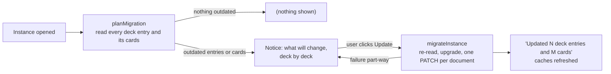

# Format versions and migrations

How Solid Memo tells old data from new, and how it brings a pod up to the
format the current app writes. Pure logic in
[domain/migration.ts](../src/domain/migration.ts); orchestration in the
`planMigration` / `migrateInstance` use cases; the notice the user sees in
[ui/MigrationContainer.tsx](../src/ui/MigrationContainer.tsx).

## Versions

Every deck and card carries `sm:formatVersion` (a missing one means 1, the
format that predates the field). `DECK_FORMAT_VERSION` and
`CARD_FORMAT_VERSION` in [domain/deck.ts](../src/domain/deck.ts) are what
the app writes today.

| Card format | What changed | Why the version moved |
|---|---|---|
| 1 | `sm:front` and `sm:back` text, both required. | — |
| 2 | A side may be a picture (`sm:frontImage` / `sm:backImage`, an IRI), text, or both; the text triples are optional. | A format-1 reader treats a card without `sm:front` as malformed and drops it, so picture-only cards must not be mistaken for format 1. |

| Deck format | What changed | Why the version moved |
|---|---|---|
| 1 | Title and the two document links. | — |
| 2 | `sm:direction` says how the deck is studied: `front-to-back` (all format 1 knew), `back-to-front` or `bidirectional`. Review state is kept per direction: the back→front state of a card lives under its own subject (`#<cardId>@back-to-front`, see [data-model.md](data-model.md)). A missing direction reads as front→back. | A format-1 reader would study a bidirectional deck one way only and count the other way's review subjects against the day's budgets without matching them to any card. |

Rules that hold across versions:

- Readers never refuse *older* pod data: a format-1 card is a valid
  format-2 card, and a format-1 deck is a format-2 deck studied
  front→back, so the app reads them as they are.
- Every write is in the current format. Adding or editing a card stamps
  `CARD_FORMAT_VERSION` on it; renaming a deck or changing its direction
  rewrites its entry with `DECK_FORMAT_VERSION`; a library import writes
  the copy in the app's format whatever the library file said.
- *Newer* data is not touched by the library import (refused with a clear
  message) and is passed through unchanged by pod reads, so a future
  version can tell formats apart.

## The migration

- **Plan first, write nothing.** Opening an instance reads every deck's
  entry and cards (the deck list already does, for its study counts) and
  counts the entries below `DECK_FORMAT_VERSION` and the cards below
  `CARD_FORMAT_VERSION`. The result is cached for the session per
  instance.
- **The user decides.** The notice names the decks, saying for each
  whether its entry, its cards or both are outdated, says what the update
  does (rewrites the format version; names, text, direction and review
  history untouched) and offers one button. Until it is pressed the app
  simply keeps working on the old format. There is no automatic write.
- **Re-read before writing.** `migrateInstance` lists each deck's cards
  again and upgrades only the outdated ones, so a card edited between the
  plan and the click is never overwritten with stale content.
- **One write per document.** `DeckRepository.saveDeck` and `saveCards`
  edit each subject in place (`getSolidDataset` → `setThing` →
  `saveSolidDatasetAt`, a PATCH), so triples the app does not know
  survive, and save the document once. A failure leaves whole decks
  either done or untouched; the plan is recomputed and the notice shows
  what remains.
- **Card format 1 → 2** changes no content (`upgradeCard`): every format-1
  card has text on both sides, which format 2 still allows. Only the
  version triple moves.
- **Deck format 1 → 2** changes no behaviour (`upgradeDeck`): a deck read
  without a direction is already front→back, so the write only states it
  (`sm:direction "front-to-back"`) and moves the version triple.

## Catching up with the library

A deck imported from the [deck library](deck-library.md) may be
re-published there in a newer format later — format 2 gave the library's
decks a study direction (they are all bidirectional). The ordinary
migration above would bring the copy to format 2 as front→back, the only
direction its format-1 entry could state; the user's copy would never
learn what the library now says.

So the deck page of an imported deck also asks the library
(`planLibraryUpgrade` in [domain/libraryUpgrade.ts](../src/domain/libraryUpgrade.ts);
shown by [ui/LibraryUpgradeContainer.tsx](../src/ui/LibraryUpgradeContainer.tsx))
and offers to apply the newer format's additions with the library's
values. The offer is made only when every check passes:

- the deck's `dcterms:source` is exactly that library document;
- the library's deck format is newer than the copy's;
- this app writes that deck format (or a newer one) and reads every card
  format the document uses — so the steps between the versions are ones
  it knows; a library published by a newer app than this one is left
  alone rather than half-applied;
- something beyond the version number would change (for 1 → 2: the
  direction differs) — otherwise the ordinary migration suffices.

Applying it is one write of the catalog entry (`saveDeck`): the library's
direction and format version. Cards and review history are untouched,
and the direction remains the user's to change in the Browser. A failed
library read shows nothing: the deck works as it is.

## Adding a format version

1. Bump the constant in `domain/deck.ts` and document the change in the
   table above.
2. Extend `upgradeCard` (or `upgradeDeck`) with the step from the
   previous version. It must be pure and idempotent; the mapper (`toCard`
   / `toDeck`) must still read every older version.
3. If the new format needs triples the old one lacks, `applyCard` (or
   `saveDeck`) in the deck repository writes them; the tooling in
   [`tooling/deckLibrary.ts`](../tooling/deckLibrary.ts) validates them
   for library files.
4. The notice, the plan and the runner need no change: they work from
   `isOutdated` and `isDeckOutdated`.
