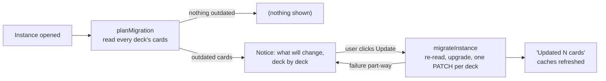

# Format versions and migrations

How Solid Memo tells old data from new, and how it brings a pod up to the
format the current app writes. Pure logic in
[domain/migration.ts](../src/domain/migration.ts); orchestration in the
`planMigration` / `migrateInstance` use cases; the notice the user sees in
[ui/MigrationContainer.tsx](../src/ui/MigrationContainer.tsx).

## Versions

Every deck and card carries `sm:formatVersion` (a missing one means 1, the
format that predates the field). `DECK_FORMAT_VERSION` and
`CARD_FORMAT_VERSION` in [domain/deck.ts](../src/domain/deck.ts) are what
the app writes today.

| Card format | What changed | Why the version moved |
|---|---|---|
| 1 | `sm:front` and `sm:back` text, both required. | — |
| 2 | A side may be a picture (`sm:frontImage` / `sm:backImage`, an IRI), text, or both; the text triples are optional. | A format-1 reader treats a card without `sm:front` as malformed and drops it, so picture-only cards must not be mistaken for format 1. |

The deck format is still 1: nothing about the catalog entry changed.

Rules that hold across versions:

- Readers never refuse *older* pod data: a format-1 card is a valid
  format-2 card, so the app reads it as is.
- Every write is in the current format. Adding or editing a card stamps
  `CARD_FORMAT_VERSION` on it; a library import writes the copy in the
  app's format whatever the library file said.
- *Newer* data is not touched by the library import (refused with a clear
  message) and is passed through unchanged by pod reads, so a future
  version can tell formats apart.

## The migration

- **Plan first, write nothing.** Opening an instance reads every deck's
  cards (the deck list already does, for its study counts) and counts
  the ones below `CARD_FORMAT_VERSION`. The result is cached for the
  session per instance.
- **The user decides.** The notice names the decks and card counts, says
  what the update does (rewrites the format version; text and review
  history untouched) and offers one button. Until it is pressed the app
  simply keeps working on the old format. There is no automatic write.
- **Re-read before writing.** `migrateInstance` lists each deck's cards
  again and upgrades only the outdated ones, so a card edited between the
  plan and the click is never overwritten with stale content.
- **One write per deck.** `DeckRepository.saveCards` edits each card's
  subject in place (`getSolidDataset` → `setThing` → `saveSolidDatasetAt`,
  a PATCH), so triples the app does not know survive, and saves the
  document once. A failure leaves whole decks either done or untouched;
  the plan is recomputed and the notice shows what remains.
- **Format 1 → 2** changes no content (`upgradeCard`): every format-1 card
  has text on both sides, which format 2 still allows. Only the version
  triple moves.

## Adding a format version

1. Bump the constant in `domain/deck.ts` and document the change in the
   table above.
2. Extend `upgradeCard` with the step from the previous version. It must
   be pure and idempotent; the mapper (`toCard`) must still read every
   older version.
3. If the new format needs triples the old one lacks, `applyCard` in the
   deck repository writes them; the tooling in
   [`tooling/deckLibrary.ts`](../tooling/deckLibrary.ts) validates them
   for library files.
4. The notice, the plan and the runner need no change: they work from
   `isOutdated`.
