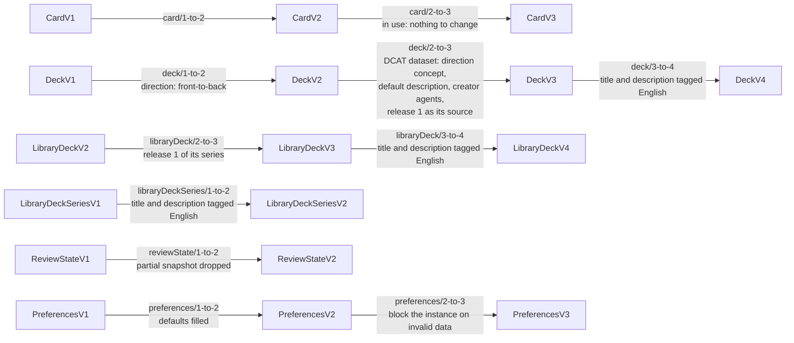
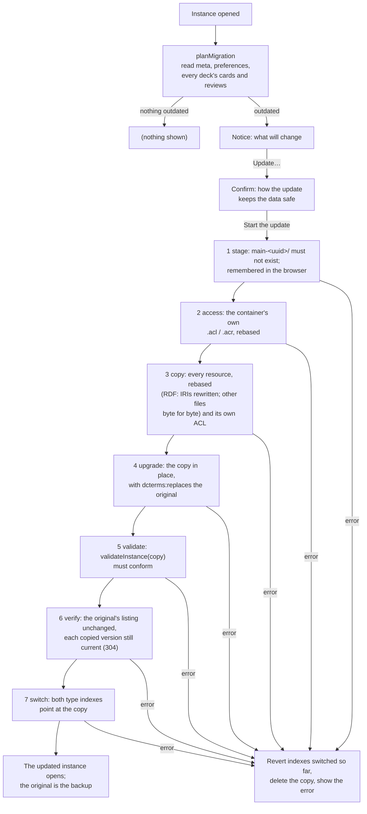

# Format versions and migrations

How Solid Memo tells old data from new, and how it brings a pod up to
the format the current app writes. The formats are the
[shapes](shapes.md); the steps between them are the migration modules
in [domain/shapes/migrations](../packages/domain/src/shapes/migrations/); the
plan is in [domain/migration.ts](../packages/domain/src/migration.ts); the notice
the user sees in [ui/MigrationContainer.tsx](../apps/web/src/ui/MigrationContainer.tsx).

## Versions

Every subject Solid Memo writes carries `sm:formatVersion` (a missing one
means 1, the format that predates the field). `LATEST_VERSION` in the
generated [shapes module](../packages/vocab/src/types.generated.ts) is what the
app writes today; `DECK_FORMAT_VERSION` and friends are aliases of it.

| Class | 1 | 2 | Why the version moved |
|---|---|---|---|
| Instance | title, created | `dcterms:replaces` (the instance it is an updated copy of) and `dcterms:modified` (when it replaced it), both optional | The format update writes a copy and keeps the original as a backup; the copy records which one, so the backup can be found, restored or deleted. |
| Deck | title, document links, provenance | `sm:direction`, stated | A format-1 reader would study a bidirectional deck one way only and count the other way's review subjects against the day's budgets without matching them to any card. |
| Card | `sm:front` and `sm:back`, both required | a side may be a picture (`sm:frontImage` / `sm:backImage`, an IRI), text, or both | A format-1 reader treats a card without `sm:front` as malformed and drops it, so picture-only cards must not be mistaken for format 1. |
| Review state | the SM-2 fields; a snapshot and per-direction subjects were added without a bump, so format 1 admits them | the same fields; the snapshot is all five triples or none; the subject naming (`#<cardId>`, `#<cardId>@back-to-front`) is part of the contract | Stamping begins: a format-1 reader meeting a format-2 state would silently ignore the snapshot and the other direction, which is what a version is meant to flag. |
| Preferences | whatever the unversioned era wrote: every field optional, a missing one meaning its default | every field stated | The document is rewritten on every save, so stamping costs nothing; format 2 is the complete record. |

Deck format 4 (and library deck series format 2, its summary in the
library index) states a deck's title and description as language-tagged
text: one value per language, exactly one of them English, which the
app shows and edits while keeping the other languages. The version moved
because a format-3 reader knows only untagged strings: it would read a
format-4 deck as having no title and drop it. The step to format 4 tags a
format-3 deck's title and description as English.

Card format 3 lets a card be retired (`owl:deprecated true`): a library
deck keeps a card it no longer uses instead of removing it, so a copy
keeps the card and its review state but no longer studies it. The version moved because a format-2 reader
would go on studying a retired card. A format-2 card is in use, so the
step to format 3 changes nothing.

Rules that hold across versions:

- **Readers never refuse older data.** A subject is read with the shape
  of its stored version, then brought up to the latest record in memory
  by the migration chain. Nothing is written until the user asks.
- **Every write is in the current format.** `recordThing` stamps the
  descriptor's version on every subject it writes: adding or editing a
  card, saving a deck, a review, the preferences, an import.
- **Newer data passes through.** A stored version above the latest is
  read with the latest shape this app has; the model keeps the stored
  version, and the migration plan never counts it. The library import
  refuses newer data instead, with a clear message.

## The chain

```mermaid
flowchart LR
    v1["CardV1"] -->|card/1-to-2| v2["CardV2"]
    v2 -->|card/2-to-3<br/>in use: nothing to change| v3["CardV3"]
    d1["DeckV1"] -->|deck/1-to-2<br/>direction: front-to-back| d2["DeckV2"]
    d2 -->|deck/2-to-3<br/>DCAT dataset: direction concept,<br/>default description, creator agents,<br/>release 1 as its source| d3["DeckV3"]
    d3 -->|deck/3-to-4<br/>title and description tagged English| d4["DeckV4"]
    l2["LibraryDeckV2"] -->|libraryDeck/2-to-3<br/>release 1 of its series| l3["LibraryDeckV3"]
    l3 -->|libraryDeck/3-to-4<br/>title and description tagged English| l4["LibraryDeckV4"]
    s1["LibraryDeckSeriesV1"] -->|libraryDeckSeries/1-to-2<br/>title and description tagged English| s2["LibraryDeckSeriesV2"]
    r1["ReviewStateV1"] -->|reviewState/1-to-2<br/>partial snapshot dropped| r2["ReviewStateV2"]
    p1["PreferencesV1"] -->|preferences/1-to-2<br/>defaults filled| p2["PreferencesV2"]
    p2 -->|preferences/2-to-3<br/>block the instance on invalid data| p3["PreferencesV3"]
```

One module per step (`<class>/<n>-to-<n+1>.ts`), each a pure, total
function from the record of one version to the record of the next,
never mutating its input. Besides the record a step is given the IRI of
the subject being migrated (`MigrationContext`), for a step that names
new resources beside it. `migrate(shape, record, { subject })` walks the
chain to the latest version; a gap is a programming error and throws. Tests
assert that the chain is contiguous for every kind, that every step is
pure, that the latest record passes through untouched, and — with the
real shapes — that every step's output conforms to the shape it moves to.

## The pod migration

The format update never writes the user's instance. It copies the
instance into a new sibling container, updates and checks the copy,
and only then points the type index at it; the original stays in the
pod as a backup.

```mermaid
flowchart TD
    open["Instance opened"] --> plan["planMigration<br/>read meta, preferences,<br/>every deck's cards and reviews"]
    plan -->|nothing outdated| quiet["(nothing shown)"]
    plan -->|outdated| notice["Notice: what will change"]
    notice -->|Update…| confirm["Confirm: how the update<br/>keeps the data safe"]
    confirm -->|Start the update| stage["1 stage: main-&lt;uuid&gt;/ must not exist;<br/>remembered in the browser"]
    stage --> access["2 access: the container's own<br/>.acl / .acr, rebased"]
    access --> copy["3 copy: every resource, rebased<br/>(RDF: IRIs rewritten; other files<br/>byte for byte) and its own ACL"]
    copy --> upgrade["4 upgrade: the copy in place,<br/>with dcterms:replaces the original"]
    upgrade --> validate["5 validate: validateInstance(copy)<br/>must conform"]
    validate --> verify["6 verify: the original's listing unchanged,<br/>each copied version still current (304)"]
    verify --> switch["7 switch: both type indexes<br/>point at the copy"]
    switch --> done["The updated instance opens;<br/>the original is the backup"]
    stage & access & copy & upgrade & validate & verify & switch -->|error| undo["Revert indexes switched so far,<br/>delete the copy, show the error"]
```

- **Plan first, write nothing.** Opening an instance reads the meta
  document, the preferences, and every deck's entry, cards and review
  states, and counts what is below the latest version. The result is
  cached for the session per instance.
- **The user decides.** The notice names what is outdated and which
  formats this app now writes; its button opens a confirmation that
  explains the copy, the backup, the copied access and the new address.
  Until **Start the update** is pressed the app keeps working on the old
  format. Once started the run cannot be cancelled (a half-cancelled run
  is the risky state); a progress bar shows the step and, while copying,
  the document count.
- **The original is read-only while the update runs.** Every adapter
  talks to the pod through one fetch wrapped by the write fence
  ([writeFence.ts](../packages/solid/src/writeFence.ts)).
  `updateInstance` holds the original's container from its first step
  until it returns, and while it is held any request under it other than
  GET, HEAD or OPTIONS is refused before it leaves the browser — whether
  it comes from the update (a link it failed to rebase, say) or from
  anything else in the tab. Other tabs and apps cannot be fenced; the
  verify step catches them.
- **A copy, named with a UUID.** `…/solid-memo/main/` is copied to
  `…/solid-memo/main-<uuid>/` (`stagingUrlOf`). The target must not
  exist (`ensureAbsent`), and every document of the copy is created with
  `If-None-Match: *`, so nothing is ever overwritten: had something
  appeared there meanwhile, the pod answers 412 and the run stops.
- **Access control first.** The instance container's own ACL document
  (WAC `.acl` or ACP `.acr`, found through `Link: rel="acl"`) is copied
  with its IRIs rebased before any data, so the copy is never more open
  than the original; so is the ACL of every copied resource that has
  one. An ACL that cannot be read or placed stops the run.
- **Rebased, not reinterpreted.** Turtle documents are read, every IRI
  under the old container is rewritten to the new one (`mapIris`, in the
  lazy SHACL chunk), and the result is saved; literals, blank nodes and
  foreign IRIs are left as they are. Other files are copied byte for
  byte with their content type, so files Solid Memo does not know survive.
- **The copy is updated in place**, exactly as the old in-place update
  did: meta → preferences → per deck (entry, cards, review states) →
  catalogue (last, since it lists the decks as DCAT datasets, which
  older entries are not), each an in-place edit so unknown triples survive. Each subject
  is written from the model the chain brought up to date, so content does
  not change, only its version. An instance without a catalogue gets one,
  published by the signed-in user ([data-model.md](data-model.md#the-catalogue)).
  The copy's `meta.ttl` gains `dcterms:replaces <original>` and
  `dcterms:modified`.
- **Validation is the gate.** The whole copy is checked with
  `validateInstance` ([validation.md](validation.md)); a single violation
  stops the run. The invalid-data policy does not apply here: an update
  never produces data that needs a repair.
- **Nothing changed meanwhile.** Each resource's version is taken from
  the very response it was copied from: its ETag (with the request's
  `Accept`, since an ETag belongs to one representation), else its
  Last-Modified, else a SHA-256 of the body. The original is listed
  again, and the pod is asked of each resource whether it is still that
  version — a HEAD with `If-None-Match: <ETag>` (or `If-Modified-Since`),
  which answers 304 when it is. A review saved in another tab during the
  copy stops the run, so no study is lost.
- **One commit point.** `switchInstance` rewrites the `sm:Instance`
  registration (and the `dcat:Catalog` one, adding it if missing) in
  each type index that registers the original, one save per index, each
  with `If-Match`: an index another app changed since it was read is
  not overwritten (412), and the switch is undone. If a
  later index fails, the ones already switched are switched back. Until
  this step nothing is visible to the user or to other apps.
- **Failure leaves nothing behind.** Any error deletes the copy and
  reports the step, the error and "No changes were made to your data".
  If the delete fails too, the copy's address is shown with **Try
  removing it again**.
- **A closed tab.** Step 1 remembers the copy in `localStorage`
  (`solid-memo:update:<instance>`), cleared on success or cleanup. On
  the next opening of the instance, a copy still there is offered for
  removal ("An update … was cut off"). Another browser does not know of
  it; the copy's `meta.ttl` names its original (`dcterms:replaces`), so
  it can be recognised by hand.
- **The address changes.** The updated instance lives at the new URL;
  the app opens it, and old bookmarks lead to the instance picker.

### Proof on a real server

`npm run test:pod` runs the update — the app's own use cases and Solid
adapters, wired as in `main.tsx` — against a real Solid server, recording
every HTTP request ([instanceUpdate.integration.test.ts](../e2e/pod/src/instanceUpdate.integration.test.ts)).
It seeds an old-format instance with an unknown file and shared access,
and checks that:

- not one write is attempted on the original, which is byte for byte
  (ACLs included) what it was, after the update and after a restore;
- every write goes to the copy, but for the type index, which is
  written last, after the whole copy was read back and validated;
- every write is conditional (each PUT `If-None-Match: *`, each PATCH
  `If-Match`), and the check that nothing changed got a 304 for every
  version it asked about;
- a document that appears where the copy is about to create one stops
  the update (412), leaving no trace;
- a save of a document changed in another tab since it was read fails
  (412) and keeps the other tab's change; read again, it goes through;
- the copy is updated and conforms, keeps the unknown file byte for
  byte, and has its ACLs rebased;
- a write to the original from the same tab during the update is
  refused by the fence;
- a failure while copying a document, copying access control, updating
  the copy, or switching the type index leaves the original and the
  type index as they were, and no copy;
- a change made to an already copied document by another tab makes the
  update give up at the verify step, leaving no trace.

The tests start a Community Solid Server in memory themselves; set
`SOLID_SERVER_URL` to use another server that lets anyone read and
write. `npm test` does not run them.

### The backup

The original is left untouched and unregistered. Preferences show it
under **Previous version** while the instance's meta names it:

- **Restore previous version** switches the type indexes back and
  deletes the updated instance; what was studied since the update is
  lost with it (the confirmation says so).
- **Delete backup** deletes the original and clears `dcterms:replaces`.

A backup that is gone (deleted by another app) is forgotten quietly.
Library upgrades and repairs still edit in place: they are small,
single-document writes, and only the format update copies.

## Catching up with the library

A deck imported from the [deck library](deck-library.md) says which
release it came from (`prov:wasDerivedFrom <…/decks/name/n.ttl>`; a deck
imported before releases came from what became release 1). When the
library publishes a newer release, the deck page offers to bring the
copy up to it (`planLibraryUpgrade` in
[domain/libraryUpgrade.ts](../packages/domain/src/libraryUpgrade.ts), shown by
[ui/LibraryUpgradeContainer.tsx](../apps/web/src/ui/LibraryUpgradeContainer.tsx)).

The plan compares three sets of cards by fragment id — the release the
copy came from, the current release, and the copy — so the library's
changes reach only what the user left as the library had it:

| In the releases | In the copy | The upgrade |
|---|---|---|
| Added in the new release | Not there | Adds it (retired, if the release has it retired) |
| Changed | As the old release had it | Changes it |
| Changed or removed | Changed by the user | Keeps the user's card, and says so |
| Retired | Anything | Retires it: kept, with its review states, but no longer studied |
| Retired before, in use again | Retired | Brings it back, with the review states it had |
| Removed | As the old release had it | Removes it, and its review states |
| Anything | Removed by the user | Leaves it removed |

Retiring is not a change of the card's content, so it applies to cards
the user changed too: nothing of theirs is lost. A library release never
removes a card any more (the build refuses one that drops a card of the
release before it); the removal rows are for releases made before cards
could be retired.

A new study direction is taken up when the copy is still studied the old
release's way. The notice lists the notes of every release in between.
Nothing is offered for a release that is not newer, uses a card format
this app does not know, or would change nothing. Applying it is one
write of the cards document (`applyCardChanges`: an existing card keeps
its creation time and unknown triples; `upgradedCards` says what is
written), one of the review states of removed cards, and one of the
catalog entry, which now names the new
release. Review history of every other card is kept.

## Adding a format version

1. Write `shapes/<class>/v<N+1>.ttl` (copy `v<N>.ttl`, change the version
   assertion to `sh:hasValue N+1`, add or change the properties). Add any
   new terms to the [vocabulary](vocab.md).
2. `npm run generate`: the new record type, descriptor and
   `LATEST_VERSION` appear.
3. Add `packages/domain/src/shapes/migrations/<class>/<N>-to-<N+1>.ts` and register
   it in `migrations/index.ts`.
4. Adjust `<class>FromRecord` / `<class>ToRecord` in `packages/domain/src/` if the
   model changed, and the writers that build the record.
5. Add fixtures under `packages/vocab/fixtures/<class>/v<N+1>/` and the
   conformance fixture; document the version in the table above.

The chain test, the conformance test, the drift check and the plan and
notice tests fail until all of that agrees; nothing else needs touching.
