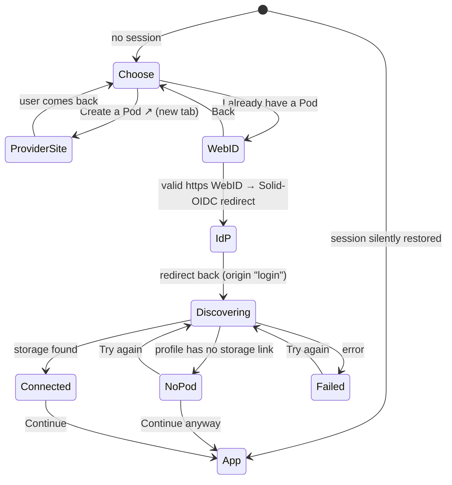

# Onboarding

How a signed-out visitor ends up with a connected Pod. The UI lives in
[src/ui/onboarding/](../src/ui/onboarding/); everything Solid-specific
stays behind use cases (see [boundaries.md](boundaries.md)).

## Flow

| Step | Component |
|---|---|
| Choose, WebID | `OnboardingFlow` + `WebIdForm` |
| Discovering, Connected, NoPod, Failed | `PodConnectionScreen` |
| Orchestration (session, account query) | `App` |

A user who logged out or whose session expired starts at **WebID**, not
**Choose**. A silently restored session skips onboarding entirely:
`SessionGateway.restore()` reports `origin: "login"` only when a login
redirect just completed.

## Pod providers

[src/domain/podProvider.ts](../src/domain/podProvider.ts) lists the
providers offered (`POD_PROVIDERS`). A provider is a name and a sign-up
link, nothing more: login is driven by the WebID and the Pod by the
profile, so adding a provider is adding a list entry.

## WebID validation

`validateWebId` ([src/domain/webId.ts](../src/domain/webId.ts)) accepts
only absolute `https:` URLs without embedded credentials. It runs in the
form (for the message) and again in the `loginWithWebId` use case (so no
caller can skip it). The discovered OIDC issuer passes the same
`isSecureUrl` check before the browser is sent there.

## Pod discovery

`discoverAccount(session)` returns a
[SolidAccount](../src/domain/account.ts) `{ webId, podUrl?, oidcIssuer? }`:

- `podUrl` — first result of `StorageGateway.discoverStorages`: the
  profile's `pim:storage` (`http://www.w3.org/ns/pim/space#storage`)
  links, falling back to the Solid Protocol's storage `Link`-header
  walk-up. Never typed by the user, never assumed from the provider or
  the WebID's origin.
- `oidcIssuer` — the profile's `solid:oidcIssuer`; informational, so a
  failed lookup does not fail discovery.

The account is held in the react-query cache (`["account", webId]`) and,
like all Pod data, is cleared on logout. Nothing is persisted by the app;
the session itself is persisted by the authn library.
