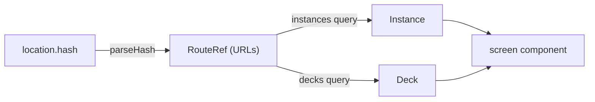

# Routing

The URL always represents the view the user is looking at, so every
screen can be bookmarked, shared, reloaded, and walked with
Back/Forward.

## Where it lives

Routing is a UI concern: [`src/ui/router.ts`](../src/ui/router.ts)
defines the serializable `RouteRef` union, the `routeToHash` /
`parseHash` pair, and the `useHashRoute` hook. `Workspace` owns the
mapping from a `RouteRef` to a rendered screen.

## Hash routing, not pathname routing

The route is kept in `location.hash`:

- Deep links work on any static host — no server rewrite rules.
- The Solid OIDC redirect uses the query string (`?code=&state=`);
  the hash stays clear of it.

## Route scheme

Instances and decks are Solid resources, so their identifiers are
full URLs, carried URL-encoded in hash query parameters.

| Hash | Screen |
| --- | --- |
| `#/storages` | storage picker |
| `#/instances` | instance picker |
| `#/new-instance?storage=…&source=…` | instance creator |
| `#/decks?instance=…` | deck list (home) |
| `#/new-deck?instance=…` | deck creator |
| `#/deck?instance=…&deck=…` | deck detail |
| `#/browse?instance=…&deck=…` | card browser |
| `#/new-card?instance=…&deck=…&return=…` | card creator |
| `#/practice?instance=…&deck=…&mode=…` | practice session |
| `#/preferences?instance=…` | preferences |

## Resolution and fallbacks

The hash carries identifiers only; `Workspace` resolves them to domain
objects before rendering:

- The deck lookup shares the `["decks", instanceUrl]` query cache with
  the deck list, so in-app navigation resolves without a refetch.
- The header logotype links to `#/` — deliberately not a route — so it
  lands on the default route: the deck list, or a picker when the
  instance is ambiguous.
- Invalid or unknown routes never strand the user: an unparsable hash
  falls back to the default route (home / instance picker / storage
  picker, by instance count), an unknown instance falls back to the
  instance picker, an unknown deck to that instance's deck list. All
  fallbacks use `history.replaceState`, so they are not Back stops;
  in-app navigation uses `pushState`, so Back walks the screens.
