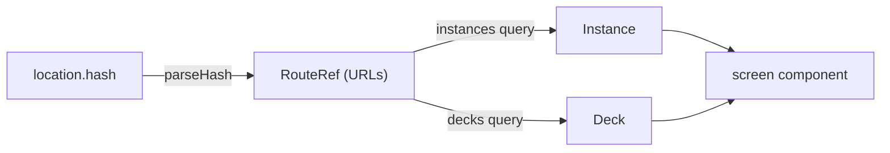

# Routing

The URL always represents the view the user is looking at, so every
screen can be bookmarked, shared, reloaded, and walked with
Back/Forward.

## Where it lives

Routing is a UI concern: [`src/ui/router.ts`](../src/ui/router.ts)
defines the serializable `RouteRef` union, the `routeToHash` /
`parseHash` pair, and the `useHashRoute` hook. `Workspace` owns the
mapping from a `RouteRef` to a rendered screen.

## Hash routing, not pathname routing

The route is kept in `location.hash`:

- Deep links work on any static host — no server rewrite rules.
- The Solid OIDC redirect uses the query string (`?code=&state=`);
  the hash stays clear of it.

## Route scheme

Instances and decks are Solid resources, so their identifiers are
full URLs, carried URL-encoded in hash query parameters.

| Hash | Screen |
| --- | --- |
| `#/storages` | storage picker |
| `#/instances` | instance picker |
| `#/new-instance?storage=…&source=…` | instance creator |
| `#/decks?instance=…` | deck list (home) |
| `#/new-deck?instance=…` | deck creator |
| `#/library?instance=…` | [deck library](deck-library.md): ready-made decks to import into the instance |
| `#/library-deck?instance=…&deck=…` | one library deck's page — its description, authors, licence, creation date and sources, with an import button for that deck alone (an unknown deck falls back to the library) |
| `#/library-browse?instance=…&deck=…[&page=n]` | a library deck's cards, read-only, paged like the Browser (paging *replaces* the history entry) |
| `#/deck?instance=…&deck=…` | deck detail |
| `#/browse?instance=…&deck=…[&page=n]` | Browser — the one place a deck and its cards are edited. Cards are paged; `page` (1-based) is omitted for the first page. Paging *replaces* the history entry, so Back leaves the Browser rather than walking every page, while opening a card *pushes*, so Back from a card returns to the same page. |
| `#/new-card?instance=…&deck=…` | card creator (opened from, and returning to, the Browser) |
| `#/card?instance=…&deck=…&card=…` | one card's own page: the card, its editor, remove (opened by clicking a Browser row; an unknown card falls back to the Browser) |
| `#/study?instance=…&deck=…` | study session: the deck's due and new prompts for today, interleaved |
| `#/preferences?instance=…` | preferences |
| `#/validate?instance=…` | developer tool: the instance's documents checked against the shapes ([validation.md](validation.md)); shows how to turn developer mode on when it is off |

## Resolution and fallbacks

The hash carries identifiers only; `Workspace` resolves them to domain
objects before rendering:

- The deck lookup shares the `["decks", instanceUrl]` query cache with
  the deck list, so in-app navigation resolves without a refetch. A
  library deck is resolved the same way from the `["library"]` cache the
  library screen reads.
- The header logotype links to `#/` — deliberately not a route — so it
  lands on the default route: the deck list, or a picker when the
  instance is ambiguous.
- Invalid or unknown routes never strand the user: an unparsable hash
  falls back to the default route (home / instance picker / storage
  picker, by instance count), an unknown instance falls back to the
  instance picker, an unknown deck to that instance's deck list, an
  unknown library deck to the library. All
  fallbacks use `history.replaceState`, so they are not Back stops;
  in-app navigation uses `pushState`, so Back walks the screens.

## Breadcrumbs

`breadcrumbsFor(route, names)` in
[src/ui/Breadcrumbs.tsx](../src/ui/Breadcrumbs.tsx) derives a trail from
the current route alone — Decks › *deck* › Browser › *card* — and
`Workspace` renders it above every screen. Every crumb — the current page
included, marked `aria-current="page"` — is a plain `<a href="#/…">` link
built with `routeToHash` — and the only way back up: screens have no
"Back to …" buttons — so following one is an
ordinary hash navigation: Back/Forward, new-tab and keyboard use all work
without extra code. Top-level screens (deck list, instance picker) show a
single crumb, so "Decks" is on hand everywhere inside an instance. The
masthead's logo and "Solid Memo" title both link to `#/`, the root.
