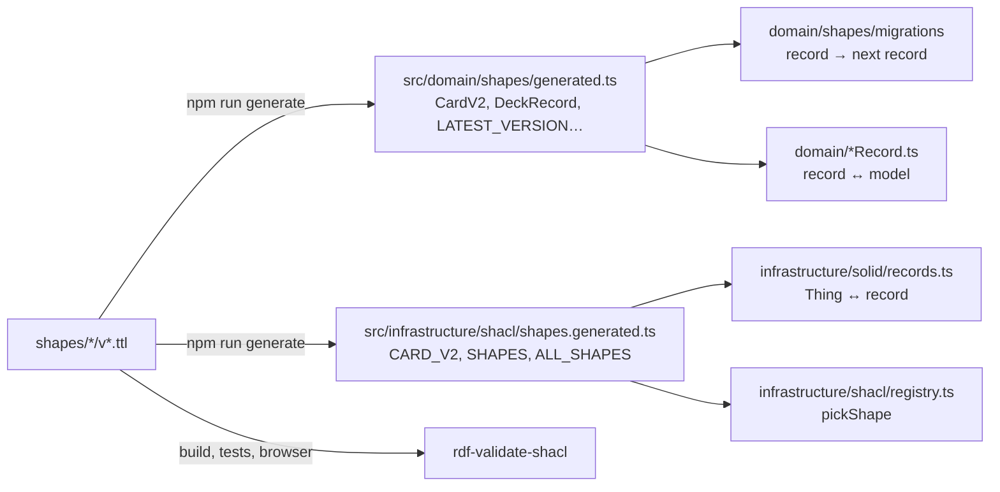

# Shapes

What a valid Solid Memo subject looks like, version by version, as
SHACL; and how those shapes drive the code. One shape file per class per
format version under [`shapes/`](../shapes/), published with the site.

## Files and IRIs

```
shapes/instance/v1.ttl        https://solid-memo.com/shapes/instance/v1.ttl#shape
shapes/deck/v1.ttl, v2.ttl    …/deck/v2.ttl#inPod  and  …/deck/v2.ttl#inLibrary
shapes/card/v1.ttl, v2.ttl
shapes/review-state/v1.ttl, v2.ttl
shapes/preferences/v1.ttl, v2.ttl
```

The shape IRIs include `.ttl` on purpose: they dereference on a static
host without any redirect trick. A deck is shaped two ways because it
lives in two places: `<#inPod>` (a catalog entry, with the links to its
two documents) and `<#inLibrary>` (a [deck library](deck-library.md)
document, which has no pod documents and may list its sources). Both
share the same named property shapes.

## Conventions

- **No `sh:targetClass`.** Format 1 and format 2 of a class target the
  same class, so targeting would make every subject fail one of them.
  The shape is chosen by `(rdf:type, sm:formatVersion)` — absent = 1 —
  and the context (pod or library) by `pickShape` in
  [registry.ts](../src/infrastructure/shacl/registry.ts), the same way
  at build time, in tests and in the browser. Every node shape carries
  `sh:class` and `sh:nodeKind sh:IRI` instead.
- **The version is asserted.** Format ≥ 2: `sm:formatVersion` with
  `sh:hasValue N`, exactly once. Format 1: `sh:maxCount 1 ; sh:in ( 1 )`,
  which reads "absent or 1" — the rule that a missing version means the
  format that predates the field.
- **Not closed.** Unknown triples are neither violations nor removed:
  readers ignore them and writers edit subjects in place.
- **Property shapes are named** (`<#front>`, never blank nodes), so the
  generator and the results can refer to them. `sh:message` is set where
  the engine's default text would be cryptic.
- **Rules a record cannot carry** — a card side has text or a picture
  (`sh:or`), the review snapshot is all five triples or none (`sh:xone`),
  a review subject is named `#<cardId>` or `#<cardId>@back-to-front`
  (`sh:pattern` on the node) — are enforced by the record → model
  mappers in code and by SHACL in validation.

## Version by version

| Shape | Beyond class, node kind and version |
|---|---|
| Instance 1 | `dcterms:title` 1..1, `dcterms:created` 1..1 |
| Deck 1 | `dcterms:title` 1..1, `dcterms:created` 0..1, `dcterms:creator` 0..n, `dcterms:license` 0..1 IRI, `dcterms:description` 0..1; in a pod `sm:cardsDocument` and `sm:reviewsDocument` 1..1 and `dcterms:source` 0..1 (the library document it came from); in the library no document links and `dcterms:source` 0..n |
| Deck 2 | Deck 1 + `sm:direction` 1..1, one of `front-to-back`, `back-to-front`, `bidirectional` |
| Card 1 | `sm:front`, `sm:back` 1..1 |
| Card 2 | `sm:front`, `sm:back` 0..1; `sm:frontImage`, `sm:backImage` 0..1 IRI; each side has text or a picture |
| Review state 1 | `sm:easeFactor` decimal, `sm:intervalDays`, `sm:repetitions` integer, `sm:due` `YYYY-MM-DD`, `sm:firstReviewedAt`, `sm:lastReviewedAt` dateTime, all 1..1; the five `sm:previous*` 0..1 each (unversioned pods already hold snapshots); subject named per direction |
| Review state 2 | Review state 1 with the snapshot all or nothing |
| Preferences 1 | `sm:newCardsPerDay`, `sm:maxReviewsPerDay`, `sm:dayBoundaryHour` (0–23) integer 0..1; `sm:answerScale` 0..1, `sm2` or `minimal`; `sm:developerMode` 0..1 boolean |
| Preferences 2 | Preferences 1 with every field 1..1 |

Why each version moved is in [migrations.md](migrations.md).

## What the shapes generate



[tooling/shapes.ts](../tooling/shapes.ts) reads, from every node shape
with an `sh:name` (`"CardV2"`, `"LibraryDeckV1"`), the properties it
lists: `sh:path`, `sh:datatype` or `sh:nodeKind sh:IRI`, `sh:minCount`,
`sh:maxCount`, `sh:in` and an optional `sh:name` for the field. Anything
else (`sh:or`, `sh:xone`, `sh:pattern`, ranges, messages) is validation
only.

| SHACL | Record field | Descriptor kind |
|---|---|---|
| `xsd:string` | `string` | `string` |
| `xsd:string` + `sh:in` | literal union | `enum` |
| `xsd:integer`, `xsd:decimal` | `number` | `integer`, `decimal` |
| `xsd:boolean` | `boolean` | `boolean` |
| `xsd:dateTime` | ISO 8601 `string` | `dateTime` |
| `sh:nodeKind sh:IRI` | `string` | `iri` |
| no `sh:minCount` | optional (`?:`) | `optional` |
| `sh:minCount 1 ; sh:maxCount 1` | required | `one` |
| no `sh:maxCount` (strings and IRIs only) | `readonly string[]` | `many` |
| `sh:maxCount 0` | not a field | — |

`sm:formatVersion` and `rdf:type` are the envelope, not fields: the
generic writer stamps them from the descriptor. Generated files hold
only types and `as const` data, are committed, and are checked for
drift by CI (`npm run generate:check`) and by `tooling/generate.test.ts`.

## Reading and writing

Every mapper is the same three steps (see
[records.ts](../src/infrastructure/solid/records.ts)):

1. `readVersioned(thing, "card")` — the class is checked, the stored
   version read (absent = 1), and the subject read with the descriptor
   of that version into a `{ version, data }` record. A version newer
   than this app knows is read with the latest shape it has; the stored
   version passes through to the model unchanged.
2. `migrate("card", record)` — the record walked up the
   [migration chain](migrations.md) to the latest version, in memory.
3. `cardFromRecord(url, storedVersion, data)` — the domain model, which
   keeps the stored version so the migration plan can count what is
   outdated.

Writing is the reverse: `cardToRecord(content)` then
`recordThing(url, CARD_V2, record, existing)`, which edits the existing
subject in place (only the shape's predicates are replaced, so foreign
triples survive), adds the class once and stamps the version. Every
subject this app writes is therefore stamped and conforms to the latest
shape — the conformance test in
[conformance.test.ts](../src/infrastructure/shacl/conformance.test.ts)
proves it for every version and every migration step.

## Where the shapes are checked

- **Build**: every file in `decks/` is validated as a library document
  (`npm run build` fails with the violations; see [deck-library.md](deck-library.md)).
- **Tests**: the fixtures in `tooling/fixtures/<class>/v<N>/{valid,invalid}/`
  pass and fail as expected; the conformance test above; every library
  deck passes.
- **Browser**: the developer tool described in [validation.md](validation.md).

## Adding a version

See [migrations.md](migrations.md#adding-a-format-version).
