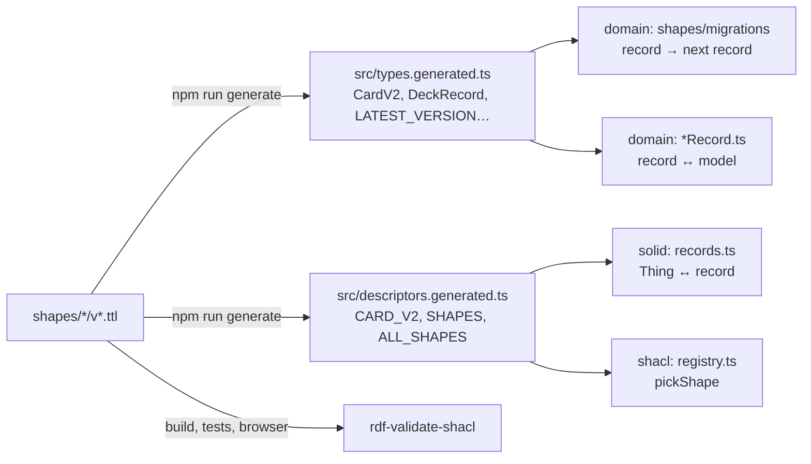

# Shapes

What a valid Solid Memo subject looks like, version by version, as
SHACL; and how those shapes drive the code. One shape file per class per
format version under [`packages/vocab/shapes/`](../packages/vocab/shapes/), published with the site.

## Files and IRIs

```
shapes/instance/v1.ttl        https://solid-memo.com/shapes/instance/v1.ttl#shape
shapes/deck/v1.ttl, v2.ttl    …/deck/v2.ttl#inPod  and  …/deck/v2.ttl#inLibrary
shapes/card/v1.ttl, v2.ttl
shapes/review-state/v1.ttl, v2.ttl
shapes/preferences/v1.ttl, v2.ttl
```

The shape IRIs include `.ttl` on purpose: they dereference on a static
host without any redirect trick. A deck is shaped two ways because it
lives in two places: `<#inPod>` (a catalog entry, with the links to its
two documents) and `<#inLibrary>` (a [deck library](deck-library.md)
document, which has no pod documents and may list its sources). Both
share the same named property shapes.

## Conventions

- **No `sh:targetClass`.** Format 1 and format 2 of a class target the
  same class, so targeting would make every subject fail one of them.
  The shape is chosen by `(rdf:type, sm:formatVersion)` — absent = 1 —
  and the context (pod or library) by `pickShape` in
  [registry.ts](../packages/shacl/src/registry.ts), the same way
  at build time, in tests and in the browser. Every node shape carries
  `sh:class` and `sh:nodeKind sh:IRI` instead. The class is Solid
  Memo's own or, for the standard classes it writes, DCAT's or FOAF's
  (`CLASS_NAMESPACES` in [packages/vocab/tooling/shapes.ts](../packages/vocab/tooling/shapes.ts)).
- **Further types are stated.** A subject that is also, say, a
  `dcat:Dataset` says so with `sh:property [ sh:path rdf:type ;
  sh:hasValue dcat:Dataset ]`; the shape is still picked by its
  `sh:class`, and the writer adds every such type.
- **The version is asserted.** Format ≥ 2: `sm:formatVersion` with
  `sh:hasValue N`, exactly once. Format 1: `sh:maxCount 1 ; sh:in ( 1 )`,
  which reads "absent or 1" — the rule that a missing version means the
  format that predates the field.
- **Not closed.** Unknown triples are neither violations nor removed:
  readers ignore them and writers edit subjects in place.
- **Property shapes are named** (`<#front>`, never blank nodes), so the
  generator and the results can refer to them. `sh:message` is set where
  the engine's default text would be cryptic.
- **Rules a record cannot carry** — a card side has text or a picture
  (`sh:or`), the review snapshot is all five triples or none (`sh:xone`),
  a review subject is named `#<cardId>` or `#<cardId>@back-to-front`
  (`sh:pattern` on the node) — are enforced by the record → model
  mappers in code and by SHACL in validation.

## Version by version

| Shape | Beyond class, node kind and version |
|---|---|
| Instance 1 | `dcterms:title` 1..1, `dcterms:created` 1..1 |
| Deck 1 | `dcterms:title` 1..1, `dcterms:created` 0..1, `dcterms:creator` 0..n, `dcterms:license` 0..1 IRI, `dcterms:description` 0..1; in a pod `sm:cardsDocument` and `sm:reviewsDocument` 1..1 and `dcterms:source` 0..1 (the library document it came from); in the library no document links and `dcterms:source` 0..n |
| Deck 2 | Deck 1 + `sm:direction` 1..1, one of `front-to-back`, `back-to-front`, `bidirectional`; `dcterms:modified` 0..1 dateTime |
| Card 1 | `sm:front`, `sm:back` 1..1 |
| Card 2 | `sm:front`, `sm:back` 0..1; `sm:frontImage`, `sm:backImage` 0..1 IRI; each side has text or a picture |
| Review state 1 | `sm:easeFactor` decimal, `sm:intervalDays`, `sm:repetitions` integer, `sm:due` `YYYY-MM-DD`, `sm:firstReviewedAt`, `sm:lastReviewedAt` dateTime, all 1..1; the five `sm:previous*` 0..1 each (unversioned pods already hold snapshots); subject named per direction |
| Review state 2 | Review state 1 with the snapshot all or nothing |
| Preferences 1 | `sm:newCardsPerDay`, `sm:maxReviewsPerDay`, `sm:dayBoundaryHour` (0–23) integer 0..1; `sm:answerScale` 0..1, `sm2` or `minimal`; `sm:developerMode` 0..1 boolean |
| Preferences 2 | Preferences 1 with every field 1..1 |
| Deck 3 | A `dcat:Dataset` too. `dcterms:title` and `dcterms:description` 1..1; `dcterms:created`, `dcterms:modified` 0..1; `dcterms:creator` 0..n IRIs (foaf:Agent nodes); `dcterms:license` 0..1; `sm:studyDirection` 1..1, a concept of `sm:StudyDirections` (`sm:direction` forbidden); `dcat:theme` 0..n IRIs, `dcat:keyword` 0..n; `dcterms:source` forbidden. In a pod also `dcat:distribution` 0..n, the two document links, `prov:wasDerivedFrom` 0..1 (the library release it came from), and the deck's own study caps `sm:deckNewCardsPerDay` and `sm:deckMaxReviewsPerDay`, integers ≥ 0, 0..1 each (added without a version bump: an older reader ignores them). In the library, one release: `dcterms:publisher`, `dcat:version` (1, 2, …), `dcat:inSeries`, `dcat:isVersionOf` 1..1; `dcat:prev`, `dcat:previousVersion`, `adms:versionNotes`, `dcterms:issued` 0..1; `dcat:theme` including the EU theme EDUC; `dcterms:language` 0..n; `dcat:distribution` 1..n; `prov:wasDerivedFrom` 0..n; no document links and no study caps |
| Deck 4 | Deck 3, but `dcterms:title` and `dcterms:description` are language-tagged text (`rdf:langString`): one or more values, at most one per language (`sh:uniqueLang`), exactly one of them English (`sh:qualifiedValueShape [ sh:languageIn ("en") ]`, `sh:qualifiedMinCount 1`, `sh:qualifiedMaxCount 1`). The app shows and edits the English text and keeps the other languages |
| Preferences 3 | Preferences 2 + `sm:invalidDataPolicy` 1..1, a concept of `sm:InvalidDataPolicies` |
| Library deck series 1 | The deck across its releases in the library index: a `dcat:DatasetSeries` and `dcat:Dataset`; title, description, publisher 1..1; `dcat:first`, `dcat:last`, `dcat:hasCurrentVersion` 1..1; `dcat:hasVersion` 1..n; themes and keywords 0..n |
| Library deck series 2 | Library deck series 1 with the version stated (`sh:hasValue 2`) and the title and description as language-tagged text, as in deck format 4 |
| Catalog 1 | A `dcat:Catalog` (an instance's `catalog.ttl#catalog`, the library index): title, description, `dcterms:publisher` 1..1; licence, modification time 0..1; `dcat:themeTaxonomy`, `dcat:dataset` 0..n |
| Agent 1 | A `foaf:Agent`: `foaf:name` 1..1, `foaf:mbox` 0..1 (a `mailto:` IRI) |
| Distribution 1 | A `dcat:Distribution`: `dcat:accessURL` 1..1; `dcat:downloadURL`, `dcat:mediaType`, `dcterms:format` 0..1 |

The DCAT and FOAF classes' values (an agent is a `foaf:Agent`, a theme a
`skos:Concept`, a licence a `dcterms:LicenseDocument`) are checked by the
DCAT-AP profile, with the reference data; Solid Memo's own shapes only
say IRI (see [validation.md](validation.md#profiles-dcat-ap-and-skos)).

Why each version moved is in [migrations.md](migrations.md).

## What the shapes generate


```mermaid
flowchart LR
    shapes["shapes/*/v*.ttl"] -->|npm run generate| types["src/types.generated.ts<br/>CardV2, DeckRecord, LATEST_VERSION…"]
    shapes -->|npm run generate| desc["src/descriptors.generated.ts<br/>CARD_V2, SHAPES, ALL_SHAPES"]
    types --> migrations["domain: shapes/migrations<br/>record → next record"]
    types --> records["domain: *Record.ts<br/>record ↔ model"]
    desc --> rw["solid: records.ts<br/>Thing ↔ record"]
    desc --> pick["shacl: registry.ts<br/>pickShape"]
    shapes -->|build, tests, browser| shacl["rdf-validate-shacl"]
```

[packages/vocab/tooling/shapes.ts](../packages/vocab/tooling/shapes.ts) reads, from every node shape
with an `sh:name` (`"CardV2"`, `"LibraryDeckV1"`), the properties it
lists: `sh:path`, `sh:datatype` or `sh:nodeKind sh:IRI`, `sh:minCount`,
`sh:maxCount`, `sh:in` and an optional `sh:name` for the field. Anything
else (`sh:or`, `sh:xone`, `sh:pattern`, ranges, messages) is validation
only.

| SHACL | Record field | Descriptor kind |
|---|---|---|
| `xsd:string` | `string` | `string` |
| `xsd:string` + `sh:in` | literal union | `enum` |
| `sh:nodeKind sh:IRI` + `sh:in` (a scheme's concepts) | IRI union | `iriEnum` |
| `xsd:integer`, `xsd:decimal` | `number` | `integer`, `decimal` |
| `xsd:boolean` | `boolean` | `boolean` |
| `xsd:dateTime` | ISO 8601 `string` | `dateTime` |
| `sh:nodeKind sh:IRI` | `string` | `iri` |
| `rdf:langString` | `LangText`: language tag (lower case) → text; one field however many languages, required with `sh:minCount 1` | `text` |
| no `sh:minCount` | optional (`?:`) | `optional` |
| `sh:minCount 1 ; sh:maxCount 1` | required | `one` |
| no `sh:maxCount` (strings and IRIs only) | `readonly string[]` | `many` |
| `sh:maxCount 0` | not a field: the writer removes the predicate | `absent` |

`sm:formatVersion` and `rdf:type` (the class and any `sh:hasValue`
types) are the envelope, not fields: the generic writer stamps them from
the descriptor. Generated files hold
only types and `as const` data, are committed, and are checked for
drift by CI (`npm run generate:check`) and by `packages/vocab/tooling/generate.test.ts`.

## Reading and writing

Every mapper is the same three steps (see
[records.ts](../packages/solid/src/records.ts)):

1. `readVersioned(thing, "card")` — the class is checked, the stored
   version read (absent = 1), and the subject read with the descriptor
   of that version into a `{ version, data }` record. A version newer
   than this app knows is read with the latest shape it has; the stored
   version passes through to the model unchanged.
2. `migrate("card", record)` — the record walked up the
   [migration chain](migrations.md) to the latest version, in memory.
3. `cardFromRecord(url, storedVersion, data)` — the domain model, which
   keeps the stored version so the migration plan can count what is
   outdated.

Writing is the reverse: `cardToRecord(content)` then
`recordThing(url, CARD_V2, record, existing)`, which edits the existing
subject in place (only the shape's predicates are replaced, so foreign
triples survive), adds the class once and stamps the version. Every
subject this app writes is therefore stamped and conforms to the latest
shape — the conformance test in
[conformance.test.ts](../packages/solid/src/conformance.test.ts)
proves it for every version and every migration step.

## Where the shapes are checked

- **Build**: every file in `packages/deck-library/decks/` is validated as a library document
  (`npm run build` fails with the violations; see [deck-library.md](deck-library.md)).
- **Tests**: the fixtures in `packages/vocab/fixtures/<class>/v<N>/{valid,invalid}/`
  pass and fail as expected; the conformance test above; every library
  deck passes.
- **Browser**: the developer tool described in [validation.md](validation.md).

## Adding a version

See [migrations.md](migrations.md#adding-a-format-version).
