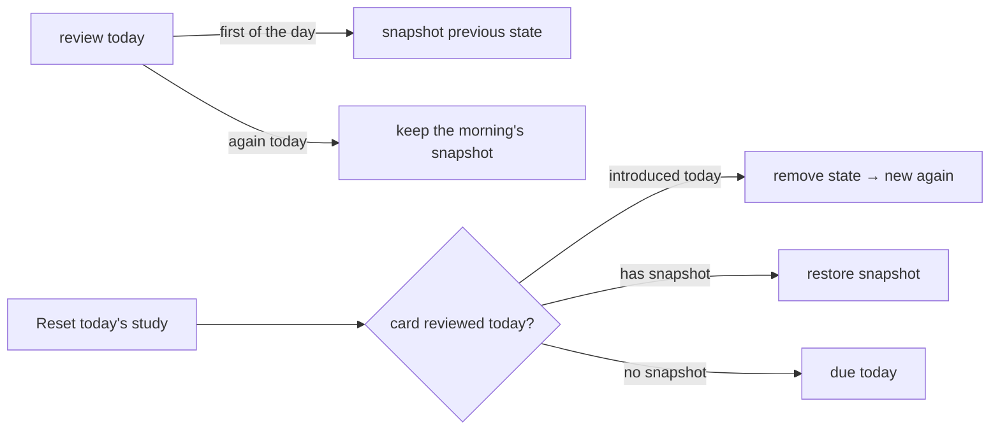

# Spaced repetition (SM-2)

How Solid Memo schedules cards. Implemented entirely in the domain layer
([sm2.ts](../src/domain/sm2.ts), [scheduling.ts](../src/domain/scheduling.ts))
as pure functions.

## Review state

Each card carries one `ReviewState`:

| Field | Meaning |
|---|---|
| `easeFactor` | SM-2 easiness (starts 2.5, never below 1.3) |
| `intervalDays` | Days until the next review |
| `repetitions` | Consecutive correct answers |
| `due` | Study day ("YYYY-MM-DD") the card is next due |
| `firstReviewedAt` | Introduction timestamp (counts against the new-card budget) |
| `lastReviewedAt` | Latest review timestamp (counts against the review budget) |

A card with no `ReviewState` is *new*.

## The SM-2 transition

The user grades each answer with a quality `q` from 0 (blackout) to 5
(perfect). `applySm2` transitions `(easeFactor, intervalDays, repetitions)`:

```mermaid
flowchart TD
    A[answer graded q] --> B{q >= 3?}
    B -- no (lapse) --> C[repetitions = 0<br/>interval = 1 day<br/>ease factor kept]
    B -- yes --> D[update ease factor<br/>EF' = EF + 0.1 − (5−q)(0.08 + (5−q)·0.02)<br/>floor 1.3]
    D --> E{repetition #}
    E -- 1st --> F[interval = 1 day]
    E -- 2nd --> G[interval = 6 days]
    E -- 3rd+ --> H[interval = round(previous × EF')]
```

Decisions fixed in code (and tests):

- The **updated** ease factor drives interval growth (computed before the
  interval, per Wozniak's original description).
- Lapses (`q < 3`) keep the ease factor; only repetitions and interval reset.
  The card returns the next study day (interval 1).
- No in-session relearning loop in v1: a failed card reappears tomorrow,
  not later in the same session.

## Study days and the queue

Scheduling works in *study days*, not calendar days. `studyDayOf` shifts an
instant back by `dayBoundaryHour` (default 4) before taking the local date —
reviewing at 03:00 still counts as yesterday. Timezone caveat: study days are
device-local; travelling shifts due times by a few hours (accepted for v1).

`buildStudyQueue` produces the day's session from cards + review states +
preferences (`now` is always passed in, never read from a clock — that keeps
it deterministic and testable):

- **due**: cards whose `due <= today`, oldest due first, capped at
  `maxReviewsPerDay` minus reviews already done today.
- **new**: cards without review state, capped at `newCardsPerDay` minus
  cards introduced today.

Both budgets clamp at zero. The queue is a snapshot: the practice screen
freezes it at session start and answered cards do not reshuffle it.

## Practice sessions

A deck offers two session modes ([PracticeContainer](../src/ui/PracticeContainer.tsx)):

- **Study** — due cards only. The daily review pass; introduces nothing new.
- **Practice** — due cards first, then new cards up to the daily new-card
  budget.

A session walks the frozen queue one card at a time:
front → reveal → grade 0–5. Each answer runs the `recordReview` use case
([useCases.ts](../src/application/useCases.ts)): load the card's stored
state (or start from the initial SM-2 state), apply the transition, compute
the next due day, persist to `reviews/<deckId>.ttl`, and return the new
state. A failed save keeps the card in place with an error; the queue only
advances on success. Ending the session invalidates the review caches so
other screens see fresh state.

Storage note: `sm:due` is stored as a plain `"YYYY-MM-DD"` string literal,
not `xsd:date` — a study day is a calendar label, and date round-trips
through `Date` objects risk timezone off-by-one shifts.

## Suggesting a session

The app only suggests a session that has something in it, so nobody starts
one to learn there was nothing to study. Both the deck page and each
deck-list row read the deck's queue for today:

| Today's queue | Deck page | Deck-list row |
|---|---|---|
| cards due | **Study** (primary) + Practice | **Study** |
| nothing due, new cards within budget | **Practice** only | **Practice** |
| nothing | "All cards have been studied" | "Nothing to study today" |
| unknown (loading / unreadable) | loading or error | no suggestion |

Rows load independently and share the `["studyQueue", deckUrl]` cache entry
with the deck page. Concurrent reads of the instance's preferences are
shared (one request for all rows) but never cached beyond the request.

## Resetting the day

The deck page offers **Reset today's study** once something has been
studied today. It undoes the current study day for that deck, as if the
day's sessions had not happened.

A review overwrites a card's state, so undoing needs a record of what was
overwritten. `recordReview` therefore stores a snapshot (`ReviewState.previous`,
the `sm:previous*` triples) of the state from **before the study day's first
review** — a second review the same day keeps that snapshot instead of
replacing it (`snapshotBeforeReview`).

`resetStudyDay` (pure, in [scheduling.ts](../src/domain/scheduling.ts)) then
decides, per card reviewed today:

| Card | Reset does |
|---|---|
| introduced today (`firstReviewedAt` is today) | removes its state — it is a new card again |
| reviewed today, has a snapshot | restores the snapshot (ease, interval, repetitions, due, last review) |
| reviewed today, no snapshot (state written before snapshots existed) | can't be restored: made due today, so it can at least be studied again |
| not reviewed today | untouched |



Because the daily budgets are derived from the same timestamps
(`lastReviewedAt` / `firstReviewedAt` falling in today), restoring them also
frees today's review and new-card budget. All changes go out in one save of
the reviews document (`applyReviewChanges`), so a reset is never half-applied.
"Today" honours the instance's `dayBoundaryHour`, like the queue.
