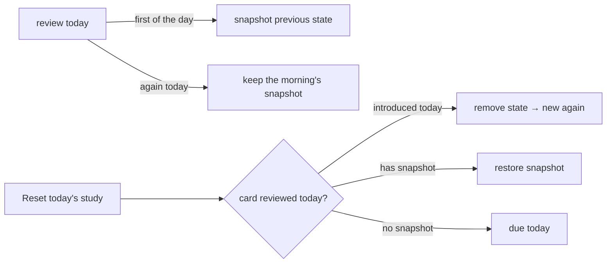

# Spaced repetition (SM-2 and FSRS)

How Solid Memo schedules cards. Implemented entirely in the domain layer
([sm2.ts](../packages/domain/src/sm2.ts), [fsrs.ts](../packages/domain/src/fsrs.ts),
[nextReview.ts](../packages/domain/src/nextReview.ts),
[scheduling.ts](../packages/domain/src/scheduling.ts)) as pure functions.

## Prompts and directions

A session asks *prompts*: a card seen from one side (`Prompt` in
[deck.ts](../packages/domain/src/deck.ts)). A deck's direction decides which
prompts its cards make — front→back, back→front, or both (a
*bidirectional* deck, two prompts per card). Each prompt is scheduled on
its own: knowing "Sweden → Stockholm" says nothing about knowing
"Stockholm → Sweden". Everything below — review state, budgets, the
queue, the session — is per prompt.

## Review state

Each prompt (card + direction) carries one `ReviewState`:

| Field | Meaning |
|---|---|
| `easeFactor` | SM-2 easiness (starts 2.5, never below 1.3) |
| `intervalDays` | Days from the last review to the due day, as whichever scheduler decided |
| `repetitions` | Consecutive correct answers |
| `memory` | FSRS-7's memory: `stability`, `stabilityFast` (days), `difficulty` (1–10); absent until the prompt's first review by an app that knows FSRS |
| `due` | Study day ("YYYY-MM-DD") the card is next due |
| `firstReviewedAt` | Introduction timestamp (counts against the new-card budget) |
| `lastReviewedAt` | Latest review timestamp (counts against the review budget) |

A prompt with no `ReviewState` is *new*. Changing a deck's direction
keeps every state: a card's front→back state waits, unused, while the
deck is studied back→front.

## Two schedulers

An instance's preferences choose the scheduler (`sm:scheduler`, a
concept of `sm:Schedulers`): **SM-2** or **FSRS** (FSRS-7). Every
answer moves both on (`nextReviewState` in
[nextReview.ts](../packages/domain/src/nextReview.ts)): SM-2's ease and
repetitions, and FSRS's memory. The chosen scheduler alone decides the
interval, and with it the due day. So switching takes effect at the
next review, either way, with nothing to convert; due days set by the
other scheduler stay until then, unless the user reschedules (below).
After a switch back, SM-2 grows from the prompt's current interval,
whoever set it.

| Instance | Scheduler | Answer scale |
|---|---|---|
| created by this app | FSRS (`NEW_INSTANCE_PREFERENCES`, written at creation) | `minimal` |
| preferences saved before FSRS | SM-2 (the step to preferences format 4) | as saved |
| no preferences document | SM-2 (`DEFAULT_PREFERENCES`) | `sm2` |

An instance without preferences reads as SM-2 on purpose: every
instance before FSRS was one, and it must not be rescheduled silently.

## The SM-2 transition

The user grades each answer with a quality `q` from 0 (blackout) to 5
(perfect). `applySm2` transitions `(easeFactor, intervalDays, repetitions)`:

```mermaid
flowchart TD
    A[answer graded q] --> B{q >= 3?}
    B -- no (lapse) --> C[repetitions = 0<br/>interval = 1 day<br/>ease factor kept]
    B -- yes --> D[update ease factor<br/>EF' = EF + 0.1 − (5−q)(0.08 + (5−q)·0.02)<br/>floor 1.3]
    D --> E{repetition #}
    E -- 1st --> F[interval = 1 day]
    E -- 2nd --> G[interval = 6 days]
    E -- 3rd+ --> H[interval = round(previous × EF')]
```

Decisions fixed in code (and tests):

- The **updated** ease factor drives interval growth (computed before the
  interval, per Wozniak's original description).
- Lapses (`q < 3`) keep the ease factor; only repetitions and interval reset.
  The card returns the next study day (interval 1).
- A grade of 0 or 1 additionally sends the card round again **within the
  session** (`repeatsInSession`); see *Study sessions*. Each pass is a
  full SM-2 review, so the state stored after the repeat is the one that
  counts.

## FSRS-7

FSRS models each prompt's memory as two traces, a slow and a fast one,
and a difficulty; its forgetting curve, the probability of recall over
time, mixes the two. [fsrs.ts](../packages/domain/src/fsrs.ts) is a port
of ts-fsrs's FSRS-7 (itself a port of fsrs-rs), with its 34 default
weights: the domain imports no vendor code. Test vectors generated with
ts-fsrs, pinned exactly in the root `package.json`, hold the port to it
(`node scripts/generateFsrsVectors.ts` writes
[fsrsVectors.ts](../packages/domain/src/testing/fsrsVectors.ts); run it
again when the pin moves, and look at what changed). A review-state
format means the formulas of its day: a model that computes memory
differently is another format.

- **Ratings.** The grade stays an SM-2 quality, in the state and in the
  answer log; FSRS's rating is derived from it: 0–2 Again, 3 Hard,
  4 Good, 5 Easy (`ratingOfQuality`).
- **Time.** FSRS is given the exact time since the prompt's last
  review, in fractional days — ten minutes for a card repeated in the
  session, months for a mature one. FSRS-7 is designed for that; same-day
  repeats need no rule of their own. Due days stay study days.
- **A prompt FSRS has not seen** (a state from before FSRS, or written by
  an older app) gets a memory estimated from its SM-2 interval first:
  the one whose curve falls to 90% exactly at that interval, the fast
  trace at 0.8 of the slow one and the difficulty neutral, 5
  (`memoryFromSm2`, after fsrs-rs's `memory_state_from_sm2`, which for
  FSRS-7 has no use for the ease factor).
- **The interval** (`fsrsIntervalDays`) is the time until the
  probability of recall falls to the **desired retention**
  (`sm:desiredRetention`, 0.70–0.97, default 0.90), solved numerically
  (`intervalFor`). Then, as ts-fsrs schedules:
  - fuzzed when 2.5 days or more: spread at random over a range around
    it (±15% of the part from 2.5 to 7 days, ±10% from 7 to 20, ±5%
    beyond, plus a day; `fuzzRange`), so cards learnt together do not
    stay due together; shorter ones are only rounded;
  - never shorter than a lower rating's interval would have been, and a
    day longer once that is a day or more: Easy > Good > Hard;
  - whole study days, **at least one**, at most a hundred years. There
    are no minute-long learning steps: a card forgotten today comes back
    within today's session (`requeueCard`), not on another day.

With the default weights and no learning steps, a new card graded Good
comes back in about five days, and Easy in about two months: FSRS-7's
prediction of 90% recall, where SM-2 says one day.

## Rescheduling with FSRS

Switching to FSRS leaves every due day as it was. **Reschedule due
dates with FSRS** (Preferences, offered while FSRS is the saved
scheduler) sets every reviewed prompt's due day as FSRS would have at
its last review, for the current desired retention
(`rescheduleByFsrs`, use case `rescheduleWithFsrs`): the memory is
estimated where there is none, the interval fuzzed, and only the states
that change are written, one write per deck. The last review, the
snapshot and the answer log stay as they are. The user confirms first,
and is told how many prompts became due sooner and later.

## Answer scales

Sessions grade with one of two button sets, chosen per instance in the
preferences (`sm:answerScale`: `minimal` in an instance the app creates,
`sm2` where none is stated):

| Scale | Buttons | Records | FSRS rating |
|---|---|---|---|
| `sm2` | 0 — Blackout … 5 — Easy | that grade | 0–2 Again, then Hard, Good, Easy |
| `minimal` | Again · Hard · Good · Easy | 1 · 3 · 4 · 5 | Again · Hard · Good · Easy |

Either scale works with either scheduler: the grade recorded is always
an SM-2 quality. The minimal scale is FSRS's own four ratings, and on SM-2
a view over its grades, not a second algorithm. Again stands
for 0–1 and Hard for 2–3, but each button must record one value: Again
records 1 (0 and 1 schedule identically) and Hard records **3**, the lowest
passing grade — recording 2 would make Hard a lapse, indistinguishable from
Again. So on the minimal scale only Again repeats in the session
([answerScale.ts](../packages/domain/src/answerScale.ts)).

## Study days and the queue

Scheduling works in *study days*, not calendar days. `studyDayOf` shifts an
instant back by `dayBoundaryHour` (default 4) before taking the local date —
reviewing at 03:00 still counts as yesterday. Timezone caveat: study days are
device-local; travelling shifts due times by a few hours (accepted for v1).

`buildStudyQueue` produces the day's session from cards + the deck's
direction + review states + preferences — the instance's, with the
deck's own daily limits in their place where it sets them
(`deckPreferences` in `domain/deckPace.ts`) (`now` is always passed in, never
read from a clock — that keeps it deterministic and testable). Retired
cards (`owl:deprecated true`) make no prompts: their review states are
kept, but never due and never new:

- **due**: prompts whose `due <= today`, oldest due first, capped at
  `maxReviewsPerDay` minus reviews already done today.
- **new**: prompts without review state, **drawn at random** (Fisher–Yates
  over an injected `random` source, so tests stay deterministic), capped at
  `newCardsPerDay` minus prompts introduced today. A long deck is
  therefore not introduced front to back, and a bidirectional deck's two
  prompts of one card need not arrive together — or even the same day.

The budgets count prompts, so a bidirectional deck spends two of the
day's new-card budget on a card introduced both ways.

Both budgets clamp at zero.

The deck list needs only the counts, which `getStudyCounts` takes from
the deck's schedule in the instance's [digest](data-model.md#the-digest)
while neither of its documents has changed (`studyCountsOf` in
`domain/studyDigest.ts`, tested against `buildStudyQueue` for every
direction and cap). A schedule holds its counts by study day, so it
stays right as days pass: any review since it was computed would have
changed the reviews document, so on a later day nothing was reviewed or
introduced yet.

The queue is a snapshot taken at session start;
the session then owns its own order (below) and a refetch never reshuffles
it.

## Study sessions

A deck offers one session, **Study** ([StudyContainer](../apps/web/src/ui/StudyContainer.tsx)):
today's due prompts plus new ones up to the daily new-card budget, the
new ones spread evenly among the due (`interleave`) rather than queued
after them, so a deck with a backlog still introduces something new
early on. The session opens with a due prompt when there is one. (There
used to be a separate due-only mode; one button with everything for the
day proved simpler.)

A session walks its queue one prompt at a time: the side asked → reveal
the other side → grade. A back→front prompt shows the card's back first.
A card graded 0 or 1 is put back into the *remainder* of the session at a
random position (`requeueCard`) — never as the very next card, unless it is
the only card left, in which case it simply repeats until it passes. The
"Card x of y" counter grows with each repeat. Each answer runs the
`recordReview` use case
([useCases.ts](../packages/application/src/useCases.ts)): load the card's stored
state (or start fresh), move SM-2 and FSRS on and schedule by the
instance's scheduler (`nextReviewState`), persist to
`reviews/<deckId>.ttl`, and return the new state. A failed save keeps the card in place with an error; the queue only
advances on success. Ending the session invalidates the review caches so
other screens see fresh state.

Storage note: `sm:due` is stored as a plain `"YYYY-MM-DD"` string literal,
not `xsd:date` — a study day is a calendar label, and date round-trips
through `Date` objects risk timezone off-by-one shifts.

## Suggesting a session

The app only suggests a session that has something in it, so nobody starts
one to learn there was nothing to study. Both the deck page and each
deck-list row read the deck's queue for today:

| Today's queue | Deck page | Deck-list row |
|---|---|---|
| prompts due and/or new within budget | **Study**, with "N due today, and M new to introduce" | **Study** with "N due · M new" |
| nothing | "All cards have been studied" | "Nothing to study today" |
| unknown (loading / unreadable) | loading or error | no suggestion |

Rows load independently and share the `["studyQueue", deckUrl]` cache entry
with the deck page. Concurrent reads of the instance's preferences are
shared (one request for all rows) but never cached beyond the request.

## Resetting the day

The deck page offers **Reset today's study** once something has been
studied today. It undoes the current study day for that deck, as if the
day's sessions had not happened.

A review overwrites a card's state, so undoing needs a record of what was
overwritten. `recordReview` therefore stores a snapshot (`ReviewState.previous`,
the `sm:previous*` triples) of the state from **before the study day's first
review** — a second review the same day keeps that snapshot instead of
replacing it (`snapshotBeforeReview`).

`resetStudyDay` (pure, in [scheduling.ts](../packages/domain/src/scheduling.ts)) then
decides, per card reviewed today:

| Card | Reset does |
|---|---|
| introduced today (`firstReviewedAt` is today) | removes its state — it is a new card again |
| reviewed today, has a snapshot | restores the snapshot (ease, interval, repetitions, due, last review, FSRS memory — or none, when the morning had none) |
| reviewed today, no snapshot (state written before snapshots existed) | can't be restored: made due today, so it can at least be studied again |
| not reviewed today | untouched |

```mermaid
flowchart LR
    R[review today] -->|first of the day| S[snapshot previous state]
    R -->|again today| K[keep the morning's snapshot]
    X[Reset today's study] --> Q{card reviewed today?}
    Q -->|introduced today| N[remove state → new again]
    Q -->|has snapshot| B[restore snapshot]
    Q -->|no snapshot| D[due today]
```

Because the daily budgets are derived from the same timestamps
(`lastReviewedAt` / `firstReviewedAt` falling in today), restoring them also
frees today's review and new-card budget. All changes go out in one save of
the reviews document (`applyReviewChanges`), so a reset is never half-applied.
The day's answers of that deck then leave the
[answer log](data-model.md#the-answer-log) as well, so the statistics
match the cards: answers still on their way to the log are added first,
then removed with the rest.
"Today" honours the instance's `dayBoundaryHour`, like the queue.
