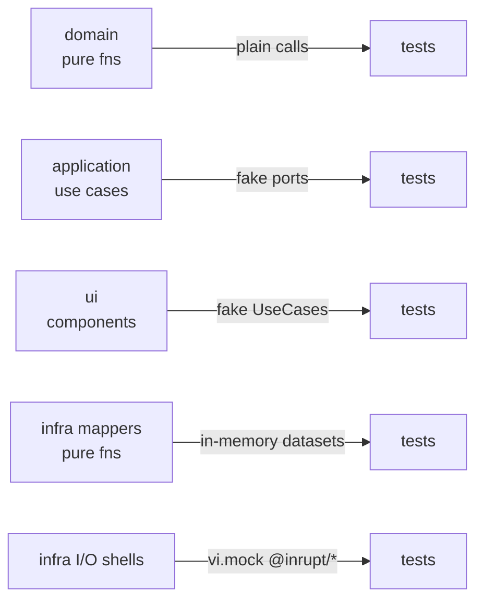

# Testing

Unit tests with [Vitest](https://vitest.dev/), `happy-dom`, and
`@testing-library/preact`. Coverage is enforced at **100%** (statements,
branches, functions, lines) — `npm test` fails below that.

## Commands

```sh
npm test        # run everything with coverage thresholds
npm run test:watch
```

## Coverage policy

100% across `src/**` with exactly two documented exclusions
(configured in [vite.config.ts](../vite.config.ts)):

- `src/main.tsx` — composition root; pure wiring, no logic.
- `src/test/` — test setup, not product code.

Code that cannot reach 100% is restructured until it can (e.g. an
unreachable defensive branch is removed rather than excluded). New code
ships with its tests in the same change; coverage never dips.

## Strategy per layer

Dependency inversion gives every layer a seam that makes mocks trivial:

| Layer | Seam | Technique |
|---|---|---|
| Domain | none needed | Pure functions; inputs (including `now: Date`) passed as parameters. Plain assertions. |
| Application | ports | Inject fake port objects (`vi.fn` per method). No module mocking. |
| UI | `UseCases` prop | Render with a fake `UseCases`; assert via testing-library queries. Query-dependent components get a fresh `QueryClient` (retries off). |
| Infrastructure mappers | none needed | Pure `SolidDataset`/`Thing` → domain functions; feed in-memory datasets built with `mockSolidDatasetFrom`/`buildThing`. |
| Infrastructure I/O shells | injected `fetch` + `vi.mock` | Mock `@inrupt/*` module functions; assert the shell orchestrates fetch → map → return. |



## Conventions

- Tests are colocated: `foo.ts` ↔ `foo.test.ts`.
- Test files follow the same import boundaries as their subject
  ([boundaries.md](boundaries.md)).
- Preact-compat note: `@tanstack/react-query` must be inlined in the vitest
  server deps so the `react → preact/compat` alias applies (see
  `vite.config.ts`).
