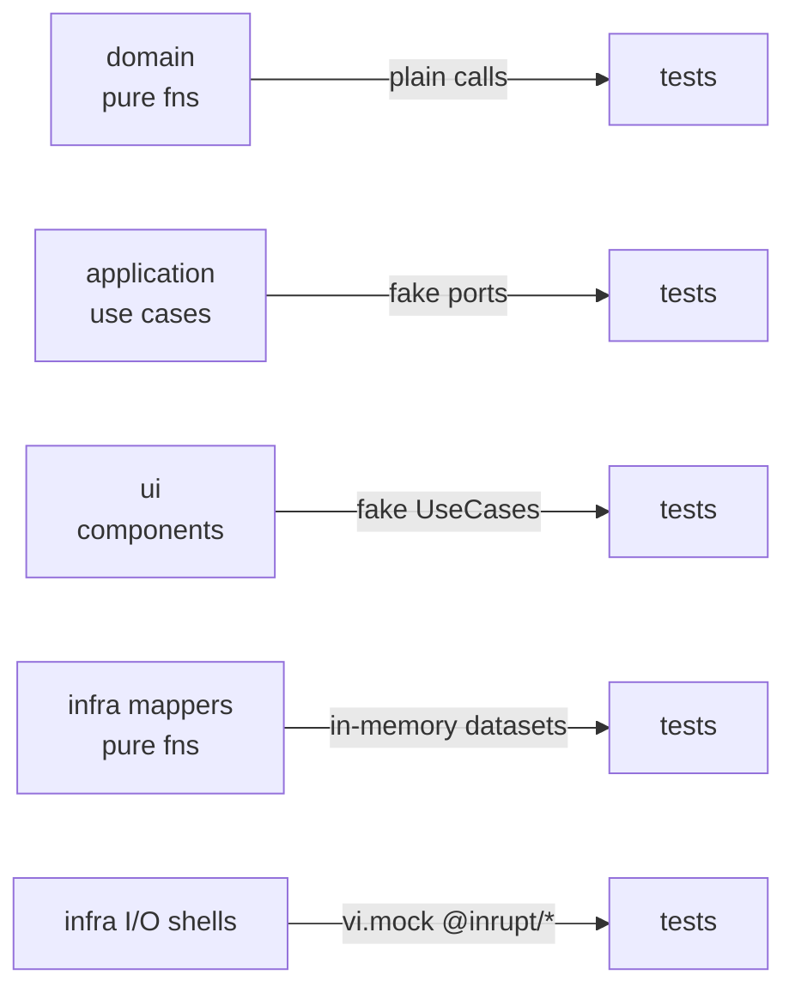

# Testing

Unit tests with [Vitest](https://vitest.dev/), `happy-dom`, and
`@testing-library/preact`, in every package. Coverage is enforced at
**100%** (statements, branches, functions, lines) per package: each
package's own tests cover its own code — `npm test` fails below that.

## Commands

```sh
npm test          # every package's tests, with coverage thresholds (turbo)
npm run check     # the same, plus typecheck, drift, formatting, boundaries
npx vitest        # watch mode, inside one package's folder
npm run test:pod  # the end-to-end tests, against the Solid servers they start
npm run servers -w @solid-memo/e2e-pod   # install those servers (once; `-- css-6` for one)
npm run pod       # a Community Solid Server on :3999, in memory, to poke at by hand
```

`npm run test:pod` runs `e2e/pod/` once against each Solid server
[servers.ts](../e2e/pod/servers.ts) knows, which its global setup
([globalSetup.ts](../e2e/pod/globalSetup.ts)) starts on free ports and
stops after; the test names say which server and version:

| Id | Server | How it runs |
|---|---|---|
| `css-7` | Community Solid Server 7.x | in memory |
| `css-6` | Community Solid Server 6.x | in memory |
| `nss-6` | node-solid-server 6.x | in a temporary folder whose root ACL lets anyone read and write |
| `nss-5` | node-solid-server 5.x | the same |

Each server is its own npm project in `e2e/pod/servers/<id>/`, with its
own lockfile, outside the workspace: two majors of the Community Solid
Server in one `node_modules` find each other's Components.js modules and
fail to start, and the app's own install does not need any of them.
`npm run servers` installs them (`npm ci` in each); the setup says which
one is missing if you have not. `SOLID_SERVERS=css-7,nss-5` runs the
suite against some only; `SOLID_SERVER_URL` against a server of your own
instead, which must let anyone read and write (as `npm run pod` does).
CI runs one job per server, side by side, none stopping the others
([migrations.md](migrations.md#proof-on-a-real-server)); Renovate keeps
the older majors on their major (`renovate.json5`).

The servers differ in what they enforce, and the tests ask each rather
than assume ([serverTraits.ts](../e2e/pod/src/serverTraits.ts), and the
precondition probe of the format update's tests):

- **node-solid-server** gives no ETag on a read and ignores `If-Match`, so
  there an edit cannot be made conditional and the test that proves an
  edit is refused is skipped; without ETags no
  [digest](data-model.md#the-digest) is kept either, so the test of two
  pages learning at once is skipped, and the others check that every
  visit reads everything. (5.7.4 also ignored `If-None-Match: *` on a
  PUT; 5.8.8 and 6.0.0 enforce it.)
- **Community Solid Server 6** builds its ETag from the modification time
  in whole seconds: an edit in the same second as a read keeps the ETag,
  so a changed document looks unchanged. The tests edit within the
  second, so there the test that proves an edit is refused and the
  digest's tests are skipped. 7 stamps milliseconds.

Every skip says why. Everything else runs on every server.

The Community Solid Server's in-memory store (the one these tests use)
cuts a document short after a PATCH that adds characters outside ASCII
(`å`, `ä`, `ö`): it stores as many bytes as there were characters. Its
file store does not; keep test data that is patched ASCII, or measure on
`-c @css:config/file.json -f <dir>`.

solid-server 6.0.0 is packaged with faults the setup works around: its
`exports` neither offers `package.json` nor names an entry it ships for
`require` (so servers are found by their folder), it lacks the root ACL
template it copies on first start (so the setup puts one in the config
folder first), and it lists its own commit-hook tool `@fastify/pre-commit`
as a dependency, whose install script would put a git hook into this
repository. 5.8.8 does too. `npm run servers` installs without install
scripts, and each project denies that one (`allowScripts`, which npm 12
honours), and node-solid-server 5's `core-js`'s, which only prints a
message.

The published library and vocabulary are also cross-checked by pySHACL
in CI, after the build (`python3 scripts/shacl_crosscheck.py`; see
[validation.md](validation.md#the-ci-cross-check)).

## Coverage policy

100% of every package's `src/` (and `tooling/` or `node/` where it has
one), set up once in [vitest.shared.ts](../vitest.shared.ts), with these
documented exclusions:

- `apps/web/src/main.tsx` — composition root; pure wiring, no logic
  (configured in [vite.config.ts](../apps/web/vite.config.ts)).
- `src/test/` and `src/testing/` — test setup and helpers other
  packages' tests import (`@solid-memo/domain/testing/libraryDeck`,
  `@solid-memo/shacl/testing/turtle`), not product code.

Code that cannot reach 100% is restructured until it can (e.g. an
unreachable defensive branch is removed rather than excluded). New code
ships with its tests in the same change; coverage never dips.

## Strategy per layer

Dependency inversion gives every layer a seam that makes mocks trivial:

| Layer | Seam | Technique |
|---|---|---|
| Domain | none needed | Pure functions; inputs (including `now: Date`) passed as parameters. Plain assertions. |
| Application | ports | Inject fake port objects (`vi.fn` per method). No module mocking. |
| UI | `UseCases` prop | Render with a fake `UseCases`; assert via testing-library queries. Query-dependent components get a fresh `QueryClient` (retries off). |
| Infrastructure mappers | none needed | Pure `SolidDataset`/`Thing` → domain functions; feed in-memory datasets built with `mockSolidDatasetFrom`/`buildThing`. |
| Infrastructure I/O shells | injected `fetch` + `vi.mock` | Mock `@inrupt/*` module functions; assert the shell orchestrates fetch → map → return. |
| Shapes (`packages/shacl/`, `packages/solid/src/conformance.test.ts`) | the real engine | The real `rdf-validate-shacl` over the real `packages/vocab/shapes/` files: fixture documents under `packages/vocab/fixtures/` pass or fail as a table says; a record written through every descriptor, and every migration step's output, conforms (`conformance.test.ts`); every library deck passes. Shape documents are read through a fake `fetch` (a `Response` with its `url` set), exactly as the browser reads them. |
| Generated code | drift test | `packages/vocab/tooling/generate.test.ts` renders the generators' output and compares it with the committed files; generated modules are data only, so importing them covers them (`packages/vocab/src/generated.test.ts`). |
| End to end | real Solid servers | `e2e/pod/` wires the real use cases and Solid adapters as `main.tsx` does, over a fetch that records every request, against Community Solid Server 7 and 6 and node-solid-server 6 and 5. |


```mermaid
graph LR
    D["domain<br/>pure fns"] -->|plain calls| T1[tests]
    A["application<br/>use cases"] -->|fake ports| T2[tests]
    U["ui<br/>components"] -->|fake UseCases| T3[tests]
    M["infra mappers<br/>pure fns"] -->|in-memory datasets| T4[tests]
    S["infra I/O shells"] -->|vi.mock @inrupt/*| T5[tests]
```

## Conventions

- Tests are colocated: `foo.ts` ↔ `foo.test.ts`.
- Test files follow the same import boundaries as their subject
  ([boundaries.md](boundaries.md)); `packages/shacl/src/testing/turtle.ts` parses Turtle
  through `@inrupt/solid-client` for the SHACL tests.
- Node tooling tests may read the vocab package's `vocab/`, `shapes/`,
  `vendor/` and `fixtures/` (through `VOCAB_ROOT`) and the deck
  library's `decks/` and `releases/` (through `DECK_LIBRARY_ROOT`):
  they are the fixtures.
- Preact-compat note: `@tanstack/react-query` must be inlined in the vitest
  server deps so the `react → preact/compat` alias applies (see
  `apps/web/vite.config.ts`).
