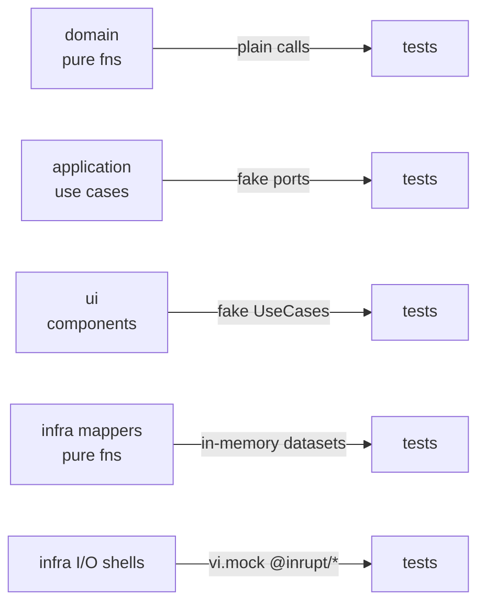

# Testing

Unit tests with [Vitest](https://vitest.dev/), `happy-dom`, and
`@testing-library/preact`. Coverage is enforced at **100%** (statements,
branches, functions, lines) — `npm test` fails below that.

## Commands

```sh
npm test        # run everything with coverage thresholds
npm run test:watch
npm run test:pod  # the format update against a real Solid server (below)
```

`npm run test:pod` runs `src/integration/` against the Solid server at
`SOLID_SERVER_URL` (default `http://localhost:3999/`), which must let
anyone read and write: `npx @solid/community-server -p 3999` starts one
in memory. Those tests are skipped when `SOLID_SERVER_URL` is unset, so
`npm test` never needs a server
([migrations.md](migrations.md#proof-on-a-real-server)).

The published library and vocabulary are also cross-checked by pySHACL
in CI, after the build (`python3 scripts/shacl_crosscheck.py`; see
[validation.md](validation.md#the-ci-cross-check)).

## Coverage policy

100% across `src/**` and `tooling/**` with exactly two documented exclusions
(configured in [vite.config.ts](../vite.config.ts)):

- `src/main.tsx` — composition root; pure wiring, no logic.
- `src/test/` — test setup, not product code.

Code that cannot reach 100% is restructured until it can (e.g. an
unreachable defensive branch is removed rather than excluded). New code
ships with its tests in the same change; coverage never dips.

## Strategy per layer

Dependency inversion gives every layer a seam that makes mocks trivial:

| Layer | Seam | Technique |
|---|---|---|
| Domain | none needed | Pure functions; inputs (including `now: Date`) passed as parameters. Plain assertions. |
| Application | ports | Inject fake port objects (`vi.fn` per method). No module mocking. |
| UI | `UseCases` prop | Render with a fake `UseCases`; assert via testing-library queries. Query-dependent components get a fresh `QueryClient` (retries off). |
| Infrastructure mappers | none needed | Pure `SolidDataset`/`Thing` → domain functions; feed in-memory datasets built with `mockSolidDatasetFrom`/`buildThing`. |
| Infrastructure I/O shells | injected `fetch` + `vi.mock` | Mock `@inrupt/*` module functions; assert the shell orchestrates fetch → map → return. |
| Shapes (`src/infrastructure/shacl/`, `tooling/`) | the real engine | The real `rdf-validate-shacl` over the real `shapes/` files: fixture documents under `tooling/fixtures/` pass or fail as a table says; a record written through every descriptor, and every migration step's output, conforms (`conformance.test.ts`); every library deck passes. Shape documents are read through a fake `fetch` (a `Response` with its `url` set), exactly as the browser reads them. |
| Generated code | drift test | `tooling/generate.test.ts` renders the generators' output and compares it with the committed files; generated modules are data only, so importing them covers them. |


```mermaid
graph LR
    D["domain<br/>pure fns"] -->|plain calls| T1[tests]
    A["application<br/>use cases"] -->|fake ports| T2[tests]
    U["ui<br/>components"] -->|fake UseCases| T3[tests]
    M["infra mappers<br/>pure fns"] -->|in-memory datasets| T4[tests]
    S["infra I/O shells"] -->|vi.mock @inrupt/*| T5[tests]
```

## Conventions

- Tests are colocated: `foo.ts` ↔ `foo.test.ts`.
- Test files follow the same import boundaries as their subject
  ([boundaries.md](boundaries.md)); `src/test/turtle.ts` parses Turtle
  through `@inrupt/solid-client` for the SHACL tests.
- `tooling/` tests may read the repository's own `vocab/`, `shapes/` and
  `decks/` folders: they are the fixtures.
- Preact-compat note: `@tanstack/react-query` must be inlined in the vitest
  server deps so the `react → preact/compat` alias applies (see
  `vite.config.ts`).
