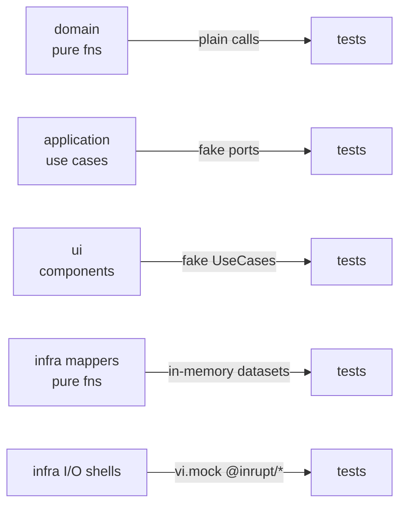

# Testing

Unit tests with [Vitest](https://vitest.dev/), `happy-dom`, and
`@testing-library/preact`, in every package. Coverage is enforced at
**100%** (statements, branches, functions, lines) per package: each
package's own tests cover its own code — `npm test` fails below that.

## Commands

```sh
npm test          # every package's tests, with coverage thresholds (turbo)
npm run check     # the same, plus typecheck, drift, formatting, boundaries
npx vitest        # watch mode, inside one package's folder
npm run pod       # start a Community Solid Server on :3999, in memory
npm run test:pod  # the end-to-end tests, against that server
```

`npm run test:pod` runs `e2e/pod/` against the Solid server at
`SOLID_SERVER_URL` (default `http://localhost:3999/`), which must let
anyone read and write, as `npm run pod` does (a Community Solid Server,
a dependency of that package). Those tests are skipped when
`SOLID_SERVER_URL` is unset. CI runs them in a job of their own, with
the server started on the runner
([migrations.md](migrations.md#proof-on-a-real-server)).

The published library and vocabulary are also cross-checked by pySHACL
in CI, after the build (`python3 scripts/shacl_crosscheck.py`; see
[validation.md](validation.md#the-ci-cross-check)).

## Coverage policy

100% of every package's `src/` (and `tooling/` or `node/` where it has
one), set up once in [vitest.shared.ts](../vitest.shared.ts), with these
documented exclusions:

- `apps/web/src/main.tsx` — composition root; pure wiring, no logic
  (configured in [vite.config.ts](../apps/web/vite.config.ts)).
- `src/test/` and `src/testing/` — test setup and helpers other
  packages' tests import (`@solid-memo/domain/testing/libraryDeck`,
  `@solid-memo/shacl/testing/turtle`), not product code.

Code that cannot reach 100% is restructured until it can (e.g. an
unreachable defensive branch is removed rather than excluded). New code
ships with its tests in the same change; coverage never dips.

## Strategy per layer

Dependency inversion gives every layer a seam that makes mocks trivial:

| Layer | Seam | Technique |
|---|---|---|
| Domain | none needed | Pure functions; inputs (including `now: Date`) passed as parameters. Plain assertions. |
| Application | ports | Inject fake port objects (`vi.fn` per method). No module mocking. |
| UI | `UseCases` prop | Render with a fake `UseCases`; assert via testing-library queries. Query-dependent components get a fresh `QueryClient` (retries off). |
| Infrastructure mappers | none needed | Pure `SolidDataset`/`Thing` → domain functions; feed in-memory datasets built with `mockSolidDatasetFrom`/`buildThing`. |
| Infrastructure I/O shells | injected `fetch` + `vi.mock` | Mock `@inrupt/*` module functions; assert the shell orchestrates fetch → map → return. |
| Shapes (`packages/shacl/`, `packages/solid/src/conformance.test.ts`) | the real engine | The real `rdf-validate-shacl` over the real `packages/vocab/shapes/` files: fixture documents under `packages/vocab/fixtures/` pass or fail as a table says; a record written through every descriptor, and every migration step's output, conforms (`conformance.test.ts`); every library deck passes. Shape documents are read through a fake `fetch` (a `Response` with its `url` set), exactly as the browser reads them. |
| Generated code | drift test | `packages/vocab/tooling/generate.test.ts` renders the generators' output and compares it with the committed files; generated modules are data only, so importing them covers them (`packages/vocab/src/generated.test.ts`). |
| End to end | a real Solid server | `e2e/pod/` wires the real use cases and Solid adapters as `main.tsx` does, over a fetch that records every request, against a Community Solid Server. |


```mermaid
graph LR
    D["domain<br/>pure fns"] -->|plain calls| T1[tests]
    A["application<br/>use cases"] -->|fake ports| T2[tests]
    U["ui<br/>components"] -->|fake UseCases| T3[tests]
    M["infra mappers<br/>pure fns"] -->|in-memory datasets| T4[tests]
    S["infra I/O shells"] -->|vi.mock @inrupt/*| T5[tests]
```

## Conventions

- Tests are colocated: `foo.ts` ↔ `foo.test.ts`.
- Test files follow the same import boundaries as their subject
  ([boundaries.md](boundaries.md)); `packages/shacl/src/testing/turtle.ts` parses Turtle
  through `@inrupt/solid-client` for the SHACL tests.
- Node tooling tests may read the vocab package's `vocab/`, `shapes/`,
  `vendor/` and `fixtures/` (through `VOCAB_ROOT`) and the deck
  library's `decks/` and `releases/` (through `DECK_LIBRARY_ROOT`):
  they are the fixtures.
- Preact-compat note: `@tanstack/react-query` must be inlined in the vitest
  server deps so the `react → preact/compat` alias applies (see
  `apps/web/vite.config.ts`).
