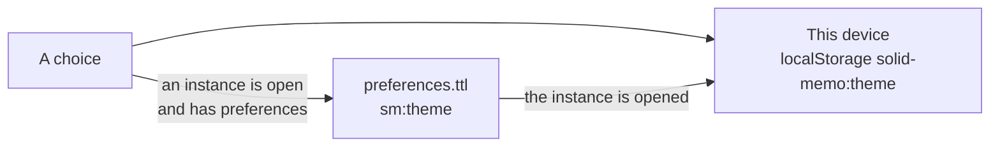

# Theme

The app comes light or dark. The user chooses with the sun/moon toggle at
the top of every screen, or under Appearance in the study preferences,
where a third choice, "As my browser", follows `prefers-color-scheme`
(and keeps following it as it changes). Until anything is chosen, that
is what the app does.

## Where the choice is kept

- **In the pod**, as `sm:theme` in the instance's preferences
  ([preferences format 4](shapes.md)): a concept of `sm:Themes`
  (`sm:systemTheme`, `sm:lightTheme`, `sm:darkTheme`). This is the
  choice that counts, and it follows the user to every device. It is
  written once the instance has preferences, that is after the user's
  first save of the study preferences (which saves the theme shown at
  the time); before that, a choice is kept on the device alone.
- **On the device**, by the `ThemePreference` port
  ([localStorageThemePreference.ts](../packages/browser/src/localStorageThemePreference.ts),
  key `solid-memo:theme`; "As my browser" is no key at all). It is what
  the sign-in screens and the first paint have, before any pod is
  reached. Opening an instance whose preferences say otherwise copies
  their choice here (`instanceTheme`).

A write to the pod that fails (another device saved the preferences
meanwhile, say) is undone: the app reads the preferences back and shows
what they hold.

## Showing it

The stylesheet's dark colours hang off `<html data-theme="dark">`. A small
script in `apps/web/index.html` sets the attribute from the device's
choice, else the browser's, before the first paint, so a page never
flashes in the other theme; `ui/theme.tsx` takes over from there and also
sets the `theme-color` meta tags for the browser's own chrome.
