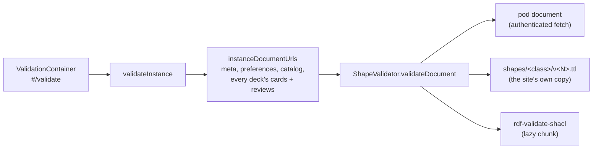

# Validation

A developer tool that checks an instance's documents against the
[shapes](shapes.md) in the browser: `#/validate?instance=…`, linked as
"Validate this instance" at the bottom of the workspace while developer
mode (a per-instance [preference](data-model.md#instance-layout)) is on.
Without developer mode the route shows how to turn it on and fetches
nothing.

## Flow

- `validateInstance` (application) lists the decks, names every document
  the instance may hold and asks the `ShapeValidator` port about each;
  `summarize` (domain) counts the violations. It reads only.
- [shaclShapeValidator.ts](../src/infrastructure/shacl/shaclShapeValidator.ts)
  fetches the document, converts it to an RDF/JS dataset
  (`toRdfJsDataset`) and, for every subject, picks the shape by class
  and stored version exactly as the mappers do (`pickShape`). A subject
  is then `checked` (with its violations), `newer` (a format this app
  does not know: skipped, reported) or `untyped` (no Solid Memo class:
  listed so strays are visible). A document that does not exist is
  `missing`, which is normal, not a problem.
- The shapes are fetched from the site's own `shapes/` folder
  (`new URL("shapes/", document.baseURI)`, like the deck library), not
  bundled: they are published anyway, the dev server serves the
  repository's folder, and the document the browser checks against is
  the one CI validated. Each shape document is fetched once per session.
- The SHACL engine ([engine.ts](../src/infrastructure/shacl/engine.ts),
  the only module that imports `rdf-validate-shacl`) is loaded with a
  dynamic import, so the library is a separate chunk fetched only when a
  validation is asked for. It validates one focus node against one node
  shape (`validateNode`), so no `sh:targetClass` is needed.

## The report

Per document, its URL and status; per subject, "conforms to deck format
2", "deck format 3 is newer than this app knows; skipped", "not a Solid
Memo subject", or a table of severity, property, message and value. The
summary line says "All 9 documents conform" or "3 violations in 2
documents". "Validate again" reads everything afresh.

The app itself never refuses a document over a violation: readers stay
lenient (a subject that does not fit its shape is simply not read, and
the [migration](migrations.md) never runs on its own). This view is
where a developer sees why.
