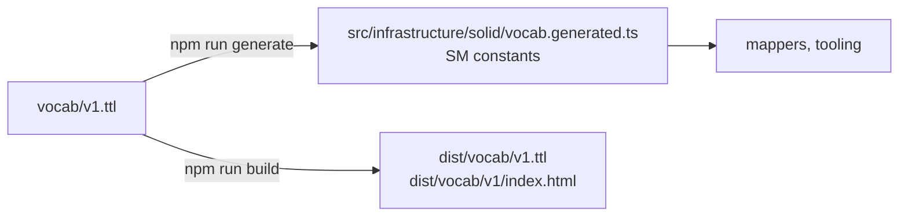

# Vocabulary

Solid Memo's own RDF terms, where they are defined, how they are
versioned and how the app's constants are produced from them. The
namespace is `https://solid-memo.com/vocab/v1#` — declared as
`solid-memo:` in the Turtle files, abbreviated to `sm:` in these docs;
no existing vocabulary covers spaced repetition.

## Source of truth

[`vocab/v1.ttl`](../vocab/v1.ttl) is an RDFS/OWL ontology: the
`owl:Ontology` subject carries `owl:versionInfo` and a `skos:changeNote`
per release, and every term is an `owl:Class`, `owl:DatatypeProperty`
(literal-valued, with an `xsd:` range) or `owl:ObjectProperty`
(IRI-valued) with `rdfs:label`, `rdfs:comment`, `rdfs:domain` where it
has one class, `rdfs:range`, `rdfs:isDefinedBy` and a
`skos:historyNote` saying when it arrived.

`SM` in [vocab.ts](../src/infrastructure/solid/vocab.ts) is a re-export
of the generated constants; the external vocabularies there (Solid, PIM,
Dublin Core, RDF, RDFS, FOAF) are not ours to publish and stay
hand-written. The generator copies each term's comment and history note
into the constant's JSDoc, so the meaning is one hover away.

## Versioning policy

- **Within v1, terms are only ever added.** An addition bumps
  `owl:versionInfo` (1.0 → 1.1 → …) and appends to the change note. A
  term's meaning, datatype or range never changes.
- **A breaking change is a new namespace** (`vocab/v2#`, with
  `owl:priorVersion` pointing back), never an edit of v1: the v1 IRIs
  are baked into every pod that ever wrote them.
- The [shapes](shapes.md) say which terms a subject of a given class and
  format version uses; the vocabulary only says what each term means.

## What dereferences

| IRI | What is served |
|---|---|
| `https://solid-memo.com/vocab/v1#Deck` (any term) | `vocab/v1/index.html`: an HTML table with one row per term, `id`ed by local name, so the fragment lands on the term. GitHub Pages redirects `/vocab/v1` to `/vocab/v1/`. The page links the Turtle with `<link rel="alternate" type="text/turtle">`. |
| `https://solid-memo.com/vocab/v1.ttl` | The ontology itself (`rdfs:seeAlso` on the ontology points here). |

A file without an extension would be served by the static host as
`application/octet-stream`, which is why the Turtle has one and the
namespace IRI lands on a page instead. Both are emitted by the
`turtleDirectoryPlugin` in [tooling/publishTurtle.ts](../tooling/publishTurtle.ts),
which also serves them in dev.

## Adding a term

1. Add it to `vocab/v1.ttl` with every annotation; bump the version and
   the change note.
2. `npm run generate` (CI runs `npm run generate:check` and fails on
   drift; the drift test in `tooling/generate.test.ts` does too).
3. Use it in a [shape](shapes.md) — the fixture test checks that every
   `sm:` predicate a shape uses is declared here.
