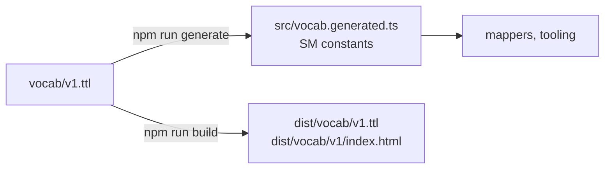

# Vocabulary

Solid Memo's own RDF terms, where they are defined, how they are
versioned and how the app's constants are produced from them. The
namespace is `https://solid-memo.com/vocab/v1#` — declared as
`solid-memo:` in the Turtle files, abbreviated to `sm:` in these docs;
no existing vocabulary covers spaced repetition.

## Source of truth

[`packages/vocab/vocab/v1.ttl`](../packages/vocab/vocab/v1.ttl) is an RDFS/OWL ontology: the
`owl:Ontology` subject carries `owl:versionInfo` and a `skos:changeNote`
per release, and every term is an `owl:Class`, `owl:DatatypeProperty`
(literal-valued, with an `xsd:` range) or `owl:ObjectProperty`
(IRI-valued) with `rdfs:label`, `rdfs:comment`, `rdfs:domain` where it
has one class, `rdfs:range`, `rdfs:isDefinedBy` and a
`skos:historyNote` saying when it arrived.

```mermaid
flowchart LR
    ttl["vocab/v1.ttl"] -->|npm run generate| ts["src/vocab.generated.ts<br/>SM constants"]
    ttl -->|npm run build| dist["dist/vocab/v1.ttl<br/>dist/vocab/v1/index.html"]
    ts --> app["mappers, tooling"]
```

`SM` in [vocab.ts](../packages/solid/src/vocab.ts) is a re-export
of the generated constants; the external vocabularies there (Solid, PIM,
Dublin Core, RDF, RDFS, FOAF) are not ours to publish and stay
hand-written. The generator copies each term's comment and history note
into the constant's JSDoc, so the meaning is one hover away.

## Concept schemes

Where a value is one of a fixed set, it is a SKOS concept, not a
string, so other applications can look up what it means:

| Scheme | Where | Concepts | Used by |
|---|---|---|---|
| `sm:StudyDirections` | `packages/vocab/vocab/v1.ttl` | `sm:frontToBack`, `sm:backToFront`, `sm:bidirectional` | `sm:studyDirection` on a deck |
| `sm:InvalidDataPolicies` | `packages/vocab/vocab/v1.ttl` | `sm:blockInstance` (default), `sm:blockSubject`, `sm:warnOnly` | `sm:invalidDataPolicy` in preferences |
| `sm:Themes` | `packages/vocab/vocab/v1.ttl` | `sm:systemTheme` (default), `sm:lightTheme`, `sm:darkTheme` | `sm:theme` in preferences ([theme.md](theme.md)) |
| Topics (`https://solid-memo.com/vocab/topics`) | [`packages/vocab/vocab/topics.ttl`](../packages/vocab/vocab/topics.ttl) | languages (swedish), geography, computing, science (chemistry), art, labour-market | `dcat:theme` on a deck, next to the EU data theme `EDUC` |

- Every scheme has a `dcterms:title` and a `skos:definition`; every
  concept a `skos:prefLabel` and `skos:definition` in each language the
  scheme's title is in (English always; the topics in English and
  Swedish, the app's languages) and its `skos:inScheme`. The generator
  refuses a concept that misses one. Top concepts say `skos:topConceptOf`, narrower ones
  `skos:broader`. The files are held to SKOS, SkoHub's best practice
  included (see [validation.md](validation.md#profiles-dcat-ap-and-skos)).
- A concept that replaces a string the app used before carries that
  string as its `skos:notation` (`sm:frontToBack` is `"front-to-back"`),
  so the mapping between them is data.
- `npm run generate` renders every scheme into
  `packages/vocab/src/concepts.generated.ts` (`STUDY_DIRECTIONS`,
  `INVALID_DATA_POLICIES`, `TOPICS`), which the app lists and labels
  from, in the language the user reads; [concepts.ts](../packages/domain/src/concepts.ts) looks concepts up by
  IRI or notation. The topics scheme's IRI lands on an HTML page
  (`vocab/topics/`), as the vocabulary's does.
- Concepts are only ever added. One that should go is deprecated
  (`owl:deprecated`), never removed: decks point at it.

## Versioning policy

- **Within v1, terms are only ever added.** An addition bumps
  `owl:versionInfo` (1.0 → 1.1 → …) and appends to the change note. A
  term's meaning, datatype or range never changes. A term that should no
  longer be written is deprecated (`owl:deprecated true`, with
  `dcterms:isReplacedBy`), not removed: `sm:direction` gave way to
  `sm:studyDirection` in 1.6. The generated constant carries
  `@deprecated`.
- **A breaking change is a new namespace** (`vocab/v2#`, with
  `owl:priorVersion` pointing back), never an edit of v1: the v1 IRIs
  are baked into every pod that ever wrote them.
- The [shapes](shapes.md) say which terms a subject of a given class and
  format version uses; the vocabulary only says what each term means.

## What dereferences

| IRI | What is served |
|---|---|
| `https://solid-memo.com/vocab/v1#Deck` (any term) | `vocab/v1/index.html`: an HTML table with one row per term, `id`ed by local name, so the fragment lands on the term. GitHub Pages redirects `/vocab/v1` to `/vocab/v1/`. The page links the Turtle with `<link rel="alternate" type="text/turtle">`. |
| `https://solid-memo.com/vocab/v1.ttl` | The ontology itself (`rdfs:seeAlso` on the ontology points here). |
| `https://solid-memo.com/vocab/external.ttl` | Reference data, not terms of ours: the external terms (EU authority-table entries, media types) Solid Memo data points at, typed so [profile validation](validation.md#profiles-dcat-ap-and-skos) can check them. |

A file without an extension would be served by the static host as
`application/octet-stream`, which is why the Turtle has one and the
namespace IRI lands on a page instead. Both are emitted by the
`turtleDirectoryPlugin` in [packages/vocab/tooling/publishTurtle.ts](../packages/vocab/tooling/publishTurtle.ts),
which also serves them in dev.

## Adding a term

1. Add it to `packages/vocab/vocab/v1.ttl` with every annotation; bump the version and
   the change note.
2. `npm run generate` (CI runs `npm run generate:check` and fails on
   drift; the drift test in `packages/vocab/tooling/generate.test.ts` does too).
3. Use it in a [shape](shapes.md) — the fixture test checks that every
   `sm:` predicate a shape uses is declared here.
